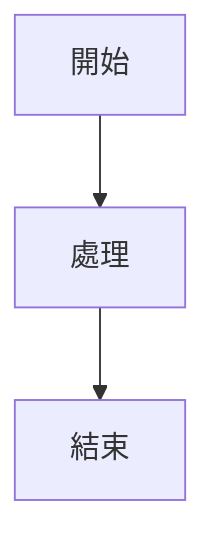

# Markdown 文檔標準化規範

> **版本**: 1.0.0  
> **最後更新**: 2025-01-20  
> **適用範圍**: ng-alain-gighub 專案所有 Markdown 文檔

## 目的 (Purpose)

本文檔定義 ng-alain-gighub 專案中所有 Markdown 文檔的統一標準，確保文檔的一致性、可讀性與可維護性。所有 AI Agent 在處理 Markdown 文檔時必須遵循此規範。

## 目標讀者 (Audience)

- AI Agent（GitHub Copilot、Claude、Gemini、Cursor 等）
- 文檔維護者
- 技術寫作人員
- 專案貢獻者

---

## 1. 命名規範 (Naming Convention)

### 1.1 檔案命名

**強制使用 kebab-case（小寫加連字符）**

✅ **正確範例**:
```text
api-specifications.md
deployment-guide.md
code-review-standards.md
ng-zorro-component-list.md
```

❌ **錯誤範例**:
Getting-Started.md          # 大寫字母
```text
deploymentGuide.md          # camelCase
CodeReview規範.md           # 混合中英文
01-系統架構思維導圖.md       # 數字前綴+中文（例外情況見下文）
```

### 1.2 特殊情況例外

**序號文檔**：允許使用數字前綴，但主檔名仍需 kebab-case
00-modern-syntax-standards.md
01-system-architecture-mindmap.mermaid.md
```text
```

**索引目錄**：統一使用小寫
delon-index/
ng-zorro-index/

```text
```

### 1.3 目錄命名

所有目錄名稱使用 kebab-case：
.github/agents/
docs/specs/
```mermaid
docs/guides/
docs/reference/
```

---

## 2. 文檔結構規範 (Document Structure)

### 2.1 必要章節順序

每個文檔應包含以下結構（依序）：

```markdown
# 文檔標題 (H1)

> **簡短描述**：一句話說明文檔用途

## 目的 (Purpose)

說明本文檔的目的與解決的問題。

## 目標讀者 (Audience)

列出此文檔的目標讀者群。

## 內容主體

[主要內容區塊]

## 使用方法 (Usage)

如何使用本文檔的指引（如適用）。

## 參考資源 (References)

相關連結與外部資源。

---

**最後更新**: YYYY-MM-DD  
**維護者**: [維護者名稱或團隊]
```

### 2.2 標題層級規範

**嚴格遵循 H1 → H2 → H3 → H4 層級順序，不得跳級**

✅ **正確範例**:
```markdown
# 主標題 (H1)
## 第一節 (H2)
### 第一節子項 (H3)
#### 第一節子項細節 (H4)
## 第二節 (H2)
### 第二節子項 (H3)
```

❌ **錯誤範例**:
```markdown
# 主標題 (H1)
### 第一節 (H3) ← 跳過 H2
## 第二節 (H2)
#### 子項 (H4) ← 跳過 H3
```

### 2.3 H1 標題規則

- **每個文檔必須有且僅有一個 H1 標題**
- H1 應位於文檔開頭（metadata 或 frontmatter 之後）
- H1 應清楚描述文檔主題
- 使用繁體中文，專業術語保留英文

✅ **正確範例**:
```markdown
# 快速開始指南
# API 規範文檔
# Angular Component 開發標準
```

---

## 3. 內容格式規範 (Content Formatting)

### 3.1 列表格式

**無序列表**：使用 `-` 符號
```markdown
- 第一項
- 第二項
  - 子項使用兩個空格縮排
  - 另一個子項
- 第三項
```

**有序列表**：使用 `1.` 格式，確保編號連續
```markdown
1. 第一步
2. 第二步
3. 第三步
   1. 子步驟 3.1
   2. 子步驟 3.2
4. 第四步
```

❌ **避免亂序編號**:
```markdown
1. 第一步
4. 第二步  ← 錯誤
3. 第三步  ← 錯誤
```

### 3.2 程式碼區塊

使用三個反引號包圍，並標註語言：

````markdown
```typescript
export class ExampleComponent {
  // 程式碼
}
```

```bash
npm install
npm start
```
````

### 3.3 表格格式

使用標準 Markdown 表格，對齊分隔符：

```markdown
| 欄位名稱 | 類型 | 說明 |
|---------|------|------|
| id      | UUID | 主鍵 |
| name    | TEXT | 名稱 |
```

### 3.4 強調與標記

- **粗體**: `**重要內容**`
- *斜體*: `*強調內容*`
- `行內程式碼`: `` `code` ``
- ~~刪除線~~: `~~已廢棄~~`

### 3.5 連結格式

使用相對路徑連結專案內文檔：

```markdown
詳見 [快速開始指南](../guides/getting-started.md)
參考 [API 規範](./api-specifications.md)
```

外部連結使用完整 URL：

```markdown
[Angular 官方文檔](https://angular.dev)
[NG-ZORRO](https://ng.ant.design)
```

---

## 4. 語言與術語規範 (Language Standards)

### 4.1 語言使用

**主要語言**: 繁體中文（台灣用語）

**英文使用時機**:
- 技術術語保留英文（Component、Service、API）
- 專有名詞（Angular、TypeScript、Supabase）
- 程式碼、指令、檔案名稱

### 4.2 統一術語表

| 中文 | 英文 | 說明 |
|------|------|------|
| 元件 | Component | Angular 元件 |
| 服務 | Service | Angular 服務 |
| 模組 | Module | Angular 模組（傳統模組） |
| 獨立元件 | Standalone Component | Angular 19+ 獨立元件 |
| 指令 | Directive | Angular 指令 |
| 管道 | Pipe | Angular 管道 |
| 路由 | Router/Routing | 路由系統 |
| 狀態管理 | State Management | 狀態管理 |
| 響應式 | Reactive | RxJS 響應式 |
| 訊號 | Signal | Angular Signals |
| 依賴注入 | Dependency Injection (DI) | DI 系統 |
| 變更檢測 | Change Detection | CD 系統 |
| 生命週期 | Lifecycle | 元件生命週期 |

### 4.3 禁止使用

❌ **避免**:
- 簡體中文用語（組件、模塊、調用）
- 過度口語化（超棒、很酷、牛逼）
- 不一致的術語翻譯

✅ **使用**:
- 專業、正式的技術用語
- 保持術語一致性
- 清晰、準確的描述

---

## 5. 文檔分類與目錄結構 (Directory Structure)

### 5.1 根目錄文檔

根目錄僅保留關鍵文檔：

README.md                    # 專案主說明
README-zh_CN.md              # 簡體中文版
CONTRIBUTING.md              # 貢獻指南
```text
AGENTS.md                    # AI Agent 總覽
CLAUDE.md                    # Claude AI 配置
GEMINI.md                    # Gemini AI 配置
LICENSE                      # 授權條款
```

### 5.2 docs/ 目錄結構

docs/
├── README.md                         # 文檔索引（主要導航）
├── CHANGELOG.md                      # 文檔變更記錄
│
```yaml
│   ├── 00-modern-syntax-standards.md
│   ├── 00-api-standards.md
│   ├── 00-component-standards.md
│   ├── 00-state-standards.md
│   ├── 00-testing-standards.md
│   └── ...
│
├── architecture/                     # 架構設計
│   ├── 01-system-architecture-mindmap.mermaid.md
│   ├── 02-project-structure-flowchart.mermaid.md
│   ├── 20-complete-architecture-flowchart.mermaid.md
│   ├── 21-architecture-review-report.md
│   └── ...
│
├── guides/                           # 開發指南
│   ├── getting-started.md           # 25-快速開始指南
│   ├── development-workflow.md      # 28-開發工作流程
│   ├── testing-guide.md             # 31-測試指南
│   ├── deployment-guide.md          # 32-部署指南
│   └── ...
│
├── reference/                        # 參考文檔
│   ├── api-documentation.md         # 26-API接口詳細文檔
│   ├── sql-schema-definition.md     # 22-完整SQL表結構定義
│   ├── data-model-mapping.md        # 27-資料模型對照表
│   ├── glossary.md                  # 35-詞彙表
│   ├── shared-imports-guide.md      # 37-SHARED_IMPORTS使用指南
│   └── ...
│
├── delon-index/                      # @delon 套件索引
│   ├── README.md
│   ├── 01-delon-abc.md
│   ├── 02-delon-acl.md
│   └── ...
│
├── ng-zorro-index/                   # NG-ZORRO 元件索引
│   ├── README.md
│   ├── 01-alert.md
│   ├── 02-form.md
│   └── ...
│
└── archive/                          # 歸檔文檔
    ├── README.md
    └── [過時或已完成的文檔]
```

### 5.3 分類原則

- **specs/**: 開發規範、編碼標準、最佳實踐
- **architecture/**: 系統架構圖、流程圖、設計文檔
- **guides/**: 操作指南、教學、工作流程
- **reference/**: API 文檔、資料表定義、查詢資料
- **archive/**: 已完成的專案報告、過時文檔

---

## 6. 內容質量規範 (Content Quality)

### 6.1 必要資訊

每個指南類文檔應包含：

1. **目的 (Purpose)**: 為什麼需要這份文檔？
2. **目標讀者 (Audience)**: 誰會使用這份文檔？
3. **先決條件 (Prerequisites)**: 需要哪些背景知識？
4. **主要內容**: 詳細的說明、步驟或範例
5. **使用方法 (Usage)**: 如何應用文檔中的資訊
6. **參考資源 (References)**: 相關文檔與外部連結

### 6.2 範例與程式碼

提供實際範例，標註清楚：

````markdown
**範例**: 建立 Standalone Component

```typescript
import { Component } from '@angular/core';
import { CommonModule } from '@angular/common';

@Component({
  selector: 'app-example',
  standalone: true,
  imports: [CommonModule],
  template: `<div>Example Component</div>`
})
export class ExampleComponent {}
```
````

### 6.3 錯誤修正標註

如果重寫或修正原有內容，請標註：

```markdown
> ⚠️ **原文已重寫**: 原內容有誤或不完整，已根據最新技術重構。
```

### 6.4 版本資訊

技術相關文檔應標註版本：

```markdown
**適用版本**:
- Angular: 20.3.x
- NG-ZORRO: 20.3.x
- ng-alain: 20.1.x
- Supabase: 2.81.x
```

---

## 7. Markdown 語法規範 (Markdown Syntax)

### 7.1 標準 Markdown

使用標準 Markdown 語法，相容 GitHub Flavored Markdown (GFM)。

### 7.2 Mermaid 圖表

使用 Mermaid 語法繪製圖表：

````markdown

````

### 7.3 特殊區塊

使用 blockquote 標註重要資訊：

```markdown
> **📌 提示**: 重要提示內容

> ⚠️ **警告**: 注意事項

> ✅ **最佳實踐**: 建議做法

> ❌ **避免**: 不建議的做法
```

### 7.4 換行與空行

- 段落之間使用一個空行
- 標題前後各留一個空行
- 列表項目之間不留空行（除非有子項）

---

## 8. 文檔維護規範 (Maintenance)

### 8.1 版本控制

每次重大更新應更新文檔底部的版本資訊：

```markdown
---

**版本**: 2.1.0  
**最後更新**: 2025-01-20  
**維護者**: 開發團隊  
**變更記錄**: 新增 Signals 相關說明
```

### 8.2 文檔審查

定期審查文檔：
- 每月檢查技術文檔是否過時
- 每季更新版本資訊
- 重大專案變更時更新相關文檔

### 8.3 貢獻流程

修改文檔遵循標準 Git 流程：
1. 建立 feature branch
2. 修改文檔並遵循本規範
3. 提交 PR 並標註 `docs` label
4. 經過 review 後合併

---

## 9. AI Agent 特別指引 (AI Agent Guidelines)

### 9.1 自動修正範圍

AI Agent 可自動修正：
- 檔案命名不符合 kebab-case
- 標題層級跳級
- 列表編號錯誤
- 明顯的文法或拼字錯誤
- 缺少必要章節（目的、受眾）
- 術語不一致

### 9.2 需要人工確認

以下情況需標註並等待確認：
- 技術內容可能過時或錯誤
- 大幅重寫整個文檔
- 刪除看似重複但可能有用的內容
- 更改文檔的分類或位置

### 9.3 處理原則

1. 分析文檔當前狀態
2. 識別需要修正的問題
3. 按優先順序修正：
   a. 檔案命名與結構
   b. 標題層級
```markdown
   d. 格式與列表
   e. 語言與術語
   f. 內容質量提升
4. 產生修正報告
5. 更新文檔索引
```

---

## 10. 檢查清單 (Checklist)

在完成文檔編寫或修改後，使用此檢查清單驗證：

### 命名與結構
- [ ] 檔案名稱使用 kebab-case
- [ ] 檔案位於正確的目錄分類
- [ ] 文檔有且僅有一個 H1 標題

### 內容結構
- [ ] 包含「目的」章節
- [ ] 包含「目標讀者」章節
- [ ] 標題層級連續不跳級（H1→H2→H3）
- [ ] 列表格式正確（- 或 1.）
- [ ] 列表編號連續

### 語言與格式
- [ ] 使用繁體中文
- [ ] 技術術語統一
- [ ] 程式碼區塊標註語言
- [ ] 連結正確有效
- [ ] 表格格式正確

### 質量與完整性
- [ ] 內容準確無誤
- [ ] 範例清晰易懂
- [ ] 包含版本資訊（如適用）
- [ ] 包含參考資源
- [ ] 更新日期正確

---

## 11. 範例對照 (Examples)

### 11.1 檔案命名對照

| 修正前 | 修正後 |
|--------|--------|
| `25-快速開始指南.md` | `getting-started.md` |
| `00-現代化語法規範.md` | `00-modern-syntax-standards.md` |
| `API_規範.md` | `api-standards.md` |
| `NG-ZORRO組件清單.md` | `ng-zorro-component-list.md` |

### 11.2 結構對照

**修正前**:
```markdown
### 開始使用
一些內容...
##### 安裝步驟
...
```

**修正後**:
```markdown
# 快速開始指南

## 目的

本指南協助新開發者快速設置開發環境。

## 目標讀者

新加入的前端開發者。

## 安裝步驟

### 1. 環境準備
...
```

---

## 12. 參考資源 (References)

- [Markdown Guide](https://www.markdownguide.org/)
- [GitHub Flavored Markdown Spec](https://github.github.com/gfm/)
- [Google 技術寫作指南](https://developers.google.com/tech-writing)
- [Microsoft 風格指南](https://docs.microsoft.com/en-us/style-guide/)

---

**版本**: 1.0.0  
**最後更新**: 2025-01-20  
**維護者**: AI Agent Team & Documentation Team  
**適用專案**: ng-alain-gighub

---

## 附錄 A: 常見問題 (FAQ)

### Q1: 為什麼選擇 kebab-case？
A: kebab-case 是 URL 友善格式，符合 Web 標準，且在 Linux/Unix 系統中相容性最好。

### Q2: 已有數字前綴的文檔要改嗎？
A: 如果文檔有序號邏輯關係（如架構圖系列），可保留數字前綴，但主檔名改為 kebab-case。

### Q3: 中英文混合的文檔標題怎麼處理？
A: 專有名詞保留英文，其餘使用中文。例如：`Angular Component 開發標準`。

### Q4: 舊連結會失效嗎？
A: 需要更新所有內部連結。可使用工具批次檢查與修正。

### Q5: Archive 裡的文檔也要改嗎？
A: Archive 裡的文檔可以低優先級處理，但新加入 archive 的文檔應遵循規範。

---

## 附錄 B: 工具推薦 (Tools)

### Markdown 編輯器
- VSCode + Markdown All in One
- Typora
- Mark Text

### Markdown Linter
- markdownlint (VSCode extension)
- remark-lint

### 連結檢查
- markdown-link-check
- LinkChecker

### 格式化工具
- Prettier (with Markdown plugin)

---

**本規範為 ng-alain-gighub 專案文檔標準，所有 AI Agent 與貢獻者必須遵循。**
