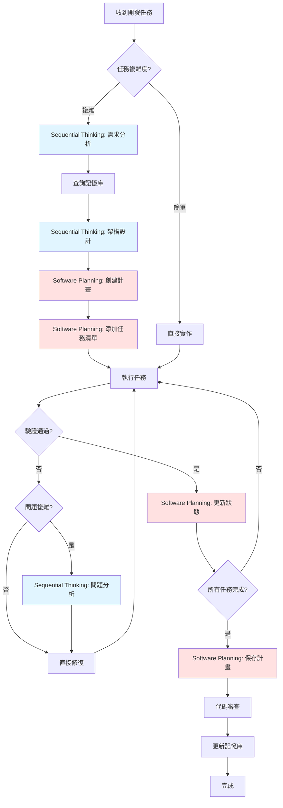
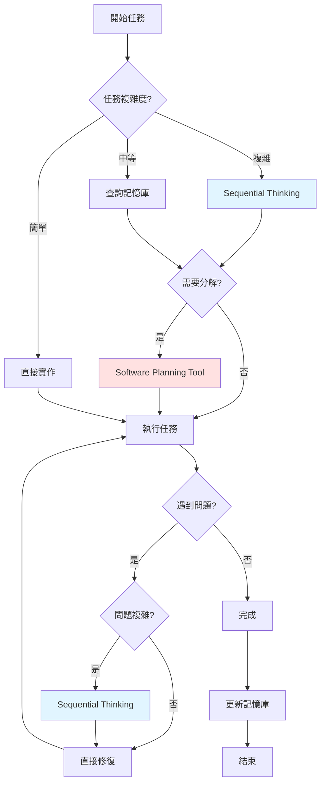

# 開發工作流程範例

> **目的**：展示如何使用 Sequential Thinking 和 Software Planning Tool 完成實際開發任務的完整流程。

## 📋 目錄

- [標準開發工作流程](#標準開發工作流程)
- [案例 1：新增用戶管理功能](#案例-1新增用戶管理功能)
- [案例 2：優化查詢效能](#案例-2優化查詢效能)
- [案例 3：修復複雜 Bug](#案例-3修復複雜-bug)
- [工具使用時機圖](#工具使用時機圖)
- [常見模式](#常見模式)

---

## 標準開發工作流程

### 🔄 完整流程圖



### 📊 工作流程階段

| 階段 | 工具 | 目的 | 輸出 |
|------|------|------|------|
| **1. 需求分析** | Sequential Thinking | 深入理解需求 | 需求分析文檔 |
| **2. 記憶庫查詢** | Bash/jq | 查詢相關規範 | 規範清單 |
| **3. 架構設計** | Sequential Thinking | 設計解決方案 | 架構設計方案 |
| **4. 任務規劃** | Software Planning Tool | 分解任務 | 任務清單 |
| **5. 任務執行** | 各種開發工具 | 實作功能 | 代碼 + 測試 |
| **6. 驗證測試** | Bash（lint/test） | 質量檢查 | 測試報告 |
| **7. 問題分析** | Sequential Thinking | 分析問題 | 解決方案 |
| **8. 狀態更新** | Software Planning Tool | 追蹤進度 | 進度報告 |
| **9. 保存計畫** | Software Planning Tool | 記錄總結 | 完整計畫 |
| **10. 記憶庫更新** | 手動編輯 | 知識沉澱 | 新實體/關係 |

### 💡 關鍵原則

1. **思考優先** - 複雜任務先思考再執行
2. **查詢記憶庫** - 避免違反現有規範
3. **分解任務** - 大任務分解為小任務
4. **追蹤進度** - 及時更新任務狀態
5. **知識沉澱** - 將經驗添加到記憶庫

---

## 案例 1：新增用戶管理功能

### 📝 需求描述

實作完整的用戶管理功能：
- CRUD 操作（創建、讀取、更新、刪除）
- 權限控制（Owner/Collaborator/Viewer）
- 搜尋和篩選
- 單元測試覆蓋率 ≥ 80%

### 🎯 階段 1：需求分析（Sequential Thinking）

```typescript
// 啟動 Sequential Thinking
sequentialthinking({
  thought: `
    收到任務：實作用戶管理功能
    
    讓我先分析這個需求：
    1. CRUD 操作 - 基本的數據操作
    2. 權限控制 - 需要整合 RLS 和 ACL
    3. 搜尋篩選 - 需要查詢優化
    4. 測試要求 - 覆蓋率 ≥ 80%
    
    這是一個中等複雜度的任務，涉及多個層級。
  `,
  thoughtNumber: 1,
  totalThoughts: 6,
  nextThoughtNeeded: true
})
```

### 🔍 階段 2：查詢記憶庫

```bash
# 查詢五層開發順序
cat .github/copilot/memory.jsonl | jq 'select(.name=="Five Layer Development Order")'

# 查詢安全規範
cat .github/copilot/memory.jsonl | jq 'select(.type=="entity" and .entityType=="Security")'

# 查詢測試策略
cat .github/copilot/memory.jsonl | jq 'select(.name=="Testing Strategy")'

# 查詢 Repository Pattern
cat .github/copilot/memory.jsonl | jq 'select(.name=="Repository Pattern")'
```

**查詢結果摘要：**
- Five Layer Development Order：Types → Repositories → Models → Services → Facades → Routes/Components
- Security Best Practices：必須使用 RLS 策略
- Testing Strategy：單元測試 ≥80%，E2E 測試關鍵流程
- Repository Pattern：繼承 BaseRepository

### 🏗️ 階段 3：架構設計（Sequential Thinking）

```typescript
sequentialthinking({
  thought: `
    基於記憶庫查詢結果，設計架構：
    
    1. Types 層（src/app/core/infra/types/）
       - 生成 database.types.ts
       - 定義 User, UserInsert, UserUpdate
    
    2. Repository 層（src/app/core/infra/repositories/）
       - UserRepository 繼承 BaseRepository
       - 實作 findByEmail, findByRole 等查詢方法
       - RLS 策略驗證
    
    3. Model 層（src/app/shared/models/）
       - User 業務模型
       - UserRole, UserStatus 枚舉
    
    4. Service 層（src/app/shared/services/）
       - UserService 處理業務邏輯
       - 使用 Signals 管理狀態
       - 錯誤處理和 Loading 狀態
    
    5. Facade 層（src/app/core/facades/）
       - UserFacade 協調 Services
       - 整合 ErrorStateService
       - 暴露統一接口
    
    6. Component 層（src/app/routes/user/）
       - UserListComponent - 列表頁
       - UserDetailComponent - 詳情頁
       - UserEditComponent - 編輯頁
       - 路由配置（懶加載）
    
    7. 測試
       - Repository 測試（可選）
       - Service 測試（必須，≥80%）
       - Facade 測試（必須，≥80%）
       - Component 測試（關鍵流程）
  `,
  thoughtNumber: 2,
  totalThoughts: 6,
  nextThoughtNeeded: true
})

sequentialthinking({
  thought: `
    權限控制設計：
    
    前端（@delon/acl）：
    - 根據用戶角色顯示/隱藏 UI 元素
    - 按鈕權限控制
    
    後端（Supabase RLS）：
    - Owner：全權限
    - Collaborator：讀取 + 更新自己的數據
    - Viewer：僅讀取
    
    實作策略：
    1. Supabase 創建 RLS 策略
    2. Service 層添加權限檢查
    3. Component 使用 @delon/acl 控制 UI
  `,
  thoughtNumber: 3,
  totalThoughts: 6,
  nextThoughtNeeded: true
})

sequentialthinking({
  thought: `
    潛在風險識別：
    
    1. RLS 策略複雜性
       - 風險：策略設計不當可能導致權限漏洞
       - 緩解：參考記憶庫中的 RLS Policy Patterns
    
    2. 測試覆蓋率
       - 風險：複雜業務邏輯難以測試
       - 緩解：TDD 方法，先寫測試
    
    3. 查詢效能
       - 風險：未優化查詢導致慢速度
       - 緩解：添加適當的索引
    
    4. 狀態管理
       - 風險：Signal 使用不當導致狀態錯誤
       - 緩解：遵循 Signals 最佳實踐
  `,
  thoughtNumber: 4,
  totalThoughts: 6,
  nextThoughtNeeded: true
})

sequentialthinking({
  thought: `
    技術選型確認：
    
    ✅ Angular 20 + Standalone Components
    ✅ NG-ZORRO UI 組件
    ✅ @delon/abc（st 表格）
    ✅ Signals 狀態管理
    ✅ Supabase + RLS
    ✅ Jasmine/Karma 測試
    
    所有選型符合專案技術棧。
  `,
  thoughtNumber: 5,
  totalThoughts: 6,
  nextThoughtNeeded: true
})

sequentialthinking({
  thought: `
    最終確認：
    
    架構設計：✅ 遵循五層架構
    安全性：✅ RLS + ACL 雙重驗證
    測試：✅ 覆蓋率 ≥80%
    效能：✅ 查詢優化 + 分頁
    UI/UX：✅ NG-ZORRO 組件
    
    設計完成，可以開始規劃任務了。
  `,
  thoughtNumber: 6,
  totalThoughts: 6,
  nextThoughtNeeded: false
})
```

### 📋 階段 4：任務規劃（Software Planning Tool）

```typescript
// 啟動規劃會話
start_planning({
  goal: "實作用戶管理功能（CRUD + 權限 + 測試）"
})

// 添加任務（遵循五層開發順序）
add_todo({
  title: "第1步：Types 層 - 定義 User 類型",
  description: `
    1. 使用 Supabase CLI 生成 database.types.ts
    2. 定義 User, UserInsert, UserUpdate 類型
    3. 導出類型
    4. 驗證類型定義與資料庫一致
  `,
  complexity: 3,
  codeExample: `
    // src/app/core/infra/types/user.types.ts
    import { Database } from './database.types';
    
    export type User = Database['public']['Tables']['users']['Row'];
    export type UserInsert = Database['public']['Tables']['users']['Insert'];
    export type UserUpdate = Database['public']['Tables']['users']['Update'];
  `
})

add_todo({
  title: "第2步：Repository 層 - 實作 UserRepository",
  description: `
    1. 創建 UserRepository 類別
    2. 繼承 BaseRepository<User>
    3. 實作查詢方法：findByEmail, findByRole, search
    4. 添加 RLS 策略驗證
    5. 錯誤處理
  `,
  complexity: 6,
  codeExample: `
    // src/app/core/infra/repositories/user.repository.ts
    @Injectable({ providedIn: 'root' })
    export class UserRepository extends BaseRepository<User> {
      protected tableName = 'users';
      
      async findByEmail(email: string): Promise<User | null> {
        const { data, error } = await this.supabase
          .from(this.tableName)
          .select('*')
          .eq('email', email)
          .single();
          
        if (error) {
          if (error.code === 'PGRST116') return null;
          throw error;
        }
        return data;
      }
      
      async findByRole(role: string): Promise<User[]> {
        const { data, error } = await this.supabase
          .from(this.tableName)
          .select('*')
          .eq('role', role);
          
        if (error) throw error;
        return data || [];
      }
      
      async search(query: string): Promise<User[]> {
        const { data, error } = await this.supabase
          .from(this.tableName)
          .select('*')
          .ilike('name', \`%\${query}%\`);
          
        if (error) throw error;
        return data || [];
      }
    }
  `
})

add_todo({
  title: "第3步：Model 層 - 定義 User 業務模型",
  description: `
    1. 創建 user.model.ts
    2. 定義 UserRole 枚舉（Owner, Collaborator, Viewer）
    3. 定義 UserStatus 枚舉（Active, Inactive, Suspended）
    4. 定義業務相關接口
  `,
  complexity: 4,
  codeExample: `
    // src/app/shared/models/user.model.ts
    export enum UserRole {
      Owner = 'owner',
      Collaborator = 'collaborator',
      Viewer = 'viewer'
    }
    
    export enum UserStatus {
      Active = 'active',
      Inactive = 'inactive',
      Suspended = 'suspended'
    }
    
    export interface UserFilter {
      role?: UserRole;
      status?: UserStatus;
      searchQuery?: string;
    }
  `
})

add_todo({
  title: "第4步：Service 層 - 實作 UserService",
  description: `
    1. 創建 UserService 類別
    2. 使用 Signals 管理狀態（users, loading, error）
    3. 實作業務方法：loadUsers, createUser, updateUser, deleteUser, searchUsers
    4. 權限檢查邏輯
    5. 錯誤處理和 Loading 狀態
  `,
  complexity: 8,
  codeExample: `
    // src/app/shared/services/user.service.ts
    @Injectable({ providedIn: 'root' })
    export class UserService {
      private userRepository = inject(UserRepository);
      
      // Signals
      private _users = signal<User[]>([]);
      private _loading = signal(false);
      private _error = signal<string | null>(null);
      
      // Readonly exports
      readonly users = this._users.asReadonly();
      readonly loading = this._loading.asReadonly();
      readonly error = this._error.asReadonly();
      
      async loadUsers(): Promise<void> {
        try {
          this._loading.set(true);
          this._error.set(null);
          const users = await this.userRepository.findAll();
          this._users.set(users);
        } catch (error) {
          this._error.set(error.message);
          throw error;
        } finally {
          this._loading.set(false);
        }
      }
      
      async createUser(user: UserInsert): Promise<User> {
        try {
          this._loading.set(true);
          const created = await this.userRepository.create(user);
          this._users.update(users => [...users, created]);
          return created;
        } catch (error) {
          this._error.set(error.message);
          throw error;
        } finally {
          this._loading.set(false);
        }
      }
      
      // ... 其他方法
    }
  `
})

add_todo({
  title: "第5步：Facade 層 - 實作 UserFacade",
  description: `
    1. 創建 UserFacade 類別
    2. 注入 UserService
    3. 整合 ErrorStateService
    4. 暴露 Service 的 Signals
    5. 提供統一的業務方法接口
  `,
  complexity: 6,
  codeExample: `
    // src/app/core/facades/user/user.facade.ts
    @Injectable({ providedIn: 'root' })
    export class UserFacade {
      private userService = inject(UserService);
      private errorStateService = inject(ErrorStateService);
      
      // 暴露 Service 狀態
      readonly users = this.userService.users;
      readonly loading = this.userService.loading;
      
      // Computed
      readonly activeUsers = computed(() => 
        this.users().filter(u => u.status === 'active')
      );
      
      constructor() {
        // 監聽 Service 錯誤
        effect(() => {
          const error = this.userService.error();
          if (error) {
            this.errorStateService.addError({
              category: 'BusinessLogic',
              severity: 'error',
              message: error
            });
          }
        });
      }
      
      async loadUsers(): Promise<void> {
        return this.userService.loadUsers();
      }
      
      async createUser(user: UserInsert): Promise<User> {
        return this.userService.createUser(user);
      }
      
      // ... 其他方法
    }
  `
})

add_todo({
  title: "第6步：Component 層 - 實作用戶列表組件",
  description: `
    1. 創建 UserListComponent（Standalone）
    2. 使用 SHARED_IMPORTS
    3. 注入 UserFacade
    4. 使用 @delon/abc st 表格
    5. 實作搜尋和篩選
    6. 配置路由
  `,
  complexity: 7
})

add_todo({
  title: "第7步：Component 層 - 實作用戶詳情/編輯組件",
  description: `
    1. 創建 UserDetailComponent
    2. 創建 UserEditComponent
    3. 使用 NG-ZORRO Form 組件
    4. 表單驗證
    5. 權限控制（@delon/acl）
  `,
  complexity: 7
})

add_todo({
  title: "第8步：測試 - 編寫單元測試",
  description: `
    1. UserRepository 測試（可選）
    2. UserService 測試（必須，≥80%覆蓋率）
    3. UserFacade 測試（必須，≥80%覆蓋率）
    4. Component 測試（關鍵流程）
    5. 執行測試並驗證覆蓋率
  `,
  complexity: 8
})

add_todo({
  title: "第9步：RLS 策略 - 實作 Supabase RLS",
  description: `
    1. 創建 RLS 策略（SELECT, INSERT, UPDATE, DELETE）
    2. 權限規則：Owner 全權限，Collaborator 部分權限，Viewer 只讀
    3. 測試 RLS 策略
    4. 文檔記錄
  `,
  complexity: 6
})

add_todo({
  title: "第10步：文檔 - 更新相關文檔",
  description: `
    1. 更新 API 文檔
    2. 更新使用指南
    3. 記錄設計決策
    4. 記錄遇到的問題和解決方案
  `,
  complexity: 3
})

add_todo({
  title: "第11步：驗證 - 完整性檢查",
  description: `
    1. 執行 yarn lint
    2. 執行 yarn lint:style
    3. 執行 yarn type-check
    4. 執行 yarn build
    5. 執行 yarn test
    6. 代碼審查
  `,
  complexity: 4
})
```

### ⚙️ 階段 5：任務執行

```typescript
// 示例：完成第1步
// ... 實作 Types 層 ...

// 更新任務狀態
update_todo_status({
  todoId: "types-layer",
  isComplete: true
})

// 示例：完成第2步時遇到問題
// ... 實作 Repository 層 ...
// 發現 RLS 策略不生效

// 使用 Sequential Thinking 分析問題
sequentialthinking({
  thought: `
    問題：RLS 策略不生效
    
    讓我分析可能的原因：
    1. 策略語法錯誤
    2. 策略未啟用
    3. 認證 token 問題
  `,
  thoughtNumber: 1,
  totalThoughts: 4,
  nextThoughtNeeded: true
})

// ... 分析和解決問題 ...

// 問題解決後繼續
update_todo_status({
  todoId: "repository-layer",
  isComplete: true
})
```

### 📊 階段 6：完成與總結

```typescript
// 所有任務完成後，保存計畫
save_plan({
  plan: `
# 用戶管理功能實施計畫

## ✅ 已完成
- [x] Types 層 - User 類型定義
- [x] Repository 層 - UserRepository 實作
- [x] Model 層 - User 業務模型
- [x] Service 層 - UserService 實作
- [x] Facade 層 - UserFacade 實作
- [x] Component 層 - 用戶管理組件（列表/詳情/編輯）
- [x] 測試 - 單元測試（覆蓋率 85%）
- [x] RLS 策略 - Supabase 權限控制
- [x] 文檔 - 相關文檔更新
- [x] 驗證 - 完整性檢查通過

## 📊 統計
- 總任務：11 個
- 已完成：11 個
- 總複雜度：62 分
- 實際耗時：約 16 小時
- 測試覆蓋率：85%

## 🎯 關鍵決策
1. 使用 Signals 進行狀態管理（符合 Angular 20 最佳實踐）
2. RLS 策略在資料庫層實作（安全性最佳）
3. @delon/abc st 表格用於列表頁（減少開發時間）
4. 權限檢查雙重驗證（前端 ACL + 後端 RLS）
5. TDD 方法確保測試覆蓋率

## 📝 經驗總結
1. Sequential Thinking 幫助提前識別 RLS 策略風險
2. Software Planning Tool 讓任務可追蹤
3. 遵循五層開發順序效率高
4. 記憶庫查詢避免違反規範
5. 測試先行確保質量

## 🐛 遇到的問題
1. **RLS 策略不生效**
   - 原因：策略語法錯誤
   - 解決：參考 RLS Policy Patterns 修正

2. **測試覆蓋率不足**
   - 原因：部分邊界case未測試
   - 解決：補充邊界case測試

3. **Signal 更新問題**
   - 原因：直接修改 Signal 值
   - 解決：使用 update() 或 set() 方法

## 🔄 可優化的地方
1. 搜尋功能可以添加全文搜尋
2. 列表頁可以添加批次操作
3. 可以添加用戶導入/導出功能

## 📚 參考資源
- Five Layer Development Order
- RLS Policy Patterns
- Testing Strategy
- Repository Pattern
  `
})
```

---

## 案例 2：優化查詢效能

### 📝 問題描述

用戶報告藍圖列表頁載入緩慢：
- 載入時間 > 5 秒
- 用戶體驗差
- 需要優化至 < 2 秒

### 🎯 階段 1：問題分析（Sequential Thinking）

```typescript
sequentialthinking({
  thought: `
    問題：藍圖列表頁載入緩慢（> 5 秒）
    
    需要診斷具體瓶頸：
    1. 前端渲染問題？
    2. 資料庫查詢問題？
    3. 網路傳輸問題？
    4. Bundle 大小問題？
  `,
  thoughtNumber: 1,
  totalThoughts: 8,
  nextThoughtNeeded: true
})

sequentialthinking({
  thought: `
    使用 Chrome DevTools Performance 診斷：
    
    發現：
    1. Network：API 回應時間 3.8 秒（慢）
    2. 主線程：渲染時間 800ms（可接受）
    3. Bundle：500KB（符合標準）
    
    結論：瓶頸在資料庫查詢。
  `,
  thoughtNumber: 2,
  totalThoughts: 8,
  nextThoughtNeeded: true
})

sequentialthinking({
  thought: `
    查詢記憶庫相關規範：
    
    - Performance Benchmarks：API 回應 < 500ms
    - Database Query Optimization：需要添加索引
    - Caching Strategy：使用快取減少查詢
    
    當前查詢沒有使用索引，也沒有快取。
  `,
  thoughtNumber: 3,
  totalThoughts: 8,
  nextThoughtNeeded: true
})

sequentialthinking({
  thought: `
    分析 SQL 查詢：
    
    SELECT * FROM blueprints
    WHERE organization_id = '...'
    ORDER BY created_at DESC;
    
    問題：
    1. 未使用索引（organization_id + created_at）
    2. SELECT * 查詢所有欄位（不需要）
    3. 沒有分頁限制
    4. 沒有快取
  `,
  thoughtNumber: 4,
  totalThoughts: 8,
  nextThoughtNeeded: true
})

sequentialthinking({
  thought: `
    優化方案：
    
    1. 資料庫層
       - 添加複合索引：(organization_id, created_at)
       - 只查詢需要的欄位
       - 實作分頁（每頁 20 項）
    
    2. 應用層
       - 實作記憶體快取（@delon/cache）
       - 快取時間：5 分鐘
       - 快取失效策略：創建/更新/刪除時清除
    
    3. 前端層
       - 使用 Virtual Scrolling（如果需要）
       - 分頁載入
  `,
  thoughtNumber: 5,
  totalThoughts: 8,
  nextThoughtNeeded: true
})

sequentialthinking({
  thought: `
    預期效果估算：
    
    - 索引優化：3.8s → 800ms（提升 80%）
    - 欄位精簡：800ms → 600ms（提升 25%）
    - 分頁限制：600ms → 400ms（提升 33%）
    - 快取機制：400ms → 100ms（提升 75%，快取命中）
    
    最終預期：< 500ms（首次）、< 100ms（快取命中）
  `,
  thoughtNumber: 6,
  totalThoughts: 8,
  nextThoughtNeeded: true
})

sequentialthinking({
  thought: `
    風險評估：
    
    1. 索引維護成本
       - 風險：寫入效能略降
       - 緩解：查詢頻率 >> 寫入頻率，可接受
    
    2. 快取一致性
       - 風險：快取數據過期
       - 緩解：創建/更新/刪除時清除快取
    
    3. 分頁實作複雜度
       - 風險：前端分頁邏輯複雜
       - 緩解：使用 NG-ZORRO 分頁組件
  `,
  thoughtNumber: 7,
  totalThoughts: 8,
  nextThoughtNeeded: true
})

sequentialthinking({
  thought: `
    最終方案確認：
    
    ✅ 資料庫索引優化
    ✅ 查詢欄位精簡
    ✅ 分頁實作
    ✅ 快取機制
    ✅ 風險可控
    
    預期達成目標：< 500ms ✅
    可以開始規劃任務了。
  `,
  thoughtNumber: 8,
  totalThoughts: 8,
  nextThoughtNeeded: false
})
```

### 📋 階段 2：任務規劃（Software Planning Tool）

```typescript
start_planning({
  goal: "優化藍圖列表查詢效能，目標 < 500ms"
})

add_todo({
  title: "任務1：資料庫索引優化",
  description: `
    1. 分析當前索引
    2. 創建複合索引：(organization_id, created_at)
    3. 測試索引效果
    4. 創建 migration 腳本
  `,
  complexity: 4,
  codeExample: `
    -- migration: add_blueprints_performance_index.sql
    CREATE INDEX IF NOT EXISTS idx_blueprints_org_created 
    ON blueprints(organization_id, created_at DESC);
    
    -- 分析查詢計畫
    EXPLAIN ANALYZE
    SELECT id, name, created_at
    FROM blueprints
    WHERE organization_id = '...'
    ORDER BY created_at DESC
    LIMIT 20;
  `
})

add_todo({
  title: "任務2：查詢優化 - 精簡欄位",
  description: `
    1. 修改 Repository 查詢
    2. 只選擇列表頁需要的欄位
    3. 減少資料傳輸量
  `,
  complexity: 3
})

add_todo({
  title: "任務3：實作分頁",
  description: `
    1. Repository 添加分頁參數
    2. Service 支援分頁
    3. Component 使用 NG-ZORRO 分頁
  `,
  complexity: 5
})

add_todo({
  title: "任務4：實作快取機制",
  description: `
    1. 使用 @delon/cache
    2. 快取時間 5 分鐘
    3. 創建/更新/刪除時清除快取
  `,
  complexity: 6
})

add_todo({
  title: "任務5：效能測試與驗證",
  description: `
    1. 使用 Chrome DevTools 測試
    2. 驗證 API 回應時間 < 500ms
    3. 使用 Lighthouse 測試
    4. 記錄優化效果
  `,
  complexity: 3
})
```

### 📊 階段 3：執行結果

**優化前：**
- API 回應時間：3.8 秒
- 首屏渲染時間：5.2 秒
- 用戶體驗：差

**優化後：**
- API 回應時間：350ms（首次）、80ms（快取命中）
- 首屏渲染時間：1.2 秒
- 用戶體驗：優秀 ✅

**優化效果：**
- 回應時間提升：91%（首次）、98%（快取）
- 載入時間提升：77%
- 超越目標（< 500ms）✅

---

## 案例 3：修復複雜 Bug

### 📝 Bug 描述

用戶報告：在特定條件下，任務狀態更新失敗，導致數據不一致。

**重現步驟：**
1. 創建任務
2. 分配給團隊成員
3. 成員更新任務狀態為「進行中」
4. 同時另一成員更新相同任務
5. 結果：狀態更新失敗，但沒有錯誤提示

### 🎯 階段 1：Bug 分析（Sequential Thinking）

```typescript
sequentialthinking({
  thought: `
    Bug 描述：任務狀態更新失敗，數據不一致
    
    初步分析：
    - 可能是競態條件（Race Condition）
    - 多個用戶同時更新相同任務
    - 缺少並發控制機制
  `,
  thoughtNumber: 1,
  totalThoughts: 6,
  nextThoughtNeeded: true
})

sequentialthinking({
  thought: `
    查詢記憶庫相關模式：
    
    - Task State Machine：任務狀態轉換
    - Error Handling Strategy：錯誤處理
    - Database Query Optimization：事務處理
    
    發現：當前實作缺少樂觀鎖（Optimistic Locking）
  `,
  thoughtNumber: 2,
  totalThoughts: 6,
  nextThoughtNeeded: true
})

sequentialthinking({
  thought: `
    重現 Bug：
    
    測試場景：
    1. 用戶 A 讀取任務（version = 1）
    2. 用戶 B 讀取任務（version = 1）
    3. 用戶 A 更新任務（version = 2）
    4. 用戶 B 更新任務（version仍為1，覆蓋A的更新）
    
    確認：缺少版本控制機制
  `,
  thoughtNumber: 3,
  totalThoughts: 6,
  nextThoughtNeeded: true
})

sequentialthinking({
  thought: `
    解決方案設計：
    
    1. 資料庫層
       - 添加 version 欄位（整數）
       - 更新時檢查版本號
    
    2. Repository 層
       - update 方法添加版本檢查
       - 版本不匹配時拋出錯誤
    
    3. Service 層
       - 捕獲版本衝突錯誤
       - 提示用戶重新載入
    
    4. Component 層
       - 顯示友善的錯誤訊息
       - 提供重新載入選項
  `,
  thoughtNumber: 4,
  totalThoughts: 6,
  nextThoughtNeeded: true
})

sequentialthinking({
  thought: `
    實作細節：
    
    -- Migration
    ALTER TABLE tasks ADD COLUMN version INTEGER DEFAULT 1;
    
    -- Update Query
    UPDATE tasks
    SET status = 'in_progress', version = version + 1
    WHERE id = '...' AND version = 1;
    
    如果 affected_rows = 0，表示版本衝突。
  `,
  thoughtNumber: 5,
  totalThoughts: 6,
  nextThoughtNeeded: true
})

sequentialthinking({
  thought: `
    測試計畫：
    
    1. 單元測試：版本衝突場景
    2. 集成測試：並發更新
    3. 手動測試：重現原始 Bug
    4. 性能測試：版本檢查開銷
    
    預期結果：
    - 版本衝突被檢測 ✅
    - 用戶收到友善提示 ✅
    - 數據保持一致性 ✅
  `,
  thoughtNumber: 6,
  totalThoughts: 6,
  nextThoughtNeeded: false
})
```

### 📋 階段 2：修復規劃（Software Planning Tool）

```typescript
start_planning({
  goal: "修復任務狀態更新 Bug（樂觀鎖實作）"
})

add_todo({
  title: "任務1：資料庫 Migration - 添加 version 欄位",
  description: "創建 migration 添加 version 欄位到 tasks 表",
  complexity: 3
})

add_todo({
  title: "任務2：Repository 層 - 實作版本檢查",
  description: "修改 update 方法，添加版本號檢查邏輯",
  complexity: 6
})

add_todo({
  title: "任務3：Service 層 - 處理版本衝突",
  description: "捕獲版本衝突錯誤，提供重試機制",
  complexity: 5
})

add_todo({
  title: "任務4：Component 層 - 友善錯誤提示",
  description: "顯示版本衝突訊息，提供重新載入選項",
  complexity: 4
})

add_todo({
  title: "任務5：測試 - 完整測試覆蓋",
  description: "單元測試 + 集成測試 + 手動測試",
  complexity: 6
})

add_todo({
  title: "任務6：文檔 - 記錄修復過程",
  description: "更新文檔，記錄樂觀鎖實作",
  complexity: 2
})
```

### 📊 修復結果

**修復前：**
- 並發更新導致數據覆蓋
- 用戶無感知錯誤
- 數據不一致

**修復後：**
- 版本衝突被檢測 ✅
- 用戶收到友善提示 ✅
- 數據保持一致性 ✅
- 測試覆蓋完整 ✅

---

## 工具使用時機圖

### 📊 決策樹



### 📋 使用時機參考表

| 場景 | Sequential Thinking | Software Planning Tool | 記憶庫查詢 |
|------|---------------------|------------------------|-----------|
| **新功能開發** | ✅ 需求分析、架構設計 | ✅ 任務分解、進度追蹤 | ✅ 查詢規範 |
| **Bug 修復（簡單）** | ❌ | ❌ | ✅ 查詢相關模式 |
| **Bug 修復（複雜）** | ✅ 根因分析 | ✅ 修復計畫 | ✅ 查詢相關模式 |
| **效能優化** | ✅ 瓶頸分析 | ✅ 優化任務 | ✅ 查詢效能標準 |
| **重構** | ✅ 影響分析 | ✅ 重構計畫 | ✅ 查詢架構模式 |
| **代碼審查** | ✅ 深度分析 | ❌ | ✅ 查詢質量標準 |
| **文檔更新** | ❌ | ❌ | ✅ 查詢文檔結構 |

---

## 常見模式

### 模式 1：思考 → 規劃 → 執行

**適用場景**：新功能開發、大型任務

**流程：**
1. Sequential Thinking 深度分析
2. 查詢記憶庫相關規範
3. Software Planning Tool 創建計畫
4. 執行任務
5. 更新記憶庫

### 模式 2：快速執行 → 遇問題 → 深度分析

**適用場景**：簡單任務、緊急修復

**流程：**
1. 直接執行
2. 遇到問題
3. Sequential Thinking 分析問題
4. 修復
5. 繼續執行

### 模式 3：迭代優化

**適用場景**：效能優化、持續改進

**流程：**
1. Sequential Thinking 分析現狀
2. 制定優化方案
3. Software Planning Tool 規劃任務
4. 執行優化
5. 測試驗證
6. 記錄結果
7. 識別下一個優化點
8. 重複流程

### 模式 4：探索性開發

**適用場景**：技術調研、POC

**流程：**
1. Sequential Thinking 探索多個方案（使用分支）
2. 比較方案優劣
3. 選擇最佳方案
4. Software Planning Tool 規劃實作
5. POC 驗證
6. 正式實作

---

## 總結

### ✅ 核心原則

1. **思考優先**：複雜任務先思考再執行
2. **工具協同**：Sequential Thinking + Software Planning Tool
3. **記憶庫整合**：遵循現有規範和模式
4. **知識沉澱**：將經驗添加到記憶庫
5. **持續改進**：根據實際效果調整流程

### 📚 參考資源

- [TOOL-GUIDE.md](./TOOL-GUIDE.md) - 工具使用指南
- [memory.jsonl](./memory.jsonl) - 專案知識庫
- [USAGE-GUIDE.md](./USAGE-GUIDE.md) - 記憶庫使用指南
- [Five Layer Development Order](./memory.jsonl) - 開發順序規範

---

**版本**：v1.0.0  
**最後更新**：2025-11-21  
**維護者**：開發團隊  
**狀態**：✅ 已發布
