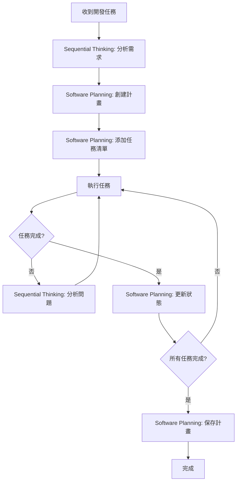

# AI 工具使用指南

> **目的**：為 AI 助手提供 Sequential Thinking 和 Software Planning Tool 的完整使用指南，提升開發效率和質量。

## 📋 目錄

- [概述](#概述)
- [Sequential Thinking Tool](#sequential-thinking-tool)
- [Software Planning Tool](#software-planning-tool)
- [工具整合使用](#工具整合使用)
- [最佳實踐](#最佳實踐)
- [實際案例](#實際案例)
- [常見問題](#常見問題)

---

## 概述

本指南介紹兩個核心 AI 工具，旨在提升開發流程的系統性和可追蹤性：

1. **Sequential Thinking Tool**：用於複雜問題的深度分析和結構化思考
2. **Software Planning Tool**：用於任務規劃、分解和進度追蹤

這兩個工具應該協同使用，形成「思考 → 規劃 → 執行」的完整工作流程。

---

## Sequential Thinking Tool

### 🎯 什麼是 Sequential Thinking

Sequential Thinking Tool 是一個結構化思考工具，允許 AI 助手：
- 將複雜問題分解為多個思考步驟
- 在思考過程中進行修正和分支
- 記錄完整的思考鏈以供審查
- 支援假設驗證和迭代改進

### 📌 何時使用

**必須使用的場景：**
- ✅ 複雜的架構設計決策
- ✅ 多步驟的問題解決方案
- ✅ 需要深度分析的技術選型
- ✅ 大型功能的設計規劃
- ✅ 複雜 Bug 的根因分析

**不需要使用的場景：**
- ❌ 簡單的代碼修改
- ❌ 直接的文檔更新
- ❌ 明確的錯誤修復

### 🛠️ 如何使用

**工具調用範例：**

```typescript
// 基本使用
sequentialthinking({
  thought: "讓我分析這個架構設計問題...",
  nextThoughtNeeded: true,
  thoughtNumber: 1,
  totalThoughts: 5
})

// 修正前一個想法
sequentialthinking({
  thought: "我需要修正第2步的分析，因為...",
  nextThoughtNeeded: true,
  thoughtNumber: 4,
  totalThoughts: 6,
  isRevision: true,
  revisesThought: 2
})

// 創建分支探索不同方案
sequentialthinking({
  thought: "讓我探索方案 B 的可能性...",
  nextThoughtNeeded: true,
  thoughtNumber: 5,
  totalThoughts: 8,
  branchFromThought: 3,
  branchId: "alternative-b"
})
```

**參數說明：**

| 參數 | 類型 | 必填 | 說明 |
|-----|------|------|------|
| `thought` | string | ✅ | 當前的思考步驟內容 |
| `nextThoughtNeeded` | boolean | ✅ | 是否需要下一步思考 |
| `thoughtNumber` | number | ✅ | 當前思考步驟編號 |
| `totalThoughts` | number | ✅ | 預計總思考步驟數（可調整） |
| `isRevision` | boolean | ❌ | 是否為修正前一個想法 |
| `revisesThought` | number | ❌ | 修正哪個步驟（需 isRevision=true） |
| `branchFromThought` | number | ❌ | 從哪個步驟分支 |
| `branchId` | string | ❌ | 分支識別符 |
| `needsMoreThoughts` | boolean | ❌ | 是否需要更多步驟 |

### 📝 思考模式範例

**線性思考模式：**
```text
思考1 → 思考2 → 思考3 → 思考4 → 結論
```

**修正模式：**
```text
思考1 → 思考2 → 思考3 → [發現問題] → 修正思考2 → 新思考4 → 結論
```

**分支探索模式：**
```text
思考1 → 思考2 → 思考3
                    ├─ 分支A: 思考4a → 思考5a
                    └─ 分支B: 思考4b → 思考5b → 選擇B
```

### 💡 最佳實踐

1. **初始估計要保守**
   ```typescript
   // ✅ 好的做法：保守估計，允許調整
   totalThoughts: 5  // 可以在過程中增加到 8

   // ❌ 避免：過度樂觀
   totalThoughts: 2  // 可能不足以深入分析
   ```

2. **及時修正錯誤**
   ```typescript
   // ✅ 發現錯誤時立即修正
   sequentialthinking({
     thought: "剛才的分析有誤，因為...",
     isRevision: true,
     revisesThought: 3
   })
   ```

3. **使用分支探索方案**
   ```typescript
   // ✅ 探索多個可能方案
   sequentialthinking({
     thought: "方案 A：使用微服務架構...",
     branchFromThought: 2,
     branchId: "microservices"
   })
   ```

4. **記錄關鍵決策理由**
   ```typescript
   // ✅ 明確記錄為什麼選擇某個方案
   sequentialthinking({
     thought: "選擇方案 B，因為：1. 更簡單 2. 維護成本低 3. 滿足當前需求",
     nextThoughtNeeded: false  // 思考完成
   })
   ```

---

## Software Planning Tool

### 🎯 什麼是 Software Planning Tool

Software Planning Tool 是一個任務管理工具，允許 AI 助手：
- 啟動規劃會話
- 創建和管理任務清單
- 追蹤任務完成狀態
- 保存完整的實施計畫

### 📌 何時使用

**必須使用的場景：**
- ✅ 開發新功能
- ✅ 大型任務分解
- ✅ 多步驟的重構
- ✅ 需要團隊協作的任務
- ✅ 複雜的問題修復

**不需要使用的場景：**
- ❌ 單一文件的修改
- ❌ 簡單的文檔更新
- ❌ 明確且簡單的任務

### 🛠️ 如何使用

**1. 啟動規劃會話**

```typescript
start_planning({
  goal: "實作用戶管理功能，包含 CRUD 操作和權限控制"
})
```

**2. 添加任務**

```typescript
add_todo({
  title: "創建 User Repository",
  description: `
    實作 UserRepository 類別：
    - 繼承 BaseRepository
    - 實作 CRUD 方法
    - 添加權限檢查
  `,
  complexity: 6,
  codeExample: `
    export class UserRepository extends BaseRepository<User> {
      protected tableName = 'users';
      
      async findWithPermissions(userId: string): Promise<User | null> {
        // 實作邏輯
      }
    }
  `
})
```

**3. 更新任務狀態**

```typescript
update_todo_status({
  todoId: "1763723897915",
  isComplete: true
})
```

**4. 查看所有任務**

```typescript
get_todos()
```

**5. 保存計畫**

```typescript
save_plan({
  plan: `
# 用戶管理功能實施計畫

## 已完成
- [x] 創建 User Types
- [x] 創建 User Repository
- [x] 創建 User Service

## 進行中
- [ ] 創建 User Facade
- [ ] 創建 User Components
- [ ] 編寫單元測試
  `
})
```

**6. 移除任務**

```typescript
remove_todo({
  todoId: "1763723897915"
})
```

### 📊 複雜度評估指南

| 複雜度 | 說明 | 預計時間 | 範例 |
|--------|------|---------|------|
| 1-2 | 非常簡單 | < 30 分鐘 | 簡單的型別定義、配置修改 |
| 3-4 | 簡單 | 30分鐘 - 1小時 | 基本 CRUD Repository |
| 5-6 | 中等 | 1-2 小時 | Service 層實作、簡單 Facade |
| 7-8 | 複雜 | 2-4 小時 | 複雜的業務邏輯、多個整合點 |
| 9-10 | 非常複雜 | > 4 小時 | 架構設計、大型重構 |

### 💡 最佳實踐

1. **任務要具體且可執行**
   ```typescript
   // ✅ 好的任務描述
   add_todo({
     title: "實作 UserRepository.findByEmail 方法",
     description: "添加根據 email 查詢用戶的方法，包含 RLS 策略驗證",
     complexity: 4
   })

   // ❌ 避免：過於籠統
   add_todo({
     title: "處理用戶相關功能",
     description: "做一些用戶的事情",
     complexity: 5
   })
   ```

2. **設定合理的複雜度**
   ```typescript
   // ✅ 根據實際工作量評估
   add_todo({
     title: "創建完整的用戶管理 Service",
     description: "包含狀態管理、錯誤處理、多個業務方法",
     complexity: 7  // 合理評估為複雜任務
   })
   ```

3. **包含程式碼範例**
   ```typescript
   // ✅ 提供具體的實作參考
   add_todo({
     title: "實作 UserService",
     codeExample: `
       @Injectable({ providedIn: 'root' })
       export class UserService {
         private userRepository = inject(UserRepository);
         users = signal<User[]>([]);
         
         async loadUsers(): Promise<void> {
           // 實作邏輯
         }
       }
     `,
     complexity: 6
   })
   ```

4. **定期更新任務狀態**
   ```typescript
   // ✅ 完成任務後立即更新
   update_todo_status({
     todoId: "task-123",
     isComplete: true
   })
   ```

---

## 工具整合使用

### 🔄 標準工作流程



### 📋 工作流程步驟

**步驟 1：深度分析（Sequential Thinking）**

```typescript
// 使用 Sequential Thinking 分析需求
sequentialthinking({
  thought: "讓我分析用戶管理功能的需求...",
  thoughtNumber: 1,
  totalThoughts: 6,
  nextThoughtNeeded: true
})
```

**步驟 2：啟動規劃（Software Planning Tool）**

```typescript
// 基於分析結果，啟動規劃會話
start_planning({
  goal: "實作用戶管理功能（CRUD + 權限 + 測試）"
})
```

**步驟 3：創建任務清單（Software Planning Tool）**

```typescript
// 根據五層開發順序添加任務
add_todo({
  title: "第1步：Types 層 - 定義 User 類型",
  complexity: 3
})

add_todo({
  title: "第2步：Repository 層 - 實作 UserRepository",
  complexity: 5
})

add_todo({
  title: "第3步：Model 層 - 定義 User 業務模型",
  complexity: 4
})

// ... 更多任務
```

**步驟 4：執行與追蹤**

```typescript
// 完成任務後更新狀態
update_todo_status({
  todoId: "task-types",
  isComplete: true
})
```

**步驟 5：遇到問題時深度分析（Sequential Thinking）**

```typescript
// 遇到複雜問題時，使用 Sequential Thinking 分析
sequentialthinking({
  thought: "Repository 實作遇到問題，讓我分析原因...",
  thoughtNumber: 1,
  totalThoughts: 4,
  nextThoughtNeeded: true
})
```

**步驟 6：完成後保存計畫（Software Planning Tool）**

```typescript
// 保存最終計畫
save_plan({
  plan: "完整的實施計畫與總結"
})
```

### 🎯 與記憶庫整合

**查詢記憶庫以輔助思考：**

```bash
# 在使用 Sequential Thinking 前，先查詢相關知識
cat .github/copilot/memory.jsonl | jq 'select(.name=="Five Layer Development Order")'

# 在規劃任務時，參考開發標準
cat .github/copilot/memory.jsonl | jq 'select(.type=="entity" and .entityType=="Development Standard")'

# 檢查工具使用模式
cat .github/copilot/memory.jsonl | jq 'select(.name=="Tool-Assisted Development Pattern")'
```

**完整整合範例：**

```typescript
// 1. 查詢記憶庫
const developmentOrder = await queryMemory("Five Layer Development Order");

// 2. 使用 Sequential Thinking 分析
sequentialthinking({
  thought: `根據記憶庫中的五層開發順序：${developmentOrder}，
            讓我規劃用戶管理功能的實作步驟...`,
  thoughtNumber: 1,
  totalThoughts: 5,
  nextThoughtNeeded: true
})

// 3. 基於分析結果創建計畫
start_planning({
  goal: "遵循五層開發順序實作用戶管理功能"
})

// 4. 添加任務（按照五層順序）
add_todo({ title: "Types 層", complexity: 3 })
add_todo({ title: "Repository 層", complexity: 5 })
// ... 其他層級
```

---

## 最佳實踐

### ✅ DO - 應該做的

1. **複雜任務必須使用 Sequential Thinking**
   - 先思考，再執行
   - 記錄完整的思考過程
   - 允許修正和調整

2. **大型任務必須使用 Software Planning Tool**
   - 分解為可管理的子任務
   - 設定合理的複雜度
   - 追蹤執行進度

3. **兩個工具協同使用**
   - Sequential Thinking 用於分析和設計
   - Software Planning Tool 用於規劃和執行
   - 形成完整的開發閉環

4. **與記憶庫整合**
   - 查詢相關規範和模式
   - 遵循已定義的開發順序
   - 記錄新的模式和實踐

5. **及時更新狀態**
   - 完成任務後立即標記
   - 保持計畫與實際同步
   - 記錄遇到的問題和解決方案

### ❌ DON'T - 應該避免的

1. **不要跳過思考直接執行**
   ```typescript
   // ❌ 錯誤：直接開始編碼
   // 開始實作用戶管理功能...

   // ✅ 正確：先使用 Sequential Thinking 分析
   sequentialthinking({
     thought: "讓我先分析用戶管理功能的需求和架構..."
   })
   ```

2. **不要創建過於龐統的任務**
   ```typescript
   // ❌ 錯誤：任務太大且不具體
   add_todo({
     title: "完成用戶功能",
     complexity: 10
   })

   // ✅ 正確：拆分為具體的子任務
   add_todo({ title: "Types 層 - User 類型", complexity: 3 })
   add_todo({ title: "Repository 層 - UserRepository", complexity: 5 })
   ```

3. **不要忽略記憶庫中的規範**
   ```typescript
   // ❌ 錯誤：未查詢記憶庫，可能違反規範
   // 直接開始實作...

   // ✅ 正確：先查詢相關規範
   cat memory.jsonl | jq 'select(.name=="Five Layer Development Order")'
   ```

4. **不要過度估計自己的能力**
   ```typescript
   // ❌ 錯誤：totalThoughts 設定太少
   sequentialthinking({
     thought: "這是個複雜的架構問題...",
     totalThoughts: 2  // 明顯不足
   })

   // ✅ 正確：保守估計，允許調整
   sequentialthinking({
     thought: "這是個複雜的架構問題...",
     totalThoughts: 6  // 可以在過程中增加
   })
   ```

5. **不要忘記保存最終計畫**
   ```typescript
   // ❌ 錯誤：完成後未保存計畫
   // 任務完成了，直接結束

   // ✅ 正確：保存完整計畫以供參考
   save_plan({
     plan: "完整的實施計畫，包含已完成和未完成的任務"
   })
   ```

---

## 實際案例

### 案例 1：新增用戶管理功能

**需求：** 實作完整的用戶管理功能，包含 CRUD 操作和權限控制。

**步驟 1：使用 Sequential Thinking 分析**

```typescript
// 思考 1：理解需求
sequentialthinking({
  thought: `
    讓我分析用戶管理功能的需求：
    1. CRUD 操作（創建、讀取、更新、刪除）
    2. 權限控制（誰可以操作什麼）
    3. 需要查詢記憶庫中的相關規範
  `,
  thoughtNumber: 1,
  totalThoughts: 5,
  nextThoughtNeeded: true
})

// 思考 2：查詢記憶庫
sequentialthinking({
  thought: `
    查詢記憶庫發現：
    - Five Layer Development Order：必須遵循五層開發順序
    - Security Best Practices：需要 RLS 策略
    - Testing Strategy：單元測試覆蓋率 ≥80%
  `,
  thoughtNumber: 2,
  totalThoughts: 5,
  nextThoughtNeeded: true
})

// 思考 3：確認架構設計
sequentialthinking({
  thought: `
    架構設計：
    1. Types 層：定義 User, UserInsert, UserUpdate 類型
    2. Repository 層：UserRepository（CRUD + RLS）
    3. Model 層：User 業務模型
    4. Service 層：UserService（業務邏輯 + Signals）
    5. Facade 層：UserFacade（協調 + 錯誤處理）
    6. Component 層：用戶列表、詳情、編輯組件
    7. 測試：單元測試 + E2E 測試
  `,
  thoughtNumber: 3,
  totalThoughts: 5,
  nextThoughtNeeded: true
})

// 思考 4：識別風險和挑戰
sequentialthinking({
  thought: `
    潛在風險：
    1. RLS 策略複雜性（需要仔細設計）
    2. 權限檢查邏輯（Owner/Collaborator/Viewer）
    3. 測試覆蓋率要求（需要完整的測試計畫）
    
    解決方案：
    1. 參考記憶庫中的 RLS Policy Patterns
    2. 使用 Branch Permission Rules 作為參考
    3. 編寫詳細的測試計畫
  `,
  thoughtNumber: 4,
  totalThoughts: 5,
  nextThoughtNeeded: true
})

// 思考 5：確認最終方案
sequentialthinking({
  thought: `
    最終方案確認：
    - 遵循五層開發順序 ✅
    - 實作 RLS 策略 ✅
    - 權限檢查邏輯 ✅
    - 單元測試 ≥80% ✅
    - 符合企業標準 ✅
    
    可以開始規劃任務了。
  `,
  thoughtNumber: 5,
  totalThoughts: 5,
  nextThoughtNeeded: false
})
```

**步驟 2：使用 Software Planning Tool 規劃**

```typescript
// 啟動規劃會話
start_planning({
  goal: "實作用戶管理功能（CRUD + 權限 + 測試）"
})

// 添加任務（按照五層開發順序）
add_todo({
  title: "第1步：Types 層 - 定義 User 類型",
  description: `
    1. 使用 Supabase CLI 生成 database.types.ts
    2. 定義 User, UserInsert, UserUpdate 類型
    3. 導出類型
  `,
  complexity: 3,
  codeExample: `
    export type User = Database['public']['Tables']['users']['Row'];
    export type UserInsert = Database['public']['Tables']['users']['Insert'];
    export type UserUpdate = Database['public']['Tables']['users']['Update'];
  `
})

add_todo({
  title: "第2步：Repository 層 - 實作 UserRepository",
  description: `
    1. 創建 UserRepository 類別
    2. 繼承 BaseRepository<User>
    3. 實作 findByEmail 方法
    4. 添加 RLS 策略驗證
  `,
  complexity: 6,
  codeExample: `
    @Injectable({ providedIn: 'root' })
    export class UserRepository extends BaseRepository<User> {
      protected tableName = 'users';
      
      async findByEmail(email: string): Promise<User | null> {
        const { data, error } = await this.supabase
          .from(this.tableName)
          .select('*')
          .eq('email', email)
          .single();
          
        if (error) throw error;
        return data;
      }
    }
  `
})

add_todo({
  title: "第3步：Model 層 - 定義 User 業務模型",
  description: `
    1. 創建 user.model.ts
    2. 定義業務相關枚舉（UserRole, UserStatus）
    3. 定義業務相關接口
  `,
  complexity: 4
})

add_todo({
  title: "第4步：Service 層 - 實作 UserService",
  description: `
    1. 創建 UserService 類別
    2. 使用 Signals 管理狀態
    3. 實作業務邏輯方法（loadUsers, createUser, updateUser, deleteUser）
    4. 添加錯誤處理
  `,
  complexity: 7
})

add_todo({
  title: "第5步：Facade 層 - 實作 UserFacade",
  description: `
    1. 創建 UserFacade 類別
    2. 協調 UserService
    3. 整合 ErrorStateService
    4. 暴露統一的 Signal 接口
  `,
  complexity: 6
})

add_todo({
  title: "第6步：Component 層 - 實作用戶管理組件",
  description: `
    1. 用戶列表組件（UserListComponent）
    2. 用戶詳情組件（UserDetailComponent）
    3. 用戶編輯組件（UserEditComponent）
    4. 配置路由（懶加載）
  `,
  complexity: 8
})

add_todo({
  title: "第7步：測試 - 編寫單元測試",
  description: `
    1. UserRepository 測試
    2. UserService 測試（覆蓋率 ≥80%）
    3. UserFacade 測試（覆蓋率 ≥80%）
    4. Component 測試（關鍵流程）
  `,
  complexity: 7
})

add_todo({
  title: "第8步：文檔 - 更新相關文檔",
  description: `
    1. 更新 API 文檔
    2. 更新使用指南
    3. 記錄設計決策
  `,
  complexity: 3
})
```

**步驟 3：執行與追蹤**

```typescript
// 完成第1步後
update_todo_status({
  todoId: "types-layer",
  isComplete: true
})

// 完成第2步後
update_todo_status({
  todoId: "repository-layer",
  isComplete: true
})

// ... 依此類推
```

**步驟 4：保存計畫**

```typescript
save_plan({
  plan: `
# 用戶管理功能實施計畫

## ✅ 已完成
- [x] Types 層 - User 類型定義
- [x] Repository 層 - UserRepository 實作
- [x] Model 層 - User 業務模型
- [x] Service 層 - UserService 實作
- [x] Facade 層 - UserFacade 實作
- [x] Component 層 - 用戶管理組件
- [x] 測試 - 單元測試（覆蓋率 85%）
- [x] 文檔 - 相關文檔更新

## 📊 統計
- 總任務：8 個
- 已完成：8 個
- 總複雜度：44 分
- 實際耗時：約 12 小時

## 🎯 關鍵決策
1. 使用 RLS 策略保護用戶數據
2. 權限檢查在 Service 層實作
3. Signals 用於狀態管理
4. 測試覆蓋率達到 85%

## 📝 經驗總結
1. 遵循五層開發順序效率高
2. Sequential Thinking 幫助提前識別風險
3. Software Planning Tool 讓進度可追蹤
4. 記憶庫查詢避免重複錯誤
  `
})
```

### 案例 2：優化頁面載入效能

**需求：** 某個頁面載入時間過長（> 5 秒），需要優化。

**步驟 1：使用 Sequential Thinking 分析問題**

```typescript
// 思考 1：確認問題
sequentialthinking({
  thought: `
    問題描述：
    - 頁面載入時間 > 5 秒
    - 用戶體驗差
    - 需要找出瓶頸並優化
  `,
  thoughtNumber: 1,
  totalThoughts: 6,
  nextThoughtNeeded: true
})

// 思考 2：分析可能的原因
sequentialthinking({
  thought: `
    可能的原因：
    1. 初始 Bundle 太大
    2. 查詢效率問題
    3. 未使用 OnPush 策略
    4. 大量數據渲染
    5. 未使用 Virtual Scrolling
  `,
  thoughtNumber: 2,
  totalThoughts: 6,
  nextThoughtNeeded: true
})

// 思考 3：查詢記憶庫
sequentialthinking({
  thought: `
    查詢記憶庫發現：
    - Performance Benchmarks：LCP < 2.5s 是目標
    - Performance Optimization Techniques：多個優化技術
    - OnPush Strategy：必須使用
    - Virtual Scrolling：大列表必須使用
  `,
  thoughtNumber: 3,
  totalThoughts: 6,
  nextThoughtNeeded: true
})

// 思考 4：診斷具體問題
sequentialthinking({
  thought: `
    使用 Chrome DevTools 診斷：
    1. Network：初始 Bundle 800KB（超標）
    2. Performance：主線程阻塞 3 秒
    3. 發現：未使用 lazy loading
    4. 發現：列表渲染 1000+ 項目未使用 Virtual Scrolling
  `,
  thoughtNumber: 4,
  totalThoughts: 6,
  nextThoughtNeeded: true
})

// 思考 5：制定優化方案
sequentialthinking({
  thought: `
    優化方案：
    1. 路由改為 lazy loading（預計減少 300KB）
    2. 實作 Virtual Scrolling（cdk-virtual-scroll）
    3. 確認使用 OnPush 策略
    4. 優化查詢（添加索引）
    5. 實作分頁（每頁 20 項）
  `,
  thoughtNumber: 5,
  totalThoughts: 6,
  nextThoughtNeeded: true
})

// 思考 6：確認方案可行性
sequentialthinking({
  thought: `
    可行性確認：
    - Lazy loading：Angular 內建支援 ✅
    - Virtual Scrolling：CDK 提供 ✅
    - OnPush：檢查現有組件 ✅
    - 查詢優化：Supabase 支援 ✅
    - 分頁：NG-ZORRO 提供 ✅
    
    預期效果：載入時間 < 2 秒 ✅
  `,
  thoughtNumber: 6,
  totalThoughts: 6,
  nextThoughtNeeded: false
})
```

**步驟 2：使用 Software Planning Tool 規劃**

```typescript
start_planning({
  goal: "優化頁面載入效能，目標 LCP < 2.5s"
})

add_todo({
  title: "任務1：實作 Lazy Loading",
  description: "將路由改為懶加載，減少初始 Bundle 大小",
  complexity: 4
})

add_todo({
  title: "任務2：實作 Virtual Scrolling",
  description: "使用 CDK Virtual Scrolling 渲染大列表",
  complexity: 6
})

add_todo({
  title: "任務3：確認 OnPush 策略",
  description: "檢查所有組件是否使用 OnPush",
  complexity: 3
})

add_todo({
  title: "任務4：優化數據庫查詢",
  description: "添加索引，優化查詢效能",
  complexity: 5
})

add_todo({
  title: "任務5：實作分頁",
  description: "使用 NG-ZORRO 分頁組件",
  complexity: 4
})

add_todo({
  title: "任務6：效能測試",
  description: "使用 Lighthouse 測試載入時間",
  complexity: 2
})
```

**結果：**
- 初始 Bundle：800KB → 450KB ✅
- LCP：5.2s → 1.8s ✅
- 用戶體驗顯著改善 ✅

---

## 常見問題

### Q1：何時使用 Sequential Thinking？

**A：** 當任務符合以下條件時：
- 複雜度高，需要深度分析
- 有多個可能的解決方案
- 需要權衡不同方案的優劣
- 可能需要修正或調整思路
- 涉及架構設計或技術選型

### Q2：何時使用 Software Planning Tool？

**A：** 當任務符合以下條件時：
- 需要分解為多個子任務
- 需要追蹤執行進度
- 涉及多個開發階段
- 需要評估工作量
- 需要團隊協作

### Q3：兩個工具可以同時使用嗎？

**A：** 是的，而且應該協同使用：
1. 先使用 Sequential Thinking 分析和設計
2. 再使用 Software Planning Tool 規劃和執行
3. 執行過程中遇到問題，再用 Sequential Thinking 分析
4. 形成完整的「思考 → 規劃 → 執行 → 反思」閉環

### Q4：如何評估任務複雜度？

**A：** 參考以下因素：
- 工作量（預計耗時）
- 技術難度（需要的專業知識）
- 整合點數量（依賴關係）
- 不確定性（未知因素）
- 測試複雜度（測試難易度）

### Q5：忘記保存計畫怎麼辦？

**A：** Software Planning Tool 會自動保存任務狀態，但建議：
- 定期調用 `save_plan()` 保存完整計畫
- 在任務完成後立即保存
- 記錄關鍵決策和經驗總結

### Q6：Sequential Thinking 的思考步驟可以修改嗎？

**A：** 可以，而且鼓勵：
- 使用 `isRevision: true` 修正前面的想法
- 使用 `needsMoreThoughts: true` 增加思考步驟
- 使用 `branchFromThought` 探索不同方案
- 保持思考的靈活性和適應性

### Q7：如何與記憶庫整合？

**A：** 建議的整合流程：
1. 開始任務前查詢記憶庫相關規範
2. 在 Sequential Thinking 中引用記憶庫知識
3. 在 Software Planning 中遵循記憶庫中的開發順序
4. 完成後將新的模式添加到記憶庫

### Q8：工具使用會增加開發時間嗎？

**A：** 短期內會增加一些時間，但長期收益明顯：
- 減少返工（思考周全再執行）
- 提高質量（遵循最佳實踐）
- 降低風險（提前識別問題）
- 提升效率（任務清晰可追蹤）
- 知識沉澱（記錄思考過程和決策）

---

## 相關資源

- [memory.jsonl](./memory.jsonl) - 專案知識庫
- [USAGE-GUIDE.md](./USAGE-GUIDE.md) - 記憶庫使用指南
- [DEVELOPMENT-WORKFLOWS.md](./DEVELOPMENT-WORKFLOWS.md) - 開發工作流程範例
- [README.md](./README.md) - 記憶庫基本說明
- [MEMORY_SUMMARY.md](./MEMORY_SUMMARY.md) - 記憶庫統計摘要

---

**版本**：v1.0.0  
**最後更新**：2025-11-21  
**維護者**：開發團隊  
**狀態**：✅ 已發布
