```mermaid
flowchart TD
    %% ==================== 頂層專案 ====================
    Project["⚙️ ng-alain 專案<br/>Angular 20.3.x + NG-ZORRO + NG-ALAIN<br/>Firebase + Supabase"]

    %% ==================== 前端應用層 ====================
    subgraph Frontend["🅰️ 前端應用層 (src/)"]
        direction TB

        subgraph AppBootstrap["應用啟動層"]
            direction LR
            MainTS["main.ts<br/>應用入口<br/>provideZoneChangeDetection"]
            AppConfig["app.config.ts<br/>應用配置<br/>Providers 注入"]

            MainTS --> AppConfig
        end

        subgraph AppLayer["📦 app/ (應用核心層)"]
            direction TB

            subgraph CoreModule["🧠 core/ (核心服務層)"]
                direction TB

                subgraph CoreInfra["基礎設施 (Infrastructure)"]
                    direction LR
                    CoreAccount["account/<br/>帳戶管理<br/>Account Repository"]
                    CoreBlueprint["blueprint/<br/>藍圖管理<br/>Blueprint Repository"]
                    CoreI18n["i18n/<br/>國際化<br/>多語系支援"]
                    CoreNet["net/<br/>網路層<br/>HTTP 攔截器"]
                    CoreStartup["startup/<br/>啟動服務<br/>初始化邏輯"]
                end

                subgraph CoreAuth["認證系統 (Authentication)"]
                    direction LR
                    CoreSupabase["supabase/<br/>Supabase Client<br/>Session Adapter"]
                    CorePermissions["permissions/<br/>權限管理<br/>RLS 策略"]
                end

                CoreInfra --> CoreAuth
            end

            subgraph LayoutModule["🏗️ layout/ (佈局層)"]
                direction LR
                LayoutBasic["basic/<br/>基礎佈局<br/>Header/Sidebar/Footer"]
                LayoutBlank["blank/<br/>空白佈局<br/>登入/註冊頁"]
                LayoutWidgets["widgets/<br/>佈局元件<br/>User/Notify/Search"]

                LayoutBasic --> LayoutWidgets
            end

            subgraph RoutesModule["🛣️ routes/ (路由層)"]
                direction TB

                subgraph FeatureRoutes["功能路由群"]
                    direction TB

                    subgraph AccountRoutes["account/ (帳戶功能)"]
                        direction LR
                        AccountProfile["個人資料"]
                        AccountSettings["帳戶設定"]
                        AccountTeam["團隊管理"]
                    end

                    subgraph BlueprintRoutes["blueprint/ (藍圖功能)"]
                        direction LR
                        BlueprintList["藍圖列表"]
                        BlueprintDetail["藍圖詳情"]
                        BlueprintBranch["分支管理"]
                    end

                    subgraph DashboardRoutes["dashboard/ (儀表板)"]
                        direction LR
                        DashboardMain["主儀表板"]
                        DashboardAnalytics["數據分析"]
                        DashboardProgress["進度追蹤"]
                    end

                    subgraph OrgRoutes["org/ (組織功能)"]
                        direction LR
                        OrgProfile["組織資料"]
                        OrgSchedule["組織排班"]
                        OrgCollab["協作管理"]
                    end

                    subgraph ProRoutes["pro/ (專業功能)"]
                        direction LR
                        ProTask["任務管理"]
                        ProIssue["問題追蹤"]
                        ProQuality["品質管理"]
                        ProInspection["驗收管理"]
                    end

                    subgraph ExtrasRoutes["extras/ (其他功能)"]
                        direction LR
                        ExtrasHelp["幫助中心"]
                        ExtrasSettings["系統設定"]
                    end

                    subgraph WidgetsRoutes["widgets/ (元件範例)"]
                        direction LR
                        WidgetsDemo["元件展示"]
                    end
                end

                RouteGuard["路由守衛<br/>authSimpleCanActivate<br/>權限檢查"]

                RouteGuard --> FeatureRoutes
            end

            subgraph SharedModule["🧰 shared/ (共享資源層)"]
                direction TB

                subgraph SharedComponents["components/ (共享元件)"]
                    direction LR
                    CompFileUpload["檔案上傳元件"]
                    CompImageViewer["圖片檢視元件"]
                    CompTaskCard["任務卡片元件"]
                    CompIssueCard["問題卡片元件"]
                end

                subgraph SharedWidgets["st-widget/ (簡易表格元件)"]
                    direction LR
                    WidgetTask["任務列表元件"]
                    WidgetIssue["問題列表元件"]
                    WidgetProgress["進度元件"]
                end

                subgraph SharedJsonSchema["json-schema/ (表單架構)"]
                    direction LR
                    SchemaTask["任務表單"]
                    SchemaIssue["問題表單"]
                    SchemaInspection["驗收表單"]
                end

                subgraph SharedModels["models/ (資料模型)"]
                    direction LR
                    ModelAccount["Account 模型"]
                    ModelBlueprint["Blueprint 模型"]
                    ModelTask["Task 模型"]
                    ModelIssue["Issue 模型"]
                end

                subgraph SharedServices["services/ (共享服務)"]
                    direction LR
                    ServiceAuth["auth/<br/>AuthService<br/>AuthStateService"]
                    ServiceStorage["storage/<br/>StorageService<br/>檔案上傳"]
                    ServiceRealtime["realtime/<br/>RealtimeService<br/>即時訂閱"]
                    ServiceNotify["notification/<br/>NotificationService<br/>通知管理"]
                end

                subgraph SharedUtils["utils/ (工具函式)"]
                    direction LR
                    UtilDate["日期處理"]
                    UtilValidation["表單驗證"]
                    UtilFormat["格式化工具"]
                end

                SharedImports["shared-imports/<br/>共享匯入<br/>CommonModule<br/>FormsModule<br/>NG-ZORRO"]

                SharedComponents --> SharedImports
                SharedWidgets --> SharedImports
                SharedJsonSchema --> SharedImports
            end

            CoreModule --> LayoutModule
            CoreModule --> RoutesModule
            CoreModule --> SharedModule
            LayoutModule --> RoutesModule
            SharedModule --> RoutesModule
        end

        subgraph StaticAssets["靜態資源層"]
            direction LR
            Assets["🖼️ assets/<br/>tmp/ (臨時檔案)<br/>i18n/ (語系檔)"]
            Environments["🌐 environments/<br/>environment.ts<br/>environment.development.ts"]
            Styles["🎨 styles/<br/>styles.less<br/>全域樣式"]
        end

        subgraph TestingLayer["測試層"]
            direction LR
            Testing["🧪 testing/<br/>測試工具<br/>Mock Data"]
        end

        AppBootstrap --> AppLayer
        AppLayer --> StaticAssets
        AppLayer --> TestingLayer
    end

    %% ==================== Supabase 後端層 ====================
    subgraph Supabase["🗃️ Supabase 後端層"]
        direction TB

        subgraph SupabaseCore["Supabase 核心服務"]
            direction LR
            SupaAuth["Auth<br/>JWT Token<br/>Session 管理"]
            SupaDB["PostgreSQL<br/>關聯式資料庫<br/>RLS 策略"]
            SupaStorage["Storage<br/>檔案儲存<br/>CDN 加速"]
            SupaRealtime["Realtime<br/>WebSocket<br/>即時訂閱"]
            SupaEdgeFunc["Edge Functions<br/>Deno Runtime<br/>API 整合"]
        end

        subgraph SupabaseSchema["資料庫架構"]
            direction TB

            subgraph SchemaCore["核心表"]
                direction LR
                TblAccounts["accounts<br/>帳戶統一抽象"]
                TblTeams["teams<br/>團隊管理"]
                TblBlueprints["blueprints<br/>專案藍圖"]
            end

            subgraph SchemaBranch["分支表"]
                direction LR
                TblForks["branch_forks<br/>Fork 記錄"]
                TblBranches["blueprint_branches<br/>分支記錄"]
                TblPR["pull_requests<br/>PR 記錄"]
            end

            subgraph SchemaTask["任務表"]
                direction LR
                TblTasks["tasks<br/>任務管理"]
                TblStaging["task_staging<br/>暫存區"]
                TblReports["daily_reports<br/>每日報表"]
                TblQC["quality_checks<br/>品質驗收"]
            end

            subgraph SchemaIssue["問題表"]
                direction LR
                TblIssues["issues<br/>問題追蹤"]
                TblIssueSync["issue_sync_logs<br/>跨分支同步"]
            end

            subgraph SchemaCollab["協作表"]
                direction LR
                TblComments["comments<br/>討論區"]
                TblNotify["notifications<br/>通知中心"]
                TblTodos["personal_todos<br/>待辦中心"]
            end

            subgraph SchemaData["資料表"]
                direction LR
                TblDocs["documents<br/>文件元資料"]
                TblLogs["activity_logs<br/>活動記錄"]
                TblAnalytics["analytics_cache<br/>分析快取"]
            end
        end

        subgraph SupabaseConfig["配置與遷移"]
            direction LR
            Migrations["📜 migrations/<br/>資料庫遷移<br/>Schema 定義"]
            Seed["🌱 seed.sql<br/>初始資料"]
            Roles["🛡️ roles.sql<br/>RLS 策略"]
            ConfigToml["⚙️ config.toml<br/>專案配置"]
        end

        SupabaseCore --> SupabaseSchema
        SupabaseSchema --> SupabaseConfig
    end

    %% ==================== 文件與知識層 ====================
    subgraph Docs["📚 文件與知識層 (docs/)"]
        direction TB

        subgraph Architecture["🏛️ 架構文件"]
            direction LR
            Arch01["01-系統架構思維導圖<br/>整體架構概覽"]
            Arch02["02-專案結構流程圖<br/>專案層級結構"]
            Arch04["04-業務流程圖<br/>核心業務流程"]
            Arch05["05-帳戶層流程圖<br/>帳戶與權限"]
            Arch17["17-Supabase架構圖<br/>後端架構"]
        end

        subgraph Guides["📝 作業指引"]
            direction LR
            Guide00["00-開發環境設定<br/>環境準備"]
            GuideAPI["API 使用指南<br/>介面規範"]
            GuideRLS["RLS 策略指南<br/>權限設定"]
        end

        subgraph DataCatalogue["📊 資料文件"]
            direction LR
            Catalogue18["18-資料表清單<br/>表結構說明"]
            CatalogueER["ER 圖<br/>關聯關係"]
        end

        subgraph Checklists["✅ 檢查清單"]
            direction LR
            Checklist19["19-開發前檢查清單<br/>開發準備"]
            ChecklistPR["PR 檢查清單<br/>程式碼審查"]
        end

        Architecture --> Guides
        Guides --> DataCatalogue
        DataCatalogue --> Checklists
    end

    %% ==================== 支援與工具層 ====================
    subgraph Tooling["🛠️ 支援與工具層"]
        direction TB

        subgraph MockData["🎯 Mock 資料"]
            direction LR
            MockAPI["_mock/<br/>API Mock 資料<br/>開發測試用"]
        end

        subgraph Scripts["🔁 自動化腳本"]
            direction LR
            ScriptsCI["scripts/_ci/<br/>CI/CD 腳本<br/>自動化部署"]
        end

        subgraph PublicAssets["🌐 公開資源"]
            direction LR
            PublicFiles["public/<br/>靜態檔案<br/>favicon.ico"]
        end

        subgraph E2ETesting["🧭 E2E 測試"]
            direction LR
            E2ETests["e2e/<br/>端對端測試<br/>Playwright"]
        end

        subgraph CustomTools["🤖 自訂工具"]
            direction LR
            CustomModes["custom_modes/<br/>自訂開發模式"]
            GraphBank["graph-bank/<br/>架構圖庫"]
        end

        MockData --> Scripts
        Scripts --> PublicAssets
        PublicAssets --> E2ETesting
        E2ETesting --> CustomTools
    end

    %% ==================== 專案配置層 ====================
    subgraph ProjectConfig["⚙️ 專案配置層"]
        direction TB

        subgraph BuildConfig["建置配置"]
            direction LR
            AngularJson["angular.json<br/>Angular 建置配置"]
            TsConfig["tsconfig.json<br/>TypeScript 配置"]
            PackageJson["package.json<br/>依賴管理 (yarn)"]
        end

        subgraph QualityConfig["程式碼品質"]
            direction LR
            ESLint["eslint.config.mjs<br/>ESLint 9.x 配置"]
            Prettier[".prettierrc<br/>程式碼格式化"]
            Husky[".husky/<br/>Git Hooks"]
            LintStaged["lint-staged.config.js<br/>暫存區檢查"]
        end

        subgraph GitConfig["版本控制"]
            direction LR
            Gitignore[".gitignore<br/>忽略檔案"]
            GitAttributes[".gitattributes<br/>檔案屬性"]
        end

        BuildConfig --> QualityConfig
        QualityConfig --> GitConfig
    end

    %% ==================== 關聯 ====================
    Project --> Frontend
    Project --> Supabase
    Project --> Docs
    Project --> Tooling
    Project --> ProjectConfig

    %% 前端連接後端
    CoreSupabase -->|Supabase Client| SupaAuth
    CoreSupabase -->|Supabase Client| SupaDB
    CoreSupabase -->|Supabase Client| SupaStorage
    CoreSupabase -->|Supabase Client| SupaRealtime

    ServiceAuth -->|認證| SupaAuth
    ServiceStorage -->|上傳| SupaStorage
    ServiceRealtime -->|訂閱| SupaRealtime

    CoreAccount -->|Repository| TblAccounts
    CoreBlueprint -->|Repository| TblBlueprints

    %% Repository 連接資料表
    ModelAccount -.對應.-> TblAccounts
    ModelBlueprint -.對應.-> TblBlueprints
    ModelTask -.對應.-> TblTasks
    ModelIssue -.對應.-> TblIssues

    %% 文件對齊設計
    Docs -.設計對齊.-> Frontend
    Docs -.設計對齊.-> Supabase

    %% CI/CD 管道
    Scripts -.部署.-> Frontend
    Scripts -.遷移.-> Migrations

    %% 測試管道
    Testing -.測試.-> Frontend
    E2ETesting -.測試.-> Frontend
    MockData -.Mock.-> CoreNet

    %% 程式碼品質
    ESLint -.檢查.-> Frontend
    Prettier -.格式化.-> Frontend
    Husky -.Git Hook.-> LintStaged

    %% 樣式定義
    classDef project fill:#263238,stroke:#000,color:#fff,stroke-width:3px
    classDef frontend fill:#4CAF50,stroke:#1B5E20,color:#fff,stroke-width:2px
    classDef core fill:#66BB6A,stroke:#2E7D32,color:#fff,stroke-width:2px
    classDef layout fill:#81C784,stroke:#388E3C,color:#fff,stroke-width:2px
    classDef routes fill:#A5D6A7,stroke:#4CAF50,color:#000,stroke-width:2px
    classDef shared fill:#C8E6C9,stroke:#66BB6A,color:#000,stroke-width:2px
    classDef supabase fill:#FF9800,stroke:#E65100,color:#fff,stroke-width:3px
    classDef supaCore fill:#FFB74D,stroke:#F57C00,color:#fff,stroke-width:2px
    classDef supaSchema fill:#FFCC80,stroke:#FB8C00,color:#000,stroke-width:2px
    classDef docs fill:#2196F3,stroke:#0D47A1,color:#fff,stroke-width:2px
    classDef tooling fill:#9C27B0,stroke:#6A1B9A,color:#fff,stroke-width:2px
    classDef config fill:#607D8B,stroke:#37474F,color:#fff,stroke-width:2px

    class Project project
    class Frontend,AppBootstrap,AppLayer,StaticAssets,TestingLayer frontend
    class CoreModule,CoreInfra,CoreAuth,CoreAccount,CoreBlueprint,CoreI18n,CoreNet,CoreStartup,CoreSupabase,CorePermissions core
    class LayoutModule,LayoutBasic,LayoutBlank,LayoutWidgets layout
    class RoutesModule,FeatureRoutes,RouteGuard,AccountRoutes,BlueprintRoutes,DashboardRoutes,OrgRoutes,ProRoutes,ExtrasRoutes,WidgetsRoutes routes
    class SharedModule,SharedComponents,SharedWidgets,SharedJsonSchema,SharedModels,SharedServices,SharedUtils,SharedImports shared
    class Supabase,SupabaseCore,SupabaseSchema,SupabaseConfig supabase
    class SupaAuth,SupaDB,SupaStorage,SupaRealtime,SupaEdgeFunc supaCore
    class SchemaCore,SchemaBranch,SchemaTask,SchemaIssue,SchemaCollab,SchemaData supaSchema
    class TblAccounts,TblTeams,TblBlueprints,TblForks,TblBranches,TblPR,TblTasks,TblStaging,TblReports,TblQC,TblIssues,TblIssueSync,TblComments,TblNotify,TblTodos,TblDocs,TblLogs,TblAnalytics supaSchema
    class Docs,Architecture,Guides,DataCatalogue,Checklists docs
    class Tooling,MockData,Scripts,PublicAssets,E2ETesting,CustomTools tooling
    class ProjectConfig,BuildConfig,QualityConfig,GitConfig config
```

# 02-專案結構流程圖

## 📑 目錄

- [專案結構說明](#專案結構說明)
  - [1. 前端應用層 (src/)](#1-前端應用層-src)
    - [應用啟動層](#應用啟動層)
    - [core/ (核心服務層)](#core-核心服務層)
    - [layout/ (佈局層)](#layout-佈局層)
    - [routes/ (路由層)](#routes-路由層)
    - [shared/ (共享資源層)](#shared-共享資源層)
  - [2. Supabase 後端層](#2-supabase-後端層)
    - [Supabase 核心服務](#supabase-核心服務)
    - [資料庫架構](#資料庫架構)
    - [配置與遷移](#配置與遷移)
  - [3. 文件與知識層 (docs/)](#3-文件與知識層-docs)
    - [架構文件](#架構文件)
    - [作業指引](#作業指引)
    - [資料文件](#資料文件)
    - [檢查清單](#檢查清單)
  - [4. 支援與工具層](#4-支援與工具層)
    - [Mock 資料](#mock-資料)
    - [自動化腳本](#自動化腳本)
    - [公開資源](#公開資源)
    - [E2E 測試](#e2e-測試)
    - [自訂工具](#自訂工具)
  - [5. 專案配置層](#5-專案配置層)
    - [建置配置](#建置配置)
    - [程式碼品質](#程式碼品質)
    - [版本控制](#版本控制)
- [開發流程](#開發流程)
  - [1. 環境設定](#1-環境設定)
  - [2. 程式碼開發](#2-程式碼開發)
  - [3. 程式碼檢查](#3-程式碼檢查)
  - [4. 測試](#4-測試)
  - [5. 建置部署](#5-建置部署)
- [技術棧](#技術棧)
  - [前端框架](#前端框架)
  - [UI 框架](#ui-框架)
  - [後端服務](#後端服務)
  - [開發工具](#開發工具)
- [相關文件](#相關文件)

---


> 📋 **目的**: 以流程圖形式呈現專案核心層級,方便跨團隊快速理解職責分層與依賴

**最後更新**: 2025-11-17
**版本**: v3.0(基於系統架構思維導圖)
**狀態**: ✅ 與系統架構完全對齊

- --



- --

## 專案結構說明

### 1. 前端應用層 (src/)

#### 應用啟動層
- **main.ts**: 應用入口點,設定 Zone.js
- **app.config.ts**: 應用配置,Providers 注入

#### core/ (核心服務層)
- **基礎設施 (Infrastructure)**
  - `account/`: 帳戶管理,Account Repository
  - `blueprint/`: 藍圖管理,Blueprint Repository
  - `i18n/`: 國際化多語系支援
  - `net/`: 網路層 HTTP 攔截器
  - `startup/`: 應用啟動服務

- **認證系統 (Authentication)**
  - `supabase/`: Supabase Client 與 Session Adapter
  - `permissions/`: 權限管理與 RLS 策略

#### layout/ (佈局層)
- `basic/`: 基礎佈局(Header/Sidebar/Footer)
- `blank/`: 空白佈局(登入/註冊頁)
- `widgets/`: 佈局元件(User/Notify/Search)

#### routes/ (路由層)
- `account/`: 帳戶功能(個人資料/設定/團隊)
- `blueprint/`: 藍圖功能(列表/詳情/分支)
- `dashboard/`: 儀表板(主頁/分析/進度)
- `org/`: 組織功能(資料/排班/協作)
- `pro/`: 專業功能(任務/問題/品質/驗收)
- `extras/`: 其他功能(幫助/設定)
- `widgets/`: 元件範例

#### shared/ (共享資源層)
- **components/**: 共享元件(檔案上傳/圖片檢視/任務卡片/問題卡片)
- **st-widget/**: 簡易表格元件(任務列表/問題列表/進度)
- **json-schema/**: 表單架構(任務/問題/驗收表單)
- **models/**: 資料模型(Account/Blueprint/Task/Issue)
- **services/**: 共享服務
  - `auth/`: AuthService, AuthStateService
  - `storage/`: StorageService 檔案上傳
  - `realtime/`: RealtimeService 即時訂閱
  - `notification/`: NotificationService 通知管理
- **utils/**: 工具函式(日期/驗證/格式化)
- **shared-imports/**: 共享匯入(CommonModule/FormsModule/NG-ZORRO)

### 2. Supabase 後端層

#### Supabase 核心服務
- **Auth**: JWT Token, Session 管理
- **PostgreSQL**: 關聯式資料庫, RLS 策略
- **Storage**: 檔案儲存, CDN 加速
- **Realtime**: WebSocket, 即時訂閱
- **Edge Functions**: Deno Runtime, API 整合

#### 資料庫架構
- **核心表**: accounts, teams, blueprints
- **分支表**: branch_forks, blueprint_branches, pull_requests
- **任務表**: tasks, task_staging, daily_reports, quality_checks
- **問題表**: issues, issue_sync_logs
- **協作表**: comments, notifications, personal_todos
- **資料表**: documents, activity_logs, analytics_cache

#### 配置與遷移
- **migrations/**: 資料庫遷移, Schema 定義
- **seed.sql**: 初始資料
- **roles.sql**: RLS 策略
- **config.toml**: 專案配置

### 3. 文件與知識層 (docs/)

#### 架構文件
- 01-系統架構思維導圖: 整體架構概覽
- 02-專案結構流程圖: 專案層級結構
- 04-業務流程圖: 核心業務流程
- 05-帳戶層流程圖: 帳戶與權限
- 17-Supabase架構圖: 後端架構

#### 作業指引
- 00-開發環境設定: 環境準備
- API 使用指南: 介面規範
- RLS 策略指南: 權限設定

#### 資料文件
- 18-資料表清單: 表結構說明
- ER 圖: 關聯關係

#### 檢查清單
- 19-開發前檢查清單: 開發準備
- PR 檢查清單: 程式碼審查

### 4. 支援與工具層

#### Mock 資料
- `_mock/`: API Mock 資料,開發測試用

#### 自動化腳本
- `scripts/_ci/`: CI/CD 腳本,自動化部署

#### 公開資源
- `public/`: 靜態檔案, favicon.ico

#### E2E 測試
- `e2e/`: 端對端測試, Playwright

#### 自訂工具
- `custom_modes/`: 自訂開發模式
- `graph-bank/`: 架構圖庫

### 5. 專案配置層

#### 建置配置
- `angular.json`: Angular 建置配置
- `tsconfig.json`: TypeScript 配置
- `package.json`: 依賴管理(yarn)

#### 程式碼品質
- `eslint.config.mjs`: ESLint 9.x 配置
- `.prettierrc`: 程式碼格式化
- `.husky/`: Git Hooks
- `lint-staged.config.js`: 暫存區檢查

#### 版本控制
- `.gitignore`: 忽略檔案
- `.gitattributes`: 檔案屬性

- --

## 開發流程

### 1. 環境設定
```bash
# 安裝依賴 (使用 yarn)
yarn install

# 設定 Supabase
yarn supabase:start
yarn supabase:migrate

# 啟動開發伺服器
yarn start
```

### 2. 程式碼開發
```bash
# 建立新元件 (使用 Angular 20 Control Flow)
ng generate component routes/pro/task-list

# 建立新服務
ng generate service shared/services/task

# 建立 Repository
ng generate service core/repositories/task --skip-tests
```

### 3. 程式碼檢查
```bash
# ESLint 檢查
yarn lint

# Prettier 格式化
yarn format

# 類型檢查
yarn type-check
```

### 4. 測試
```bash
# 單元測試
yarn test

# E2E 測試
yarn e2e
```

### 5. 建置部署
```bash
# 建置生產版本
yarn build

# 部署至 Firebase
yarn deploy
```

- --

## 技術棧

### 前端框架
- **Angular 20.3.x**: 主要框架
- **TypeScript 5.9.x**: 程式語言
- **RxJS 7.8.x**: 狀態管理

### UI 框架
- **NG-ZORRO 20.3.1**: Ant Design UI 元件庫
- **NG-ALAIN 20.0.2**: 企業級應用框架

### 後端服務
- **Supabase**: PostgreSQL, Auth, Storage, Realtime, Edge Functions
- **Firebase**: 部署平台

### 開發工具
- **yarn**: 套件管理器
- **ESLint 9.x**: 程式碼檢查
- **Prettier**: 程式碼格式化
- **Husky + lint-staged**: Git Hooks
- **Jasmine + Karma**: 測試框架

- --

## 相關文件

- 系統架構思維導圖: `01-系統架構思維導圖.mermaid.md`
- 業務流程圖: `04-業務流程圖.mermaid.md`
- 帳戶層流程圖: `05-帳戶層流程圖.mermaid.md`
- Supabase 架構圖: `17-Supabase架構流程圖.mermaid.md`
