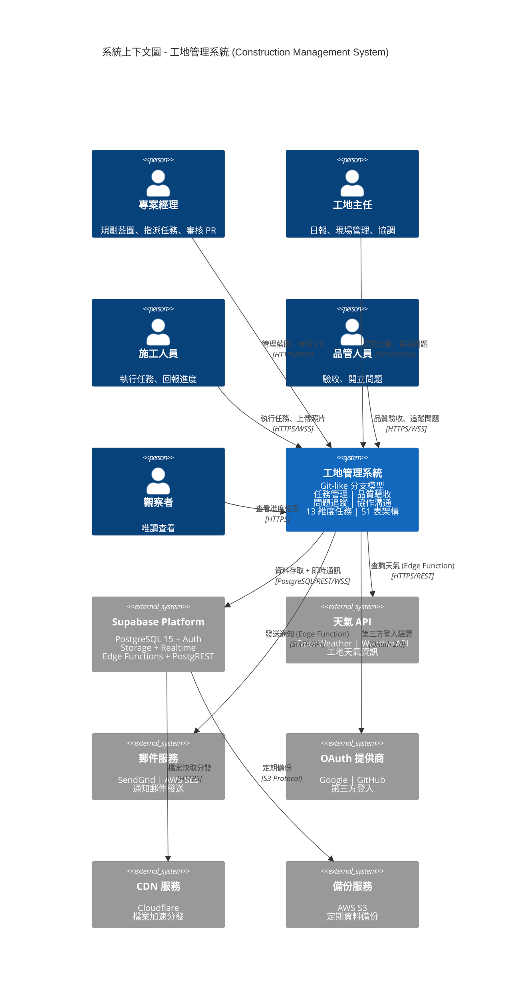

# 系統上下文圖 (System Context Diagram)

> 🎯 展示系統與外部實體的互動邊界 - 採用 C4 Model Level 1

**最後更新**: 2025-11-17
**用途**: AI Agent 理解系統邊界與外部依賴

- --

- --

## 🔑 關鍵要點

### 系統定位
- **13 維度任務管理**: 任務本體、時間、關聯、空間、資源、進度、成本、品質、風險、安全、文件、溝通、變更
- **Git-like 分支模型**: 主分支(擁有者) + 組織分支(協作) + PR 機制
- **51 張表 / 11 模組**: 帳戶、協作、權限、藍圖、任務、驗收、問題、溝通、分析、機器人、系統
- **技術棧**: Angular 20.3 + NG-ZORRO 20.3 + NG-ALAIN 20.1 + Supabase

### 外部依賴
- **Supabase**: 核心後端平台 (Database + Auth + Storage + Realtime + Edge Functions)
- **天氣 API**: Edge Function 調用 + weather_cache 快取
- **郵件服務**: 任務通知、問題通知、驗收結果
- **OAuth**: Google/GitHub 登入
- **CDN**: Storage 檔案加速
- **備份**: 每日增量 + 每週完整

### 用戶角色
- **專案經理**: 建立藍圖、管理權限、審核 PR
- **工地主任**: 日報、現場協調
- **施工人員**: 執行任務、回報進度
- **品管人員**: 驗收檢查、開立問題
- **觀察者**: 唯讀查看
