```mermaid
erDiagram
    %% ==================== 模組 1: 帳戶與身份 ====================
    AUTH_USERS ||--|| ACCOUNTS : extends
    AUTH_USERS {
        uuid id PK
        string email UK
        timestamp created_at
    }

    ACCOUNTS ||--o{ BLUEPRINTS : owns
    ACCOUNTS ||--o{ TEAMS : belongs_to
    ACCOUNTS ||--o{ USER_ROLES : has
    ACCOUNTS {
        uuid id PK
        uuid auth_user_id FK
        enum account_type "user|bot|organization"
        string display_name
        string avatar_url
        timestamp created_at
    }

    TEAMS ||--o{ TEAM_MEMBERS : contains
    TEAMS {
        uuid id PK
        uuid organization_id FK
        string name
        timestamp created_at
    }

    TEAM_MEMBERS }o--|| ACCOUNTS : member
    TEAM_MEMBERS {
        uuid id PK
        uuid team_id FK
        uuid account_id FK
        enum role "admin|member|viewer"
    }

    %% ==================== 模組 2: 組織協作 ====================
    ACCOUNTS ||--o{ ORGANIZATION_SCHEDULES : schedules
    ORGANIZATION_SCHEDULES {
        uuid id PK
        uuid organization_id FK
        uuid blueprint_id FK
        date schedule_date
        jsonb weather_info
    }

    BLUEPRINTS ||--o{ ORGANIZATION_COLLABORATIONS : invites
    ORGANIZATION_COLLABORATIONS {
        uuid id PK
        uuid owner_org_id FK
        uuid invited_org_id FK
        enum status "pending|accepted|rejected"
        timestamp created_at
    }

    %% ==================== 模組 3: 權限系統 ====================
    ROLES ||--o{ USER_ROLES : assigned
    ROLES ||--o{ ROLE_PERMISSIONS : has
    ROLES {
        uuid id PK
        string name UK
        int priority
    }

    USER_ROLES }o--|| BLUEPRINTS : scoped_to
    USER_ROLES {
        uuid id PK
        uuid account_id FK
        uuid role_id FK
        uuid blueprint_id FK
    }

    ROLE_PERMISSIONS }o--|| PERMISSIONS : grants
    PERMISSIONS {
        uuid id PK
        string resource UK
        string action UK
    }

    %% ==================== 模組 4: 藍圖/專案 (Git-like) ====================
    BLUEPRINTS ||--o{ BRANCH_FORKS : forks
    BLUEPRINTS ||--o{ TASKS : contains
    BLUEPRINTS ||--o{ ISSUES : tracks
    BLUEPRINTS {
        uuid id PK
        uuid owner_id FK
        string name
        date start_date
        date end_date
        enum status "planning|active|on_hold|completed|archived"
        jsonb settings
    }

    BRANCH_FORKS ||--o{ BLUEPRINT_BRANCHES : spawns
    BRANCH_FORKS {
        uuid id PK
        uuid blueprint_id FK
        uuid contractor_org_id FK
        text scope
    }

    BLUEPRINT_BRANCHES ||--o{ PULL_REQUESTS : submits
    BLUEPRINT_BRANCHES ||--o{ BRANCH_PERMISSIONS : has
    BLUEPRINT_BRANCHES {
        uuid id PK
        uuid fork_id FK
        uuid organization_id FK
        enum branch_type "org|team|bot"
        enum status "active|frozen|merged"
    }

    PULL_REQUESTS ||--o{ PULL_REQUEST_REVIEWS : reviewed
    PULL_REQUESTS {
        uuid id PK
        uuid branch_id FK
        uuid blueprint_id FK
        enum pr_status "open|reviewing|merged"
        jsonb payload
    }

    PULL_REQUEST_REVIEWS {
        uuid id PK
        uuid pull_request_id FK
        uuid reviewer_id FK
        enum decision "approved|rejected"
    }

    BRANCH_PERMISSIONS }o--|| PERMISSIONS : grants
    BRANCH_PERMISSIONS {
        uuid id PK
        uuid branch_role_id FK
        uuid permission_id FK
        boolean allow_write
    }

    %% ==================== 模組 5: 任務執行 ====================
    TASKS ||--o{ TASK_ASSIGNMENTS : assigned
    TASKS ||--o{ DAILY_REPORTS : generates
    TASKS ||--o{ QUALITY_CHECKS : requires
    TASKS ||--o{ STAGING_SUBMISSIONS : queued
    TASKS ||--o{ COMMENTS : discusses
    TASKS {
        uuid id PK
        uuid blueprint_id FK
        uuid parent_task_id FK
        string title
        enum status "pending|assigned|in_progress|staging|in_qa|in_inspection|completed|cancelled"
        enum priority "low|medium|high|urgent"
        date start_date
        date due_date
        decimal estimated_hours
    }

    TASK_ASSIGNMENTS }o--|| ACCOUNTS : assigned_to
    TASK_ASSIGNMENTS {
        uuid id PK
        uuid task_id FK
        uuid account_id FK
        enum role "owner|assignee|reviewer"
    }

    STAGING_SUBMISSIONS }o--|| ACCOUNTS : submitted_by
    STAGING_SUBMISSIONS {
        uuid id PK
        uuid task_id FK
        uuid submitter_id FK
        jsonb payload
        timestamp expires_at "48h撤回期"
        boolean recalled
    }

    DAILY_REPORTS ||--o{ REPORT_PHOTOS : includes
    DAILY_REPORTS }o--|| WEATHER_CACHE : references
    DAILY_REPORTS {
        uuid id PK
        uuid task_id FK
        uuid reporter_id FK
        date report_date
        text work_summary
        decimal work_hours
        int worker_count
    }

    REPORT_PHOTOS {
        uuid id PK
        uuid daily_report_id FK
        string storage_path
        jsonb metadata "EXIF"
    }

    WEATHER_CACHE {
        uuid id PK
        uuid blueprint_id FK
        date weather_date
        string condition
        decimal temperature
        jsonb raw_data
    }

    %% ==================== 模組 6: 品質驗收 ====================
    QUALITY_CHECKS ||--o{ QC_PHOTOS : includes
    QUALITY_CHECKS ||--o| ISSUES : may_create
    QUALITY_CHECKS ||--o{ INSPECTIONS : final_inspections
    QUALITY_CHECKS {
        uuid id PK
        uuid task_id FK
        uuid inspector_id FK
        enum status "pending|in_progress|passed|failed|conditional_pass"
        jsonb checklist
        decimal score
    }

    QC_PHOTOS {
        uuid id PK
        uuid quality_check_id FK
        string storage_path
        enum photo_type "before|after|defect"
    }

    INSPECTIONS {
        uuid id PK
        uuid quality_check_id FK
        enum inspection_type "initial|final|warranty"
        enum status "pending|in_progress|accepted|rejected|conditional_accept"
        timestamp inspected_at
    }

    %% ==================== 模組 7: 問題追蹤 ====================
    ISSUES ||--o{ ISSUE_ASSIGNMENTS : assigned
    ISSUES ||--o{ ISSUE_PHOTOS : includes
    ISSUES ||--o{ ISSUE_SYNC_LOGS : syncs
    ISSUES {
        uuid id PK
        uuid blueprint_id FK
        uuid task_id FK
        uuid reporter_id FK
        string title
        enum severity "low|medium|high|critical"
        enum status "open|in_progress|resolved|closed|wont_fix"
    }

    ISSUE_ASSIGNMENTS }o--|| ACCOUNTS : handler
    ISSUE_PHOTOS {
        uuid id PK
        uuid issue_id FK
        string storage_path
    }

    ISSUE_SYNC_LOGS {
        uuid id PK
        uuid issue_id FK
        uuid source_branch_id FK
        uuid target_branch_id FK
        timestamp synced_at
    }

    %% ==================== 模組 8: 協作溝通 ====================
    COMMENTS }o--|| ACCOUNTS : posted_by
    COMMENTS {
        uuid id PK
        uuid parent_id FK
        uuid task_id FK
        uuid issue_id FK
        uuid author_id FK
        text content
        jsonb mentions
    }

    NOTIFICATIONS }o--|| ACCOUNTS : sent_to
    NOTIFICATIONS {
        uuid id PK
        uuid recipient_id FK
        enum notification_type "task|issue|comment"
        boolean is_read
    }

    NOTIFICATION_RULES }o--|| ACCOUNTS : configured_by
    NOTIFICATION_RULES {
        uuid id PK
        uuid account_id FK
        enum channel "email|push|internal"
        jsonb rules
    }

    TODOS }o--|| ACCOUNTS : assigned_to
    TODOS {
        uuid id PK
        uuid account_id FK
        uuid task_id FK
        uuid issue_id FK
        enum status "pending|staging|qc|inspection|issue"
        boolean is_completed
    }

    %% ==================== 模組 9: 資料分析 ====================
    DOCUMENTS {
        uuid id PK
        uuid blueprint_id FK
        uuid uploader_id FK
        string storage_path
        enum document_type "drawing|contract|report"
        bigint file_size
    }

    DOCUMENT_VERSIONS {
        uuid id PK
        uuid document_id FK
        int version_number
        timestamp created_at
    }

    DOCUMENT_THUMBNAILS {
        uuid id PK
        uuid document_id FK
        string thumbnail_path
        enum size "small|medium|large"
    }

    ACTIVITY_LOGS {
        uuid id PK
        uuid account_id FK
        uuid blueprint_id FK
        enum entity_type "task|issue|document"
        uuid entity_id
        enum action "create|update|delete"
        jsonb changes
    }

    ANALYTICS_CACHE {
        uuid id PK
        uuid blueprint_id FK
        string cache_key
        jsonb cached_data
        timestamp expires_at
    }

    PROGRESS_TRACKING {
        uuid id PK
        uuid blueprint_id FK
        date tracking_date
        decimal completion_rate
        int total_tasks
        int completed_tasks
    }

    %% ==================== 模組 10: 機器人系統 ====================
    BOTS ||--|| ACCOUNTS : is_bot
    BOTS {
        uuid id PK
        uuid account_id FK
        enum bot_type "report|notification|backup"
        jsonb config
    }

    BOT_TASKS {
        uuid id PK
        uuid bot_id FK
        enum task_type "scheduled|triggered"
        timestamp scheduled_at
        enum status "pending|running|completed"
    }

    BOT_EXECUTION_LOGS {
        uuid id PK
        uuid bot_task_id FK
        timestamp executed_at
        jsonb result
    }

    %% ==================== 模組 11: 系統管理 ====================
    SETTINGS {
        uuid id PK
        uuid blueprint_id FK
        string key UK
        jsonb value
    }

    FEATURE_FLAGS {
        uuid id PK
        string flag_name UK
        boolean is_enabled
        jsonb target_accounts
    }
```

# 實體關係圖 (Entity Relationship Diagram)

> 🎯 展示 51 張表的核心關係 - 11 模組完整架構

**最後更新**: 2025-11-17
**用途**: AI Agent 理解資料庫 Schema 與關聯

- --

- --

## 🔑 模組關係總覽

### 核心流程
1. **帳戶** → **藍圖** → **分支 Fork** → **Pull Request**
2. **藍圖** → **任務** → **日報** → **驗收** → **問題**
3. **任務** → **暫存區** (48h 撤回) → **正式提交**
4. **問題** → **跨分支同步** → **主分支統一可見**

### 關鍵特性
- **Git-like 分支**: `branch_forks` + `blueprint_branches` + `pull_requests`
- **48h 暫存**: `staging_submissions` 可撤回機制
- **跨分支同步**: `issue_sync_logs` 問題即時同步
- **待辦中心**: `todos` 五狀態分類 (待執行/暫存/品管/驗收/問題)
- **活動記錄**: `activity_logs` 全局審計追蹤
