```mermaid
flowchart TD
    Start([資料生命週期]) --> Source{資料來源}

    %% ==================== Extract 提取階段 ====================
    Source -->|用戶輸入| UserInput[用戶操作<br/>表單/檔案/狀態]
    Source -->|第三方API| ThirdParty[外部資料源<br/>天氣/OAuth/郵件]
    Source -->|Realtime| RealtimeEvent[即時事件<br/>Database變更/Broadcast]
    Source -->|Git分支| BranchEvent[分支事件<br/>Fork/PR/Merge]

    UserInput --> FrontValidate[前端驗證<br/>Zod + Typed Forms]
    FrontValidate -->|失敗| ErrorUI[顯示錯誤]
    ErrorUI --> UserInput
    FrontValidate -->|通過| APICall

    ThirdParty --> EdgeFunc[Edge Function<br/>API封裝/重試]
    EdgeFunc --> CacheCheck{需要快取?}
    CacheCheck -->|是| WriteCache[weather_cache<br/>TTL: 6h]
    CacheCheck -->|否| APICall
    WriteCache --> APICall

    BranchEvent --> BranchWebhook[Edge: branch-webhook<br/>合併檢核/欄位遮罩]
    BranchWebhook --> APICall

    RealtimeEvent --> RealtimeProcess[Realtime處理<br/>事件分類/衝突解決]
    RealtimeProcess --> StateUpdate

    %% ==================== Transform 轉換階段 ====================
    APICall[API調用<br/>JWT Token + HTTPS] --> BackValidate[後端驗證<br/>Constraints + RLS]

    BackValidate -->|失敗| APIError[API錯誤<br/>4xx/5xx]
    APIError --> ErrorUI

    BackValidate -->|通過| RLSCheck{RLS權限}
    RLSCheck -->|拒絕| PermDenied[403 Forbidden]
    PermDenied --> ErrorUI

    RLSCheck -->|允許| Operation{操作類型}

    Operation -->|INSERT| InsertOp[插入資料<br/>UUID/預設值/時間戳]
    Operation -->|UPDATE| UpdateOp[更新資料<br/>樂觀鎖/版本號]
    Operation -->|DELETE| DeleteOp[刪除資料<br/>軟刪除/級聯]
    Operation -->|SELECT| SelectOp[查詢資料<br/>索引/分頁/JOIN]

    InsertOp --> StagingCheck{需暫存?}
    StagingCheck -->|是| Staging[staging_submissions<br/>48h可撤回]
    StagingCheck -->|否| Trigger
    Staging --> Trigger

    UpdateOp --> Trigger
    DeleteOp --> Trigger

    Trigger[Database Trigger] --> ActivityLog[activity_logs<br/>記錄變更]
    Trigger --> NotifyCheck{需通知?}
    NotifyCheck -->|是| CreateNotif[notifications<br/>通知類型分類]
    NotifyCheck -->|否| Broadcast
    CreateNotif --> Broadcast

    ActivityLog --> Broadcast[Realtime Broadcast<br/>WebSocket推送]

    InsertOp --> FileCheck{包含檔案?}
    FileCheck -->|是| StorageUpload[Storage上傳<br/>Bucket隔離]
    FileCheck -->|否| LoadResp

    StorageUpload --> ImgCheck{圖片?}
    ImgCheck -->|是| ImgOptimize[圖片優化<br/>WebP/縮圖/EXIF]
    ImgCheck -->|否| Metadata
    ImgOptimize --> Metadata[儲存元資料<br/>documents表]
    Metadata --> LoadResp

    %% ==================== Load 載入階段 ====================
    Broadcast --> LoadResp[載入回應<br/>JSON序列化]

    SelectOp --> QueryCache{快取?}
    QueryCache -->|命中| CacheHit[快取命中<br/>Redis/Memory]
    QueryCache -->|未命中| QueryDB[資料庫查詢<br/>Materialized Views]

    CacheHit --> LoadResp
    QueryDB --> UpdateCache[更新快取<br/>設定TTL]
    UpdateCache --> LoadResp

    LoadResp --> APIResp[API回應<br/>200 OK + JSON]

    APIResp --> FrontProcess[前端處理<br/>JSON解析/類型轉換]
    FrontProcess --> StateUpdate[狀態更新<br/>Angular Signals]
    StateUpdate --> UIRender[UI渲染<br/>增量更新/樂觀UI]

    %% ==================== Analytics 分析階段 ====================
    UIRender --> AnalyticsCheck{需分析?}
    AnalyticsCheck -->|否| End([結束])
    AnalyticsCheck -->|是| AnalyticsQueue[分析佇列<br/>Edge Function非同步]

    AnalyticsQueue --> Aggregate[資料聚合<br/>統計/趨勢/KPI]
    Aggregate --> MatView[物化視圖<br/>預計算/定期更新]
    MatView --> AnalyticsStore[analytics_cache<br/>progress_tracking]

    %% ==================== Backup 備份階段 ====================
    ActivityLog --> BackupSchedule{備份排程}
    BackupSchedule -->|每日| DailyBackup[每日增量<br/>pg_dump壓縮]
    BackupSchedule -->|每週| WeeklyBackup[每週完整<br/>含Storage]

    DailyBackup --> S3[AWS S3<br/>版本控制/保留30天]
    WeeklyBackup --> S3

    AnalyticsStore --> RetentionCheck{資料保留}
    RetentionCheck -->|過期| Archive[資料歸檔<br/>冷儲存/壓縮]
    RetentionCheck -->|活躍| End

    Archive --> ColdStorage[冷儲存<br/>Glacier/長期保存]
    S3 --> End
    ColdStorage --> End

    %% 樣式定義
    classDef extractStyle fill:#4CAF50,stroke:#2E7D32,stroke-width:2px,color:#fff
    classDef transformStyle fill:#2196F3,stroke:#1565C0,stroke-width:2px,color:#fff
    classDef loadStyle fill:#FF9800,stroke:#E65100,stroke-width:2px,color:#fff
    classDef analyticsStyle fill:#9C27B0,stroke:#6A1B9A,stroke-width:2px,color:#fff
    classDef errorStyle fill:#F44336,stroke:#C62828,stroke-width:2px,color:#fff
    classDef endStyle fill:#607D8B,stroke:#37474F,stroke-width:3px,color:#fff

    class UserInput,ThirdParty,RealtimeEvent,BranchEvent,FrontValidate extractStyle
    class BackValidate,Operation,InsertOp,UpdateOp,DeleteOp,Trigger,StorageUpload transformStyle
    class LoadResp,APIResp,FrontProcess,StateUpdate,UIRender,Broadcast loadStyle
    class AnalyticsQueue,Aggregate,MatView,AnalyticsStore analyticsStyle
    class ErrorUI,APIError,PermDenied errorStyle
    class Start,End endStyle
```

# 資料生命週期 ETL 流程圖

> 🎯 展示資料的提取 (Extract)、轉換 (Transform)、載入 (Load) 完整流程

**最後更新**: 2025-11-17
**用途**: AI Agent 理解資料流轉與處理機制

- --

- --

## 🔑 ETL 階段說明

### Extract (提取)
1. **用戶輸入**: Zod Schema → Typed Forms → 即時驗證
2. **第三方 API**: Edge Function → 錯誤重試 → weather_cache 快取
3. **Realtime 訂閱**: WebSocket → Database 變更 → Broadcast 廣播
4. **Git 分支事件**: Fork/PR → Edge branch-webhook → 合併檢核

### Transform (轉換)
1. **後端驗證**: PostgreSQL Constraints → RLS Policy → JWT Claims
2. **資料操作**:
   - INSERT: UUID 生成 → 暫存區 (48h) → 正式提交
   - UPDATE: 樂觀鎖 → 版本號 → 時間戳
   - DELETE: 軟刪除 → 級聯處理 → 歸檔
3. **Trigger 自動化**: activity_logs → notifications → Realtime Broadcast
4. **檔案處理**: Storage 上傳 → 圖片優化 (WebP) → EXIF 提取

### Load (載入)
1. **快取策略**: Browser → CDN → Redis → PostgreSQL Shared Buffers
2. **資料載入**: JSON 序列化 → 類型轉換 → Angular Signals
3. **UI 渲染**: 增量更新 → 樂觀 UI → 變更檢測

### Analytics (分析)
1. **非同步處理**: Edge Function 佇列 → 批次計算
2. **資料聚合**: 統計 → 趨勢 → KPI
3. **物化視圖**: 預計算 → 定期更新 (每小時)
4. **快取儲存**: analytics_cache → progress_tracking

### Backup (備份)
1. **每日增量**: pg_dump → 壓縮 → S3 (保留 30 天)
2. **每週完整**: 含 Storage 檔案 → 異地儲存
3. **資料歸檔**: 過期資料 → Glacier 冷儲存
