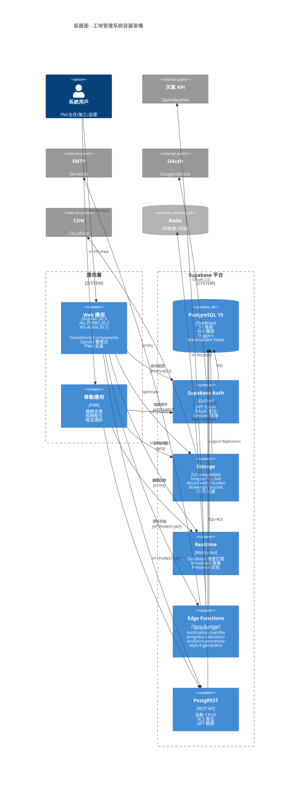

# 容器圖 (Container Diagram)

> 🎯 展示系統容器級架構 - 採用 C4 Model Level 2

**最後更新**: 2025-11-17
**用途**: AI Agent 理解系統內部容器與職責

- --



- --

## 🔑 容器職責

### 應用層

#### Web 應用 (Angular 20.3)
- **架構**: Standalone Components + Signals
- **UI**: NG-ZORRO 20.3 + NG-ALAIN 20.1
- **狀態**: Angular Signals + RxJS 7.8
- **特性**:
  - 新控制流語法 (@if/@for/@switch/@defer)
  - Typed Forms 型別安全
  - Lazy Loading 模組
  - PWA 離線支援

#### 移動應用 (PWA)
- **技術**: Progressive Web App
- **能力**:
  - 離線優先 (Service Worker)
  - 相機 API (拍照上傳)
  - 推送通知 (Web Push)
  - 安裝到主畫面

### Supabase 平台

#### PostgreSQL 15
- **資料**: 51 張表 / 11 模組
- **安全**: Row Level Security (RLS)
- **效能**:
  - B-Tree/GiST 索引
  - Materialized Views (進度聚合)
  - Triggers (自動化)
- **擴展**: pgvector, postgis

#### Supabase Auth
- **認證**: Email/Password, OAuth, Magic Link
- **授權**: JWT Token + Claims
- **整合**: RLS 無縫整合

#### Storage
- **架構**: S3-compatible Object Storage
- **Buckets**: images/, documents/, drawings/
- **功能**:
  - RLS 權限控制
  - 圖片轉換 (WebP)
  - CDN 加速
  - 版本管理

#### Realtime
- **協議**: WebSocket
- **功能**:
  - Database Changes (INSERT/UPDATE/DELETE)
  - Broadcast (自訂訊息)
  - Presence (線上狀態)
- **應用**:
  - 任務即時更新
  - 通知推送
  - 討論區訊息

#### Edge Functions
- **運行時**: Deno Runtime
- **函數**:
  - `weather-api`: 天氣整合 + 快取
  - `notification-handler`: 通知邏輯
  - `progress-calculator`: 進度計算
  - `analytics-processor`: 數據分析
  - `report-generator`: 報表生成

#### PostgREST
- **功能**: PostgreSQL → REST API
- **特性**:
  - 自動 CRUD 端點
  - 複雜查詢 (filter/order/join)
  - RLS 自動應用
  - JWT 驗證

### 外部服務

#### Redis (可選)
- **用途**: 天氣快取、Session、熱點資料
- **優勢**: 減少 DB 查詢壓力

#### 天氣 API
- **服務**: OpenWeather / WeatherAPI.com
- **調用**: Edge Function 封裝
- **快取**: weather_cache 表 (TTL: 6h)

#### SMTP 服務
- **服務**: SendGrid / AWS SES
- **用途**: 任務通知、問題通知、驗收結果

#### OAuth 提供商
- **支援**: Google, GitHub
- **整合**: Supabase Auth 配置

#### CDN
- **服務**: Cloudflare CDN
- **快取**: Storage 檔案加速

- --

## 🔄 資料流

```text
                  ↓
            Edge Functions ← 第三方 API
                  ↓
            Realtime → WebSocket 推送
                  ↓
            Storage → CDN 分發
```

## 🧪 開發環境

- **測試**: Playwright E2E
- **CI/CD**: GitHub Actions
- **品質**: ESLint + Prettier (零警告)
- **部署**: Supabase Hosting / Cloudflare Pages
