# Architecture Documentation Reorganization Plan

## Executive Summary

This document provides a comprehensive plan to reorganize the architecture documentation folder (`/docs/architecture/`) for the Angular 20 + ng-alain + Supabase enterprise application. The reorganization aims to:

1. **Consolidate** related documents into logical groups
2. **Eliminate** redundancy and contradictions
3. **Establish** a clear, consistent numbering scheme
4. **Improve** discoverability and navigation

---

## Current State Analysis

### File Inventory (23 Files)

| # | Current File | Size | Category | Quality |
|---|--------------|------|----------|---------|
| 1 | `00-architecture-design.md` | Very Large | Core | ⭐⭐⭐⭐⭐ Foundation |
| 2 | `01-system-architecture-mindmap.mermaid.md` | Medium | Overview | ⭐⭐⭐ Useful |
| 3 | `02-project-structure-flowchart.mermaid.md` | Medium | Structure | ⭐⭐⭐ Useful |
| 4 | `03-system-context-diagram.mermaid.md` | Medium | C4 Model | ⭐⭐⭐⭐ Important |
| 5 | `04-business-process-flowchart.mermaid.md` | Large | Business | ⭐⭐⭐⭐ Important |
| 6 | `05-account-layer-flowchart.mermaid.md` | Medium | Account | ⭐⭐⭐ Useful |
| 7 | `06-entity-relationship-diagram.mermaid.md` | Large | Data | ⭐⭐⭐⭐⭐ Critical |
| 8 | `07-data-lifecycle-etl-flowchart.mermaid.md` | Medium | Data | ⭐⭐⭐ Useful |
| 9 | `08-storage-bucket-structure-view.mermaid.md` | Small | Data | ⭐⭐⭐ Useful |
| 10 | `09-security-rls-permission-matrix.md` | Large | Security | ⭐⭐⭐⭐⭐ Critical |
| 11 | `10-container-diagram.mermaid.md` | Medium | C4 Model | ⭐⭐⭐⭐ Important |
| 12 | `11-component-module-view.mermaid.md` | Large | Component | ⭐⭐⭐⭐ Important |
| 13 | `12-component-module-view-supplement.md` | Medium | Component | ⭐⭐ Merge |
| 14 | `13-sequence-diagram.mermaid.md` | Medium | Behavior | ⭐⭐⭐⭐ Important |
| 15 | `14-state-diagram.mermaid.md` | Large | Behavior | ⭐⭐⭐⭐ Important |
| 16 | `15-domain-event-timeline.mermaid.md` | Large | Behavior | ⭐⭐⭐⭐ Important |
| 17 | `17-supabase-architecture-flowchart.mermaid.md` | Large | Supabase | ⭐⭐⭐⭐ Important |
| 18 | `18-deployment-infrastructure-view.mermaid.md` | Large | Deployment | ⭐⭐⭐⭐⭐ Critical |
| 19 | `20-complete-architecture-flowchart.mermaid.md` | Very Large | Overview | ⭐⭐⭐ Redundant |
| 20 | `21-architecture-review-report.md` | Medium | Review | ⭐⭐⭐ Archive |
| 21 | `22-architecture-layers-atomization-design.md` | Large | Design | ⭐⭐⭐⭐⭐ Critical |
| 22 | `account-refactoring.md` | Large | Refactoring | ⭐⭐⭐⭐ Important |
| 23 | `README.md` | Small | Index | ⭐⭐ Rebuild |

### Identified Issues

```mermaid
flowchart TD
    subgraph Issues["🔴 Current Issues"]
        I1["Inconsistent Numbering<br/>(gaps: 16, 19)"]
        I2["Redundant Content<br/>(20 overlaps with 00)"]
        I3["Scattered Topics<br/>(Account: 05, 22, refactoring)"]
        I4["Missing Groups<br/>(No clear categorization)"]
        I5["Outdated Index<br/>(README incomplete)"]
    end
```



### Content Overlap Analysis

| Documents | Overlap | Recommendation |
|-----------|---------|----------------|
| `00-architecture-design.md` + `20-complete-architecture-flowchart.mermaid.md` | 70% | Keep 00, reference from 20 |
| `11-component-module-view.mermaid.md` + `12-component-module-view-supplement.md` | 90% | Merge into 11 |
| `05-account-layer-flowchart.mermaid.md` + `22-architecture-layers-atomization-design.md` + `account-refactoring.md` | 40% | Consolidate under Account group |

---

## Proposed Reorganization

### New Category Structure

```mermaid
flowchart TD
    subgraph Root["📁 /docs/architecture/"]
        direction TB
        
        subgraph G0["00-Foundation"]
            A0["00-architecture-design.md<br/>(Main Reference)"]
        end
        
        subgraph G1["01-System Overview"]
            A1["01-system-context.md"]
            A2["02-architecture-mindmap.md"]
            A3["03-architecture-overview.md"]
        end
        
        subgraph G2["02-Component Architecture"]
            B1["10-container-diagram.md"]
            B2["11-component-diagram.md"]
            B3["12-project-structure.md"]
        end
        
        subgraph G3["03-Data Architecture"]
            C1["20-entity-relationship.md"]
            C2["21-data-lifecycle.md"]
            C3["22-storage-structure.md"]
        end
        
        subgraph G4["04-Behavior & Events"]
            D1["30-business-process.md"]
            D2["31-sequence-diagrams.md"]
            D3["32-state-diagrams.md"]
            D4["33-domain-events.md"]
        end
        
        subgraph G5["05-Security & Access"]
            E1["40-security-rls-matrix.md"]
            E2["41-account-architecture.md"]
        end
        
        subgraph G6["06-Infrastructure"]
            F1["50-supabase-architecture.md"]
            F2["51-deployment-diagram.md"]
        end
        
        subgraph G7["07-Design Decisions"]
            G1A["60-layers-atomization.md"]
            G1B["61-architecture-review.md"]
        end
    end
```



### Detailed File Mapping

| # | New Name | Old Name | Action |
|---|----------|----------|--------|
| **00-Foundation** | | | |
| 00 | `00-architecture-design.md` | `00-architecture-design.md` | **Keep** (Foundation) |
| **01-System Overview** | | | |
| 01 | `01-system-context.md` | `03-system-context-diagram.mermaid.md` | **Rename** |
| 02 | `02-architecture-mindmap.md` | `01-system-architecture-mindmap.mermaid.md` | **Rename** |
| 03 | `03-architecture-overview.md` | `20-complete-architecture-flowchart.mermaid.md` | **Rename** (simplified reference) |
| **02-Component Architecture** | | | |
| 10 | `10-container-diagram.md` | `10-container-diagram.mermaid.md` | **Keep** |
| 11 | `11-component-diagram.md` | `11-component-module-view.mermaid.md` + `12-component-module-view-supplement.md` | **Merge** |
| 12 | `12-project-structure.md` | `02-project-structure-flowchart.mermaid.md` | **Rename** |
| **03-Data Architecture** | | | |
| 20 | `20-entity-relationship.md` | `06-entity-relationship-diagram.mermaid.md` | **Rename** |
| 21 | `21-data-lifecycle.md` | `07-data-lifecycle-etl-flowchart.mermaid.md` | **Rename** |
| 22 | `22-storage-structure.md` | `08-storage-bucket-structure-view.mermaid.md` | **Rename** |
| **04-Behavior & Events** | | | |
| 30 | `30-business-process.md` | `04-business-process-flowchart.mermaid.md` | **Rename** |
| 31 | `31-sequence-diagrams.md` | `13-sequence-diagram.mermaid.md` | **Rename** |
| 32 | `32-state-diagrams.md` | `14-state-diagram.mermaid.md` | **Rename** |
| 33 | `33-domain-events.md` | `15-domain-event-timeline.mermaid.md` | **Rename** |
| **05-Security & Access** | | | |
| 40 | `40-security-rls-matrix.md` | `09-security-rls-permission-matrix.md` | **Rename** |
| 41 | `41-account-architecture.md` | `05-account-layer-flowchart.mermaid.md` + `account-refactoring.md` | **Merge** |
| **06-Infrastructure** | | | |
| 50 | `50-supabase-architecture.md` | `17-supabase-architecture-flowchart.mermaid.md` | **Rename** |
| 51 | `51-deployment-diagram.md` | `18-deployment-infrastructure-view.mermaid.md` | **Rename** |
| **07-Design Decisions** | | | |
| 60 | `60-layers-atomization.md` | `22-architecture-layers-atomization-design.md` | **Rename** |
| 61 | `61-architecture-review.md` | `21-architecture-review-report.md` | **Rename** (Archive marker) |

### Files to Remove

| File | Reason |
|------|--------|
| `12-component-module-view-supplement.md` | Merged into `11-component-diagram.md` |
| `20-complete-architecture-flowchart.mermaid.md` | Content redundant with `00-architecture-design.md`; converted to reference doc |

---

## Numbering Scheme Rationale

### Decade-Based Categories

```
00-09: Foundation & Core Documents
10-19: Component Architecture (Container, Components, Structure)
20-29: Data Architecture (ERD, Lifecycle, Storage)
30-39: Behavior & Events (Processes, Sequences, States, Events)
40-49: Security & Access Control (RLS, Account, Permissions)
50-59: Infrastructure & Deployment (Supabase, Cloud, CI/CD)
60-69: Design Decisions & Reviews (ADRs, Reviews, Patterns)
70-79: [Reserved for Future Expansion]
80-89: [Reserved for Future Expansion]
90-99: Archives & Deprecated Documents
```

### Benefits

1. **Logical Grouping**: Related documents share a decade
2. **Room for Growth**: Each category has 10 slots
3. **Easy Navigation**: Jump to relevant decade quickly
4. **Clear Hierarchy**: Numbers indicate importance and reading order

---

## New README.md Structure

```markdown
# Architecture Documentation

> Enterprise-grade Angular 20 + ng-alain + Supabase application architecture documentation.

## 📚 Documentation Map

### 🏛️ Foundation (00)
- [00-architecture-design.md](./00-architecture-design.md) - **Main Reference Document**
  - Complete system architecture design
  - ASCII diagrams and comprehensive explanations
  - Single source of truth for architecture decisions

### 🌐 System Overview (01-09)
| Document | Description | Audience |
|----------|-------------|----------|
| [01-system-context.md](./01-system-context.md) | C4 System Context Diagram | All |
| [02-architecture-mindmap.md](./02-architecture-mindmap.md) | System Architecture Mindmap | Architects |
| [03-architecture-overview.md](./03-architecture-overview.md) | Complete Architecture Flowchart | Developers |

### 🧩 Component Architecture (10-19)
| Document | Description | Audience |
|----------|-------------|----------|
| [10-container-diagram.md](./10-container-diagram.md) | C4 Container Diagram | Architects |
| [11-component-diagram.md](./11-component-diagram.md) | Component & Module View | Developers |
| [12-project-structure.md](./12-project-structure.md) | Project Structure Flowchart | Developers |

### 💾 Data Architecture (20-29)
| Document | Description | Audience |
|----------|-------------|----------|
| [20-entity-relationship.md](./20-entity-relationship.md) | Entity Relationship Diagram | DBAs |
| [21-data-lifecycle.md](./21-data-lifecycle.md) | Data Lifecycle & ETL | Data Engineers |
| [22-storage-structure.md](./22-storage-structure.md) | Storage Bucket Structure | DevOps |

### ⚡ Behavior & Events (30-39)
| Document | Description | Audience |
|----------|-------------|----------|
| [30-business-process.md](./30-business-process.md) | Business Process Flowchart | Business Analysts |
| [31-sequence-diagrams.md](./31-sequence-diagrams.md) | Interaction Sequences | Developers |
| [32-state-diagrams.md](./32-state-diagrams.md) | State Machine Diagrams | Developers |
| [33-domain-events.md](./33-domain-events.md) | Domain Event Timeline | Architects |

### 🔐 Security & Access (40-49)
| Document | Description | Audience |
|----------|-------------|----------|
| [40-security-rls-matrix.md](./40-security-rls-matrix.md) | Security & RLS Permission Matrix | Security |
| [41-account-architecture.md](./41-account-architecture.md) | Account Layer Architecture | Developers |

### ☁️ Infrastructure (50-59)
| Document | Description | Audience |
|----------|-------------|----------|
| [50-supabase-architecture.md](./50-supabase-architecture.md) | Supabase Architecture | DevOps |
| [51-deployment-diagram.md](./51-deployment-diagram.md) | Deployment Infrastructure | DevOps |

### 📋 Design Decisions (60-69)
| Document | Description | Audience |
|----------|-------------|----------|
| [60-layers-atomization.md](./60-layers-atomization.md) | Architecture Layers Design | Architects |
| [61-architecture-review.md](./61-architecture-review.md) | Architecture Review Report | Stakeholders |

## 🗺️ Reading Path

### For New Team Members
1. Start with [00-architecture-design.md](./00-architecture-design.md) - Foundation
2. Review [01-system-context.md](./01-system-context.md) - System boundaries
3. Explore [11-component-diagram.md](./11-component-diagram.md) - Code structure
4. Understand [20-entity-relationship.md](./20-entity-relationship.md) - Data model

### For Architects
1. [00-architecture-design.md](./00-architecture-design.md) - Complete reference
2. [60-layers-atomization.md](./60-layers-atomization.md) - Design patterns
3. [40-security-rls-matrix.md](./40-security-rls-matrix.md) - Security model
4. [61-architecture-review.md](./61-architecture-review.md) - Quality assessment

### For DevOps Engineers
1. [51-deployment-diagram.md](./51-deployment-diagram.md) - Infrastructure
2. [50-supabase-architecture.md](./50-supabase-architecture.md) - Backend services
3. [22-storage-structure.md](./22-storage-structure.md) - Storage management

## 📅 Document Updates

| Document | Last Updated | Status |
|----------|--------------|--------|
| 00-architecture-design.md | 2025-11-27 | ✅ Current |
| All other documents | 2025-11-27 | ✅ Reorganized |

## 🔗 Related Documentation

- [Development Guides](/docs/guides/)
- [API Reference](/docs/reference/)
- [Supabase Configuration](/docs/supabase/)
```

---

## Implementation Checklist

### Phase 1: Preparation
- [ ] Back up current `/docs/architecture/` folder
- [ ] Review this plan with team leads
- [ ] Finalize any naming adjustments

### Phase 2: File Reorganization
- [ ] Rename files according to mapping table
- [ ] Merge `11` + `12` into new `11-component-diagram.md`
- [ ] Merge `05` + `account-refactoring` into `41-account-architecture.md`
- [ ] Update `20` to be a reference/index document (not duplicate content)

### Phase 3: Content Updates
- [ ] Update internal cross-references in all documents
- [ ] Add consistent headers/footers to each document
- [ ] Remove redundant content from merged files

### Phase 4: Index & Navigation
- [ ] Create new `README.md` using provided structure
- [ ] Add navigation links at bottom of each document
- [ ] Create breadcrumb trail in each document

### Phase 5: Validation
- [ ] Verify all Mermaid diagrams render correctly
- [ ] Check all internal links work
- [ ] Review with 2-3 team members for feedback

---

## Summary

### Actions Summary


| Action | Count | Details |
|--------|-------|---------|
| **Keep** | 1 | `00-architecture-design.md` (foundation) |
| **Rename** | 15 | Most files get new numbers and cleaner names |
| **Merge** | 2 | Component modules + Account documents |
| **Remove** | 1 | Supplement file (merged content) |
| **Total** | 19 | Final document count |

### Benefits of Reorganization

1. **Clearer Navigation**: Decade-based numbering groups related content
2. **Reduced Redundancy**: Merged documents eliminate duplication
3. **Consistent Naming**: All files follow `XX-descriptive-name.md` pattern
4. **Better Discoverability**: README provides clear reading paths
5. **Room for Growth**: Each category has slots for future documents

---

## Appendix: Quick Reference Card

### File Number Reference

| Decade | Category | Example Files |
|--------|----------|---------------|
| 00 | Foundation | `00-architecture-design.md` |
| 01-09 | System Overview | `01-system-context.md`, `02-architecture-mindmap.md` |
| 10-19 | Components | `10-container-diagram.md`, `11-component-diagram.md` |
| 20-29 | Data | `20-entity-relationship.md`, `21-data-lifecycle.md` |
| 30-39 | Behavior | `30-business-process.md`, `31-sequence-diagrams.md` |
| 40-49 | Security | `40-security-rls-matrix.md`, `41-account-architecture.md` |
| 50-59 | Infrastructure | `50-supabase-architecture.md`, `51-deployment-diagram.md` |
| 60-69 | Decisions | `60-layers-atomization.md`, `61-architecture-review.md` |

### Document Cross-Reference

| Old # | New # | Topic |
|-------|-------|-------|
| 00 | 00 | Main Architecture Design |
| 01 | 02 | Architecture Mindmap |
| 02 | 12 | Project Structure |
| 03 | 01 | System Context |
| 04 | 30 | Business Process |
| 05 | 41 | Account Layer (merged) |
| 06 | 20 | Entity Relationship |
| 07 | 21 | Data Lifecycle |
| 08 | 22 | Storage Structure |
| 09 | 40 | Security RLS |
| 10 | 10 | Container Diagram |
| 11+12 | 11 | Component Diagram (merged) |
| 13 | 31 | Sequence Diagrams |
| 14 | 32 | State Diagrams |
| 15 | 33 | Domain Events |
| 17 | 50 | Supabase Architecture |
| 18 | 51 | Deployment |
| 20 | 03 | Architecture Overview |
| 21 | 61 | Architecture Review |
| 22 | 60 | Layers Atomization |

---

**Document Created**: 2025-11-27  
**Author**: Architecture Team  
**Status**: Proposed - Awaiting Review
