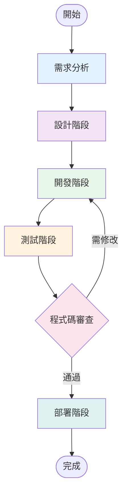
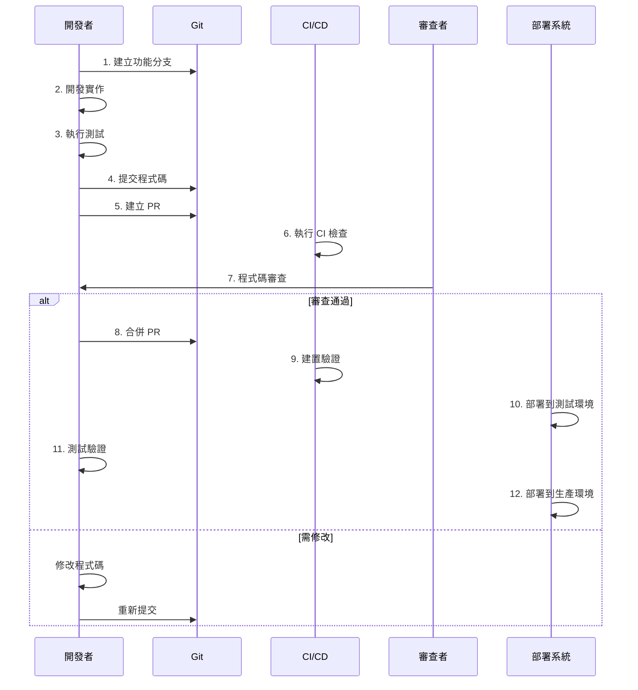

# 開發工作流程


> **📚 目的**: 定義完整的 Git 工作流程與 Pull Request 流程，確保團隊協作順暢

## 目標讀者 (Audience)

- 所有開發者
- 新成員
- 技術主管

---


## 📑 目錄

- [📋 目錄](#-目錄)
- [流程概覽](#流程概覽)
- [需求分析階段](#需求分析階段)
  - [1. 理解需求](#1-理解需求)
  - [2. 任務拆解](#2-任務拆解)
  - [3. 技術調研](#3-技術調研)
  - [4. 建立任務追蹤](#4-建立任務追蹤)
- [設計階段](#設計階段)
  - [1. 架構設計（Level 3+）](#1-架構設計level-3)
  - [2. 資料庫設計](#2-資料庫設計)
  - [3. API 設計](#3-api-設計)
  - [4. UI/UX 設計](#4-uiux-設計)
- [開發階段](#開發階段)
  - [1. 建立分支](#1-建立分支)
  - [2. 開發實作](#2-開發實作)
    - [2.1 建立資料模型（如需要）](#21-建立資料模型如需要)
    - [2.2 建立 Repository（如需要）](#22-建立-repository如需要)
    - [2.3 建立 Service（如需要）](#23-建立-service如需要)
    - [2.4 建立組件](#24-建立組件)
  - [3. 增量驗證](#3-增量驗證)
  - [4. 程式碼品質檢查](#4-程式碼品質檢查)
- [測試階段](#測試階段)
  - [1. 單元測試](#1-單元測試)
  - [2. E2E 測試（關鍵功能）](#2-e2e-測試關鍵功能)
  - [3. 手動測試](#3-手動測試)
- [程式碼審查階段](#程式碼審查階段)
  - [1. 提交前檢查](#1-提交前檢查)
  - [2. 建立 Pull Request](#2-建立-pull-request)
  - [3. 程式碼審查檢查點](#3-程式碼審查檢查點)
  - [4. 修改與重新審查](#4-修改與重新審查)
- [部署階段](#部署階段)
  - [1. 合併到主分支](#1-合併到主分支)
  - [2. 建置驗證](#2-建置驗證)
  - [3. 部署到測試環境](#3-部署到測試環境)
  - [4. 部署到生產環境](#4-部署到生產環境)
  - [5. 部署後檢查](#5-部署後檢查)
- [Git 工作流程](#git-工作流程)
  - [分支策略](#分支策略)
  - [Commit 規範](#commit-規範)
  - [PR 流程](#pr-流程)
- [檢查清單](#檢查清單)
  - [開發前檢查](#開發前檢查)
  - [開發中檢查](#開發中檢查)
  - [提交前檢查](#提交前檢查)
  - [部署前檢查](#部署前檢查)
- [相關文檔](#相關文檔)
- [流程圖](#流程圖)
  - [完整開發流程](#完整開發流程)
- [🎯 架構相關工作流程](#-架構相關工作流程)
  - [Git-like 分支模型開發流程](#git-like-分支模型開發流程)
  - [51 張資料表開發注意事項](#51-張資料表開發注意事項)

---


> 📋 **目的**：規範從需求到部署的完整開發流程，確保團隊成員遵循一致的開發標準

**最後更新**：2025-11-15
**維護者**：開發團隊

- --

## 📋 目錄

- [流程概覽](#流程概覽)
- [需求分析階段](#需求分析階段)
- [設計階段](#設計階段)
- [開發階段](#開發階段)
- [測試階段](#測試階段)
- [程式碼審查階段](#程式碼審查階段)
- [部署階段](#部署階段)
- [Git 工作流程](#git-工作流程)
- [檢查清單](#檢查清單)

**參考文檔**：
- [開發作業指引](./specs/00-development-guidelines.md) - 詳細開發規範
- [開發前檢查清單](./31-開發前檢查清單.md) - 開發前準備

- --

## 流程概覽



- --

## 需求分析階段

### 1. 理解需求

- [ ] 閱讀需求文檔或 Issue 描述
- [ ] 確認需求範圍和目標
- [ ] 識別相關的現有功能
- [ ] 確認技術可行性

### 2. 任務拆解

- [ ] 將需求拆解為可執行的子任務
- [ ] 評估每個子任務的複雜度（L1-L4）
- [ ] 識別任務之間的依賴關係
- [ ] 估算完成時間

### 3. 技術調研

- [ ] 使用 `@C7` 查詢相關技術文檔
- [ ] 檢查專案內是否有現成解決方案
- [ ] 確認是否需要新的依賴套件
- [ ] 評估對現有系統的影響

### 4. 建立任務追蹤

- [ ] 使用 `@SPT` 建立實施計劃（Level 3+）
- [ ] 記錄任務清單和檢查點
- [ ] 與團隊成員確認計劃

- --

## 設計階段

### 1. 架構設計（Level 3+）

- [ ] 使用 `@S7` 進行架構分析
- [ ] 設計資料模型（對照資料庫結構）
- [ ] 設計 API 介面（對照 API 文檔）
- [ ] 設計組件結構（遵循專案結構）

### 2. 資料庫設計

- [ ] 確認是否需要新增或修改資料表
- [ ] 設計 RLS 策略（參考安全文檔）
- [ ] 準備資料庫遷移腳本
- [ ] 使用 `@SUPABASE` 驗證設計

### 3. API 設計

- [ ] 設計 API 端點（遵循 PostgREST 規範）
- [ ] 定義請求/回應格式
- [ ] 設計錯誤處理方式
- [ ] 更新 API 文檔（如需要）

### 4. UI/UX 設計

- [ ] 設計頁面佈局（遵循 ng-alain 規範）
- [ ] 設計組件結構（使用 SHARED_IMPORTS）
- [ ] 確認響應式設計
- [ ] 確認可訪問性要求

- --

## 開發階段

### 1. 建立分支

```bash
# 建立功能分支
git checkout -b feature/feature-name

# 或修復分支
git checkout -b fix/bug-description
```

**分支命名規範**：
- `feature/` - 新功能
- `fix/` - Bug 修復
- `refactor/` - 重構
- `docs/` - 文檔更新

### 2. 開發實作

#### 2.1 建立資料模型（如需要）

- [ ] 在 `src/app/shared/models/` 建立模型檔案
- [ ] 對照資料庫結構（參考資料模型對照表）
- [ ] 確保類型定義完整
- [ ] 匯出模型（在 `index.ts` 中）

#### 2.2 建立 Repository（如需要）

- [ ] 在 `src/app/core/` 或對應位置建立 Repository
- [ ] 實作資料庫查詢邏輯
- [ ] 實作 snake_case ↔ camelCase 轉換
- [ ] 使用 Supabase MCP 工具驗證

#### 2.3 建立 Service（如需要）

- [ ] 在 `src/app/core/` 建立 Service
- [ ] 實作業務邏輯
- [ ] 使用 `@Injectable({ providedIn: 'root' })`
- [ ] 使用 `inject()` 進行依賴注入

#### 2.4 建立組件

- [ ] 使用 Standalone Component
- [ ] 使用 `SHARED_IMPORTS` 導入模組
- [ ] 使用 Signals 管理狀態
- [ ] 使用現代控制流程（`@if`, `@for`, `@switch`）
- [ ] 設定 `ChangeDetectionStrategy.OnPush`

**範例**：
```typescript
import { Component, signal, inject } from '@angular/core';
import { SHARED_IMPORTS } from '@shared/shared-imports';
import { FeatureService } from './feature.service';

@Component({
  standalone: true,
  imports: [SHARED_IMPORTS],
  changeDetection: ChangeDetectionStrategy.OnPush,
  template: `...`
})
export class FeatureComponent {
  private readonly #service = inject(FeatureService);
  readonly loading = signal(false);
  readonly data = signal<Data[]>([]);
}
```

### 3. 增量驗證

- [ ] 每完成一個功能點，執行對應測試
- [ ] 檢查 Console 是否有錯誤
- [ ] 驗證功能是否正常運作
- [ ] 執行 `yarn lint` 檢查程式碼風格

### 4. 程式碼品質檢查

- [ ] 執行 `yarn lint` 確保無錯誤
- [ ] 執行 `yarn type-check`（如果有）確保類型正確
- [ ] 檢查是否有未使用的導入
- [ ] 確認命名符合規範

- --

## 測試階段

### 1. 單元測試

- [ ] 為 Service 撰寫單元測試
- [ ] 為 Repository 撰寫單元測試
- [ ] 為組件撰寫測試（關鍵組件）
- [ ] 確保覆蓋率 ≥ 80%（關鍵邏輯 100%）

**執行測試**：
```bash
yarn test
yarn test-coverage
```

### 2. E2E 測試（關鍵功能）

- [ ] 為關鍵用戶流程撰寫 E2E 測試
- [ ] 使用 Playwright 進行瀏覽器測試
- [ ] 驗證跨瀏覽器兼容性

**執行 E2E 測試**：
```bash
yarn e2e
```

### 3. 手動測試

- [ ] 測試正常流程
- [ ] 測試錯誤處理
- [ ] 測試邊界條件
- [ ] 測試響應式設計
- [ ] 測試可訪問性

- --

## 程式碼審查階段

### 1. 提交前檢查

- [ ] 執行 `yarn lint` 無錯誤
- [ ] 執行 `yarn build` 成功
- [ ] 執行 `yarn test` 通過
- [ ] 檢查是否有 Console 錯誤
- [ ] 確認文檔已更新（如需要）

### 2. 建立 Pull Request

**PR 標題格式**：
```mermaid
[fix] 修復問題描述
[refactor] 重構說明
[docs] 文檔更新說明
```

**PR 描述應包含**：
- 變更摘要
- 相關 Issue 編號
- 測試說明
- 截圖或範例（如適用）

### 3. 程式碼審查檢查點

**審查者應檢查**：
- [ ] 程式碼符合專案規範
- [ ] 命名清晰且一致
- [ ] 無安全漏洞
- [ ] 效能考量適當
- [ ] 錯誤處理完整
- [ ] 測試覆蓋率足夠
- [ ] 文檔已更新

**審查標準**：
- 遵循 [開發作業指引](./specs/00-development-guidelines.md)
- 使用 SHARED_IMPORTS（UI 層）
- 遵循分層架構（routes → shared → core）
- 無技術債務（禁止 workaround）

### 4. 修改與重新審查

- [ ] 根據審查意見修改程式碼
- [ ] 重新執行測試
- [ ] 更新 PR 說明
- [ ] 等待審查通過

- --

## 部署階段

### 1. 合併到主分支

- [ ] PR 審查通過
- [ ] 所有檢查通過（CI/CD）
- [ ] 合併 PR 到主分支

### 2. 建置驗證

- [ ] 確認 CI/CD 建置成功
- [ ] 檢查建置日誌無錯誤
- [ ] 驗證建置產物正確

### 3. 部署到測試環境

- [ ] 部署到測試環境
- [ ] 執行冒煙測試
- [ ] 驗證功能正常

### 4. 部署到生產環境

- [ ] 確認測試環境無問題
- [ ] 執行資料庫遷移（如需要）
- [ ] 部署到生產環境
- [ ] 監控部署狀態
- [ ] 驗證生產環境功能

### 5. 部署後檢查

- [ ] 檢查錯誤日誌
- [ ] 監控效能指標
- [ ] 確認用戶回饋
- [ ] 更新 CHANGELOG.md

- --

## Git 工作流程

### 分支策略

**主分支**：
- `main` - 生產環境程式碼
- `develop` - 開發環境程式碼（可選）

**功能分支**：
- `feature/feature-name` - 新功能開發
- `fix/bug-description` - Bug 修復
- `refactor/refactor-description` - 重構
- `docs/documentation-update` - 文檔更新

### Commit 規範

遵循 [Conventional Commits](https://www.conventionalcommits.org/) 格式：

<type>(<scope>): <subject>
```mermaid
<body>

<footer>
```

**Type 類型**：
- `feat` - 新功能
- `fix` - Bug 修復
- `refactor` - 重構
- `docs` - 文檔更新
- `style` - 程式碼格式（不影響功能）
- `test` - 測試相關
- `chore` - 建置過程或輔助工具的變動

**範例**：
```bash
feat(blueprint): 新增藍圖列表頁面

- 實作藍圖列表查詢功能
- 新增篩選和排序功能
- 新增分頁功能

Closes #123
```

### PR 流程

1. **建立 PR**：
   - 從功能分支建立 PR 到主分支
   - 填寫完整的 PR 描述
   - 標記相關 Issue

2. **審查流程**：
   - 至少需要 1 位審查者批准
   - 所有 CI/CD 檢查必須通過
   - 解決所有審查意見

3. **合併**：
   - 使用 Squash and Merge 或 Rebase and Merge
   - 刪除功能分支（可選）

- --

## 檢查清單

### 開發前檢查

- [ ] 需求已明確理解
- [ ] 任務已拆解並建立追蹤
- [ ] 技術方案已確認
- [ ] 相關文檔已閱讀

### 開發中檢查

- [ ] 遵循專案結構規範
- [ ] 使用 SHARED_IMPORTS（UI 層）
- [ ] 遵循分層架構
- [ ] 程式碼風格符合規範
- [ ] 類型定義完整
- [ ] 錯誤處理完整

### 提交前檢查

- [ ] `yarn lint` 無錯誤
- [ ] `yarn build` 成功
- [ ] `yarn test` 通過
- [ ] 測試覆蓋率達標
- [ ] 無 Console 錯誤
- [ ] 文檔已更新

### 部署前檢查

- [ ] PR 審查通過
- [ ] CI/CD 檢查通過
- [ ] 測試環境驗證通過
- [ ] 資料庫遷移已準備（如需要）
- [ ] 回滾計劃已準備

- --

## 相關文檔

- [開發作業指引](./specs/00-development-guidelines.md)
- [開發前檢查清單](./31-開發前檢查清單.md)
- [API接口詳細文檔](./33-API-接口詳細文檔.md)
- [資料模型對照表](./34-資料模型對照表.md)

- --

## 流程圖

### 完整開發流程



- --

- --

## 🎯 架構相關工作流程

### Git-like 分支模型開發流程

根據 `27-完整架構流程圖.mermaid.md` 和 `28-架構審查報告.md`，開發時需注意：

1. **藍圖建立**：僅擁有者可以建立和修改任務結構
2. **Fork 任務**：擁有者可以 Fork 任務給協作組織
3. **分支開發**：協作組織只能在分支中填寫承攬欄位
4. **PR 提交**：協作組織提交 PR，擁有者審核後合併
5. **數據同步**：施工日誌、品管記錄、問題追蹤自動同步到主分支

### 51 張資料表開發注意事項

根據 `30-0-完整SQL表結構定義.md`，開發時需注意：

1. **資料表操作**：所有資料庫操作必須透過 `@SUPABASE` MCP 工具
2. **模型對齊**：TypeScript 模型需與資料庫結構完全對齊
3. **權限驗證**：分支權限必須在資料庫層（RLS）與應用層雙重驗證
4. **狀態管理**：任務狀態需反映暫存區、品管、驗收流程

- --

**最後更新**：2025-01-15
**維護者**：開發團隊
**架構版本**：v2.0（Git-like 分支模型，51 張資料表）

