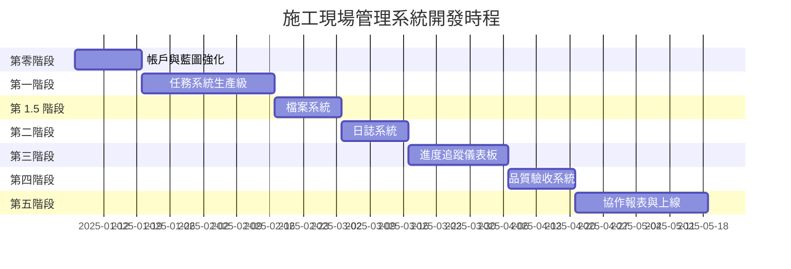

# 施工現場管理系統 - 序列化可執行任務鏈 (SETC)

> **Serialized Executable Task Chain for Construction Site Management System**

---

## 文件資訊

| 屬性 | 值 |
|------|-----|
| **PRD 來源** | `prd-construction-site-management.md` v3.0 |
| **建立日期** | 2025-11-26 |
| **總預估週數** | 18-20 週 |
| **總任務數** | 76 個執行任務 |
| **開發階段** | 6 個主要階段 + 1 個準備階段 |

---

## 執行摘要

本文件定義了施工現場管理系統從 PRD 到完整實作的**序列化可執行任務鏈**。每個任務均具備：

1. **唯一識別碼** - 用於追蹤與依賴管理
2. **明確的前置依賴** - 確保執行順序正確
3. **可驗收的完成標準** - 量化成功指標
4. **預估工時** - 資源規劃依據

---

## 階段總覽



---

## 任務鏈結構

### 階段與任務映射

| 階段 | 階段名稱 | 週數 | 任務數 | SETC 文件 |
|------|---------|------|-------|-----------|
| P0 | 帳戶與藍圖強化 | 1-2 | 11 | [01-account-blueprint-enhancement.setc.md](./setc/01-account-blueprint-enhancement.setc.md) |
| P1 | 任務系統生產級 | 3-6 | 16 | [02-task-system-production.setc.md](./setc/02-task-system-production.setc.md) |
| P1.5 | 檔案系統 | 7-8 | 12 | [03-file-system.setc.md](./setc/03-file-system.setc.md) |
| P2 | 日誌系統 | 9-10 | 11 | [04-diary-system.setc.md](./setc/04-diary-system.setc.md) |
| P3 | 進度追蹤儀表板 | 11-13 | 10 | [05-progress-dashboard.setc.md](./setc/05-progress-dashboard.setc.md) |
| P4 | 品質驗收系統 | 14-15 | 9 | [06-quality-inspection.setc.md](./setc/06-quality-inspection.setc.md) |
| P5 | 協作報表與上線 | 16-20 | 7 | [07-collaboration-reports-launch.setc.md](./setc/07-collaboration-reports-launch.setc.md) |

---

## 任務依賴圖

```mermaid
flowchart TB
    subgraph P0["第零階段：帳戶與藍圖強化"]
        P0-T01[P0-T01<br/>ACL 權限矩陣設計]
        P0-T02[P0-T02<br/>@delon/acl 整合]
        P0-T03[P0-T03<br/>路由守衛強化]
        P0-T04[P0-T04<br/>藍圖模板 CRUD]
        P0-T05[P0-T05<br/>藍圖複製功能]
        P0-T06[P0-T06<br/>工作區切換整合]
        
        P0-T01 --> P0-T02
        P0-T02 --> P0-T03
        P0-T04 --> P0-T05
        P0-T05 --> P0-T06
    end
    
    subgraph P1["第一階段：任務系統生產級"]
        P1-T01[P1-T01<br/>拖放 POC]
        P1-T02[P1-T02<br/>拖放實作]
        P1-T03[P1-T03<br/>表格增強]
        P1-T04[P1-T04<br/>批量操作]
        P1-T05[P1-T05<br/>工時模型]
        P1-T06[P1-T06<br/>工時 UI]
        P1-T07[P1-T07<br/>Gantt 視圖]
        
        P1-T01 --> P1-T02
        P1-T03 --> P1-T04
        P1-T05 --> P1-T06
        P1-T02 --> P1-T07
    end
    
    subgraph P15["第 1.5 階段：檔案系統"]
        P15-T01[P15-T01<br/>files 資料表]
        P15-T02[P15-T02<br/>版本資料表]
        P15-T03[P15-T03<br/>FileStore]
        P15-T04[P15-T04<br/>Storage 配置]
        P15-T05[P15-T05<br/>上傳元件]
        
        P15-T01 --> P15-T02
        P15-T02 --> P15-T03
        P15-T03 --> P15-T05
        P15-T04 --> P15-T05
    end
    
    subgraph P2["第二階段：日誌系統"]
        P2-T01[P2-T01<br/>日誌模型擴展]
        P2-T02[P2-T02<br/>出勤資料表]
        P2-T03[P2-T03<br/>照片上傳整合]
        P2-T04[P2-T04<br/>人員工時 UI]
        
        P2-T01 --> P2-T02
        P2-T02 --> P2-T03
        P2-T03 --> P2-T04
    end
    
    subgraph P3["第三階段：進度追蹤"]
        P3-T01[P3-T01<br/>里程碑資料表]
        P3-T02[P3-T02<br/>進度計算]
        P3-T03[P3-T03<br/>儀表板框架]
        P3-T04[P3-T04<br/>圖表實作]
        
        P3-T01 --> P3-T02
        P3-T02 --> P3-T03
        P3-T03 --> P3-T04
    end
    
    subgraph P4["第四階段：品質驗收"]
        P4-T01[P4-T01<br/>檢驗資料表]
        P4-T02[P4-T02<br/>檢驗表單]
        P4-T03[P4-T03<br/>缺失追蹤]
        P4-T04[P4-T04<br/>簽核流程]
        
        P4-T01 --> P4-T02
        P4-T02 --> P4-T03
        P4-T03 --> P4-T04
    end
    
    subgraph P5["第五階段：協作與上線"]
        P5-T01[P5-T01<br/>通知系統]
        P5-T02[P5-T02<br/>Realtime]
        P5-T03[P5-T03<br/>報表匯出]
        P5-T04[P5-T04<br/>上線準備]
        
        P5-T01 --> P5-T02
        P5-T02 --> P5-T03
        P5-T03 --> P5-T04
    end
    
    %% 階段依賴
    P0 --> P1
    P1 --> P15
    P15 --> P2
    P2 --> P3
    P3 --> P4
    P4 --> P5
```

---

## 全域前置條件

在執行任何任務之前，確保以下條件已滿足：

### 環境準備

| 條件 | 驗證方式 | 狀態 |
|------|---------|------|
| Node.js 20.x+ | `node -v` | ✅ |
| Yarn 4.9.x | `yarn -v` | ✅ |
| Angular CLI 20.x | `ng version` | ✅ |
| Supabase CLI | `supabase -v` | ✅ |
| 本地 Supabase 實例 | `supabase status` | ✅ |

### 現有基礎設施確認

| 模組 | 完成度 | 驗證檔案 |
|------|--------|---------|
| 帳戶體系 | 80% | `src/app/core/facades/account/` |
| 藍圖系統 | 70% | `src/app/features/blueprint/` |
| 任務系統 | 60% | `src/app/features/blueprint/ui/task/` |
| 日誌系統 | 40% | `src/app/features/blueprint/ui/diary/` |
| 待辦系統 | 30% | `src/app/features/blueprint/ui/todo/` |

---

## 執行規範

### 任務格式標準

每個任務遵循以下結構：

```markdown
### TASK-ID: 任務名稱

| 屬性 | 值 |
|------|-----|
| **階段** | Px |
| **預估工時** | x 天 |
| **前置依賴** | TASK-ID(s) 或 無 |
| **負責角色** | 前端/後端/全端 |

#### 描述
[任務詳細描述]

#### 執行步驟
1. 步驟一
2. 步驟二
3. ...

#### 驗收標準
- [ ] 標準一
- [ ] 標準二

#### 產出物
- `path/to/file1.ts`
- `path/to/file2.ts`
```

### 完成定義 (Definition of Done)

每個任務必須滿足：

1. ✅ **程式碼品質**
   - ESLint 零錯誤
   - TypeScript 嚴格模式通過
   - 符合專案編碼規範

2. ✅ **測試覆蓋**
   - 單元測試覆蓋率 ≥ 80%
   - 關鍵路徑 E2E 測試通過

3. ✅ **文件完整**
   - JSDoc 註解完整
   - README 更新（如適用）

4. ✅ **程式碼審查**
   - PR 已建立且審查通過
   - 無未解決的審查意見

---

## 風險緩解策略

### 技術風險

| 風險 | 機率 | 影響 | 緩解措施 |
|------|------|------|---------|
| 拖放複雜度 | 高 | 中 | P1-T01 先執行 POC 驗證 |
| Gantt 整合 | 中 | 高 | 評估 ngx-gantt 或簡化版 |
| RLS 效能 | 中 | 高 | 建立適當索引，監控查詢 |
| 測試覆蓋不足 | 高 | 高 | 每階段強制 80% 覆蓋率 |

### 時程緩衝

- 每階段預留 **10-15%** 緩衝時間
- 總時程 16 週 → **18-20 週**

---

## 進度追蹤

### 階段完成狀態

| 階段 | 狀態 | 開始日期 | 完成日期 | 備註 |
|------|------|---------|---------|------|
| P0 | ⏳ 未開始 | - | - | - |
| P1 | ⏳ 未開始 | - | - | - |
| P1.5 | ⏳ 未開始 | - | - | - |
| P2 | ⏳ 未開始 | - | - | - |
| P3 | ⏳ 未開始 | - | - | - |
| P4 | ⏳ 未開始 | - | - | - |
| P5 | ⏳ 未開始 | - | - | - |

### 圖例
- ⏳ 未開始
- 🔄 進行中
- ✅ 已完成
- ⚠️ 延遲
- ❌ 已取消

---

## 詳細任務鏈

各階段詳細任務定義請參閱：

1. [第零階段：帳戶與藍圖強化](./setc/01-account-blueprint-enhancement.setc.md)
2. [第一階段：任務系統生產級](./setc/02-task-system-production.setc.md)
3. [第 1.5 階段：檔案系統](./setc/03-file-system.setc.md)
4. [第二階段：日誌系統](./setc/04-diary-system.setc.md)
5. [第三階段：進度追蹤儀表板](./setc/05-progress-dashboard.setc.md)
6. [第四階段：品質驗收系統](./setc/06-quality-inspection.setc.md)
7. [第五階段：協作報表與上線](./setc/07-collaboration-reports-launch.setc.md)

---

## 變更記錄

| 版本 | 日期 | 變更內容 | 作者 |
|------|------|---------|------|
| 1.0 | 2025-11-26 | 初始建立 | GitHub Copilot |

---

## 附錄

### A. 技術棧版本

| 技術 | 版本 | 用途 |
|------|------|------|
| Angular | 20.3.x | 前端框架 |
| TypeScript | 5.9.x | 程式語言 |
| ng-zorro-antd | 20.3.x | UI 元件庫 |
| @delon/* | 20.1.x | ng-alain 業務元件 |
| Supabase | 2.84.x | 後端服務 |
| RxJS | 7.8.x | 響應式程式設計 |

### B. 相關文件

- [PRD 文件](./prd-construction-site-management.md)
- [架構文件](../architecture/)
- [API 標準](./00-api-standards.md)
- [測試標準](./00-testing-standards.md)
- [安全標準](./00-security-standards.md)
