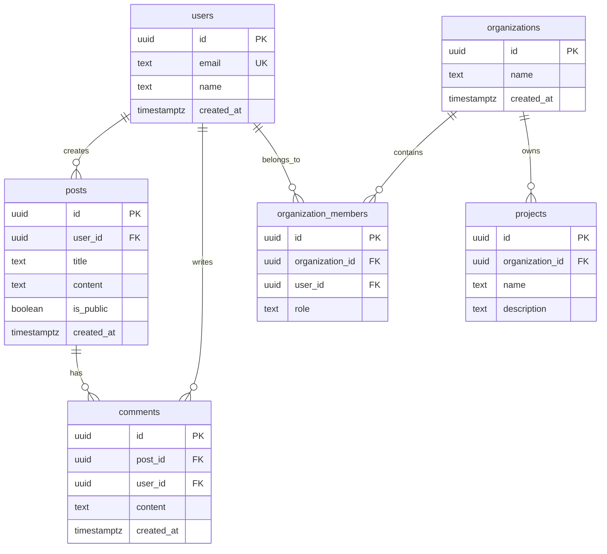

# 資料庫架構設計 | Database Architecture Design

> **文件版本 | Document Version**: 1.0.0  
> **最後更新 | Last Updated**: 2025-11-22

---

## 📋 核心設計原則 | Core Design Principles

### 1. 正規化與效能平衡 | Normalization vs Performance



### 2. 資料表設計範本 | Table Design Template

```sql
-- 標準資料表結構
CREATE TABLE table_name (
  -- 主鍵（使用 UUID）
  id UUID PRIMARY KEY DEFAULT gen_random_uuid(),
  
  -- 業務欄位
  name TEXT NOT NULL,
  description TEXT,
  
  -- 外鍵關聯
  user_id UUID REFERENCES auth.users(id) ON DELETE CASCADE,
  
  -- 元資料欄位
  created_at TIMESTAMPTZ DEFAULT now() NOT NULL,
  updated_at TIMESTAMPTZ DEFAULT now() NOT NULL,
  deleted_at TIMESTAMPTZ  -- Soft delete
);

-- 索引
CREATE INDEX idx_table_name_user_id ON table_name(user_id);
CREATE INDEX idx_table_name_deleted_at ON table_name(deleted_at) 
  WHERE deleted_at IS NULL;

-- 觸發器：自動更新 updated_at
CREATE TRIGGER set_updated_at
  BEFORE UPDATE ON table_name
  FOR EACH ROW
  EXECUTE FUNCTION public.set_updated_at();

-- RLS 策略
ALTER TABLE table_name ENABLE ROW LEVEL SECURITY;
```

---

## 📊 常見資料模型 | Common Data Models

### 使用者認證系統 | User Authentication System

```sql
-- Supabase Auth 已提供 auth.users 表
-- 擴充使用者 Profile
CREATE TABLE public.user_profiles (
  id UUID PRIMARY KEY REFERENCES auth.users(id) ON DELETE CASCADE,
  display_name TEXT,
  avatar_url TEXT,
  bio TEXT,
  created_at TIMESTAMPTZ DEFAULT now(),
  updated_at TIMESTAMPTZ DEFAULT now()
);

-- RLS 策略
ALTER TABLE user_profiles ENABLE ROW LEVEL SECURITY;

CREATE POLICY "users_view_all_profiles" ON user_profiles
  FOR SELECT USING (true);

CREATE POLICY "users_update_own_profile" ON user_profiles
  FOR UPDATE USING (auth.uid() = id);
```

---

**延伸閱讀 | Further Reading**:
- [RLS 策略設計](../security/rls.md)
- [查詢優化](../best-practices/query-optimization.md)
- [資料庫遷移策略](../deployment/migrations.md)
