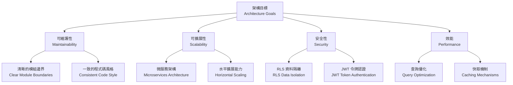
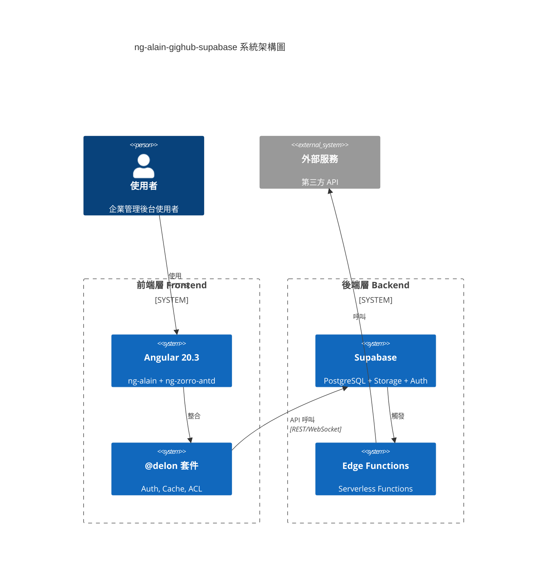
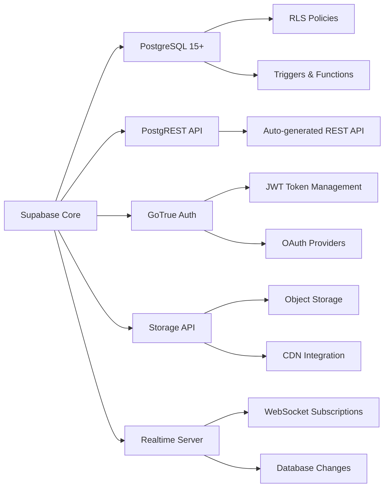
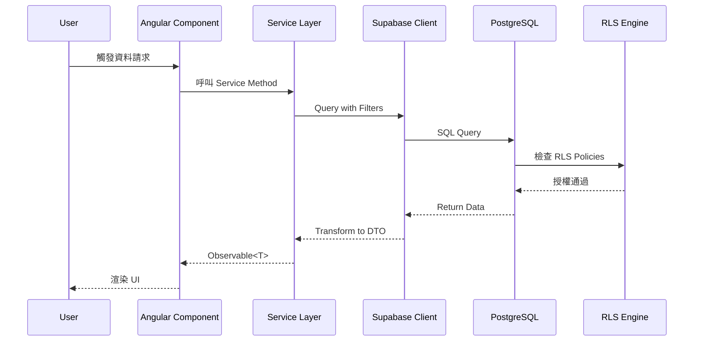
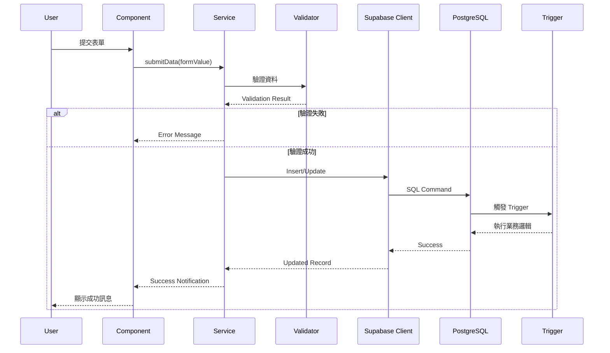
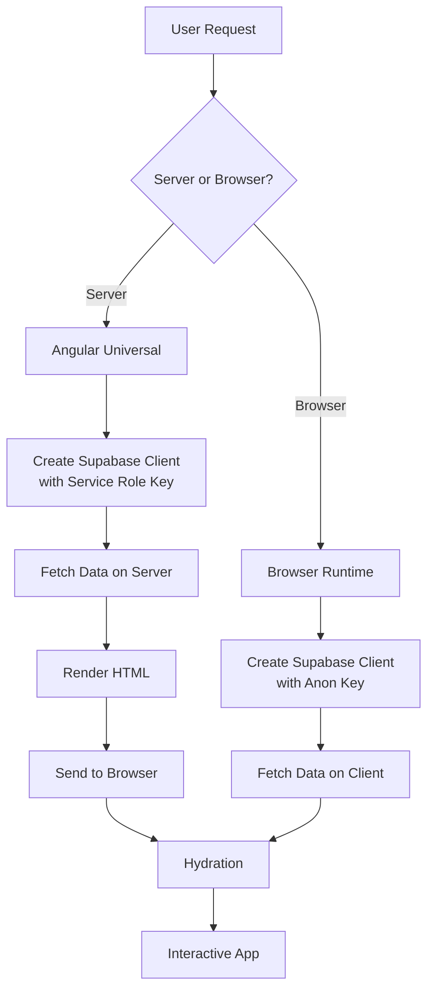
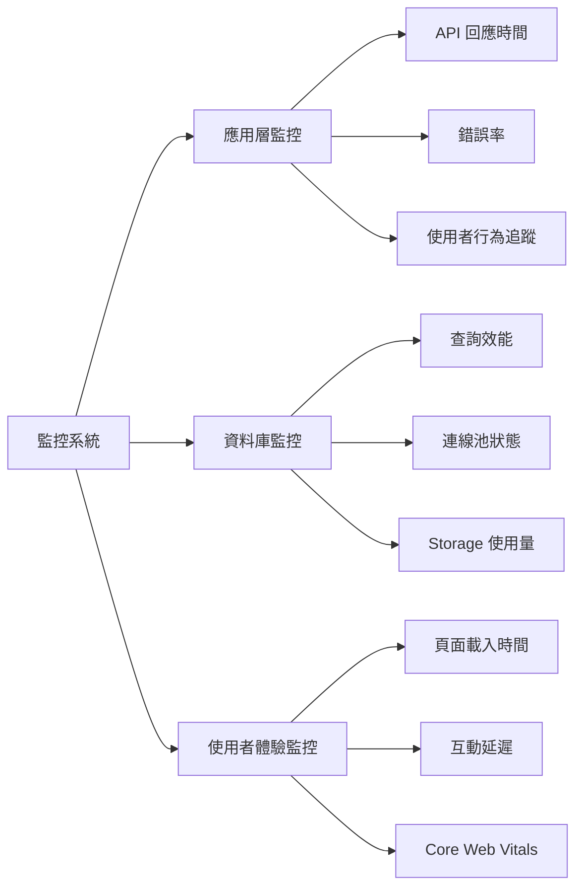

# 整體架構概覽 | Overall Architecture Overview

> **文件版本 | Document Version**: 1.0.0  
> **最後更新 | Last Updated**: 2025-11-22  
> **適用對象 | Target Audience**: 架構師、技術主管、資深開發者

---

## 📋 目錄 | Table of Contents

- [1. 架構願景](#1-架構願景--architecture-vision)
- [2. 系統架構圖](#2-系統架構圖--system-architecture-diagram)
- [3. 核心元件](#3-核心元件--core-components)
- [4. 資料流向](#4-資料流向--data-flow)
- [5. 技術決策](#5-技術決策--technical-decisions)
- [6. 整合策略](#6-整合策略--integration-strategy)

---

## 1. 架構願景 | Architecture Vision

### 1.1 設計原則 | Design Principles

本專案採用 **企業級、模組化、可擴展** 的架構設計，核心原則包括：

**The project adopts an enterprise-level, modular, and scalable architecture with core principles including:**

| 原則 | Principle | 說明 | Description |
|------|-----------|------|-------------|
| **關注點分離** | Separation of Concerns | 前端展示層、業務邏輯層、資料存取層清晰分離 | Clear separation of presentation, business logic, and data access layers |
| **型別安全** | Type Safety | 全面採用 TypeScript 嚴格模式，確保編譯時期錯誤檢測 | Full TypeScript strict mode for compile-time error detection |
| **SSR 相容** | SSR Compatible | 所有元件與服務必須支援 Server-Side Rendering | All components and services must support Server-Side Rendering |
| **安全優先** | Security First | RLS、加密、身份驗證內建於架構核心 | RLS, encryption, and authentication built into the architecture core |
| **效能優化** | Performance Optimized | 快取策略、查詢優化、lazy loading 預設啟用 | Caching strategies, query optimization, and lazy loading enabled by default |

### 1.2 架構目標 | Architecture Goals



---

## 2. 系統架構圖 | System Architecture Diagram

### 2.1 高階架構 | High-Level Architecture



### 2.2 詳細架構分層 | Detailed Architecture Layers

```mermaid
graph TB
    subgraph "展示層 Presentation Layer"
        A1[Angular Components]
        A2[ng-zorro-antd UI]
        A3[Routing & Guards]
    end
    
    subgraph "業務邏輯層 Business Logic Layer"
        B1[@delon/auth Service]
        B2[@delon/cache Service]
        B3[Custom Business Services]
    end
    
    subgraph "資料存取層 Data Access Layer"
        C1[Supabase Client Wrapper]
        C2[TypeScript Type Definitions]
        C3[RxJS Operators]
    end
    
    subgraph "後端服務層 Backend Service Layer"
        D1[Supabase PostgreSQL]
        D2[Supabase Storage]
        D3[Supabase Auth]
        D4[Edge Functions]
    end
    
    subgraph "基礎設施層 Infrastructure Layer"
        E1[RLS Policies]
        E2[Database Triggers]
        E3[Backup & Monitoring]
    end
    
    A1 --> B1
    A2 --> B2
    A3 --> B3
    
    B1 --> C1
    B2 --> C1
    B3 --> C1
    
    C1 --> D1
    C1 --> D2
    C1 --> D3
    C1 --> D4
    
    D1 --> E1
    D1 --> E2
    D1 --> E3
```

---

## 3. 核心元件 | Core Components

### 3.1 前端元件 | Frontend Components

#### 3.1.1 Angular 應用層 | Angular Application Layer

| 元件 | Component | 職責 | Responsibility | 技術 | Technology |
|------|-----------|------|----------------|------|------------|
| **App Module** | 應用程式根模組 | Application Root Module | Angular 20.3 |
| **Routing Module** | 路由管理與守衛 | Route Management & Guards | Angular Router |
| **Layout Components** | 頁面佈局元件 | Page Layout Components | ng-alain Layout |
| **Feature Modules** | 功能模組（Lazy Loaded） | Feature Modules (Lazy Loaded) | Angular Modules |

#### 3.1.2 @delon 整合層 | @delon Integration Layer

```typescript
// @delon/auth 與 Supabase Auth 整合範例
import { Injectable } from '@angular/core';
import { ITokenService } from '@delon/auth';
import { createClient, SupabaseClient } from '@supabase/supabase-js';

@Injectable({ providedIn: 'root' })
export class SupabaseAuthService {
  private supabase: SupabaseClient;

  constructor(private tokenService: ITokenService) {
    this.supabase = createClient(
      environment.supabaseUrl,
      environment.supabaseAnonKey
    );
  }

  async signIn(email: string, password: string) {
    const { data, error } = await this.supabase.auth.signInWithPassword({
      email,
      password
    });

    if (data.session) {
      // 將 Supabase Session 整合到 @delon/auth
      this.tokenService.set({
        token: data.session.access_token,
        refresh_token: data.session.refresh_token,
        expired: data.session.expires_at
      });
    }

    return { data, error };
  }
}
```

### 3.2 後端元件 | Backend Components

#### 3.2.1 Supabase 核心服務 | Supabase Core Services



---

## 4. 資料流向 | Data Flow

### 4.1 讀取資料流程 | Data Read Flow



### 4.2 寫入資料流程 | Data Write Flow



### 4.3 SSR 資料流程 | SSR Data Flow



---

## 5. 技術決策 | Technical Decisions

### 5.1 核心技術選型 | Core Technology Stack

| 層級 | Layer | 技術選擇 | Technology Choice | 理由 | Rationale |
|------|-------|----------|-------------------|------|-----------|
| **前端框架** | Frontend | Angular 20.3 | 企業級、TypeScript 原生支援、強大的 DI 系統 |
| **UI 框架** | UI | ng-alain + ng-zorro-antd | 企業級組件庫、開箱即用的管理後台功能 |
| **狀態管理** | State | @delon/auth + @delon/cache | 與 ng-alain 無縫整合、輕量級 |
| **後端服務** | Backend | Supabase | PostgreSQL + Auth + Storage 一體化、自動 API 生成 |
| **資料庫** | Database | PostgreSQL 15+ | 強大的 JSON 支援、RLS 原生支援、成熟穩定 |
| **部署平台** | Deployment | Vercel / Cloudflare | 全球 CDN、零配置部署、Edge Functions 支援 |

### 5.2 關鍵決策記錄 | Architecture Decision Records (ADR)

#### ADR-001: 選擇 Supabase 而非自建後端

**決策 | Decision**: 採用 Supabase 作為後端服務  
**日期 | Date**: 2025-11-22  
**狀態 | Status**: ✅ Accepted

**背景 | Context**:
- 需要快速建立企業級後端服務
- 需要支援認證、儲存、即時功能
- 團隊規模有限，需減少維運負擔

**決策 | Decision**:
選擇 Supabase 而非自建 Node.js/NestJS 後端

**理由 | Rationale**:
1. **開發效率**: 自動生成 REST API，無需手動編寫 CRUD
2. **內建功能**: Auth、Storage、Realtime 開箱即用
3. **型別安全**: 可自動生成 TypeScript 型別定義
4. **可擴展性**: 支援 Edge Functions 擴充業務邏輯
5. **成本效益**: 減少伺服器維運成本

**權衡 | Trade-offs**:
- ✅ 優點: 快速開發、低維運成本、自動擴展
- ⚠️ 缺點: 被鎖定在 Supabase 生態系、複雜業務邏輯需透過 Edge Functions

#### ADR-002: 使用 @delon/auth 整合 Supabase Auth

**決策 | Decision**: 使用 @delon/auth 作為認證狀態管理層  
**日期 | Date**: 2025-11-22  
**狀態 | Status**: ✅ Accepted

**理由 | Rationale**:
1. ng-alain 專案標準做法
2. 提供統一的 Token 管理介面
3. 支援 Route Guards 與 ACL 整合
4. 可無縫接入 Supabase Session

**實作策略 | Implementation Strategy**:
```typescript
// 將 Supabase Session 映射到 @delon/auth Token
const token = {
  token: supabaseSession.access_token,
  refresh_token: supabaseSession.refresh_token,
  expired: supabaseSession.expires_at
};
this.tokenService.set(token);
```

---

## 6. 整合策略 | Integration Strategy

### 6.1 ng-alain 與 Supabase 整合點 | Integration Points

```mermaid
graph TB
    subgraph "ng-alain Ecosystem"
        A1[@delon/auth]
        A2[@delon/cache]
        A3[@delon/acl]
        A4[ng-zorro-antd]
    end
    
    subgraph "Supabase Services"
        B1[Supabase Auth]
        B2[PostgreSQL]
        B3[Storage]
        B4[Realtime]
    end
    
    A1 <-->|Token Sync| B1
    A2 <-->|Query Cache| B2
    A3 <-->|Permission Check| B1
    A4 <-->|Data Binding| B2
    
    style A1 fill:#1890ff
    style A2 fill:#52c41a
    style B1 fill:#722ed1
    style B2 fill:#eb2f96
```

### 6.2 服務封裝策略 | Service Encapsulation Strategy

#### 層級結構 | Layer Structure

```
src/app/core/services/
├── supabase/
│   ├── supabase.service.ts          # Supabase Client 單例
│   ├── supabase-auth.service.ts     # 認證服務
│   ├── supabase-storage.service.ts  # 儲存服務
│   └── supabase-realtime.service.ts # 即時訂閱服務
├── data/
│   ├── user.service.ts              # 業務邏輯層：使用者服務
│   ├── organization.service.ts      # 業務邏輯層：組織服務
│   └── ...
└── shared/
    ├── cache.service.ts             # 整合 @delon/cache
    └── error-handler.service.ts     # 錯誤處理
```

#### 範例：基礎 Supabase Service

```typescript
import { Injectable } from '@angular/core';
import { createClient, SupabaseClient } from '@supabase/supabase-js';
import { environment } from '@env/environment';

@Injectable({ providedIn: 'root' })
export class SupabaseService {
  private client: SupabaseClient;

  constructor() {
    this.client = createClient(
      environment.supabase.url,
      environment.supabase.anonKey,
      {
        auth: {
          persistSession: true,
          autoRefreshToken: true
        }
      }
    );
  }

  getClient(): SupabaseClient {
    return this.client;
  }

  // 通用查詢方法
  async query<T>(table: string) {
    return this.client.from(table).select<'*', T>();
  }
}
```

### 6.3 SSR 整合策略 | SSR Integration Strategy

#### 關鍵考量 | Key Considerations

1. **環境變數區分 | Environment Variable Separation**
   - Server: 使用 `SUPABASE_SERVICE_ROLE_KEY`（完整權限）
   - Client: 使用 `NEXT_PUBLIC_SUPABASE_ANON_KEY`（RLS 限制）

2. **Client 初始化 | Client Initialization**

```typescript
import { Injectable, PLATFORM_ID, Inject } from '@angular/core';
import { isPlatformBrowser } from '@angular/common';

@Injectable({ providedIn: 'root' })
export class SupabaseService {
  private client: SupabaseClient;

  constructor(@Inject(PLATFORM_ID) private platformId: Object) {
    const key = isPlatformBrowser(this.platformId)
      ? environment.supabase.anonKey
      : environment.supabase.serviceRoleKey;

    this.client = createClient(environment.supabase.url, key);
  }
}
```

3. **避免 Browser-only API | Avoid Browser-only APIs**

```typescript
// ❌ 錯誤：直接使用 localStorage
localStorage.setItem('token', token);

// ✅ 正確：使用 Angular Universal 相容的方式
import { PLATFORM_ID, Inject } from '@angular/core';
import { isPlatformBrowser } from '@angular/common';

if (isPlatformBrowser(this.platformId)) {
  localStorage.setItem('token', token);
}
```

---

## 7. 監控與可觀測性 | Monitoring & Observability

### 7.1 監控指標 | Monitoring Metrics



### 7.2 日誌策略 | Logging Strategy

| 層級 | Level | 使用場景 | Use Case | 保留期限 | Retention |
|------|-------|----------|----------|----------|-----------|
| **ERROR** | 系統錯誤、例外狀況 | System Errors | 90 天 |
| **WARN** | 效能警告、棄用功能 | Performance Warnings | 30 天 |
| **INFO** | 業務流程、重要操作 | Business Flows | 14 天 |
| **DEBUG** | 開發除錯資訊 | Development Debugging | 7 天 |

---

## 8. 下一步 | Next Steps

### 8.1 延伸閱讀 | Further Reading

- [資料庫架構設計](./database.md) - 深入了解資料表設計與關聯
- [認證與授權架構](./auth.md) - Supabase Auth 與 @delon/auth 整合
- [儲存服務架構](./storage.md) - 檔案上傳與 CDN 策略
- [Real-time 功能架構](./realtime.md) - WebSocket 與即時訂閱

### 8.2 實作檢查清單 | Implementation Checklist

- [ ] 建立 Supabase 專案並配置環境變數
- [ ] 實作 SupabaseService 基礎封裝
- [ ] 整合 @delon/auth 與 Supabase Auth
- [ ] 設定 RLS 基本策略
- [ ] 實作第一個 CRUD 功能
- [ ] 撰寫單元測試與整合測試
- [ ] 配置 CI/CD 流程

---

**文件維護者 | Maintained by**: 7Spade Development Team  
**最後審核 | Last Reviewed**: 2025-11-22  
**下次審核 | Next Review**: 2026-02-22
