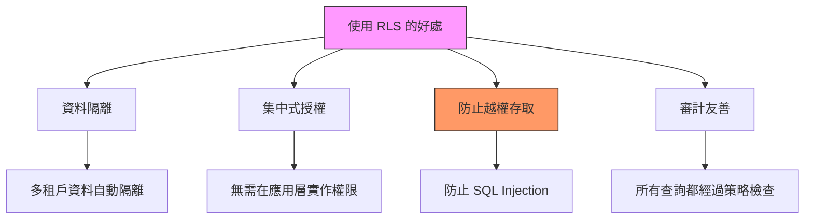
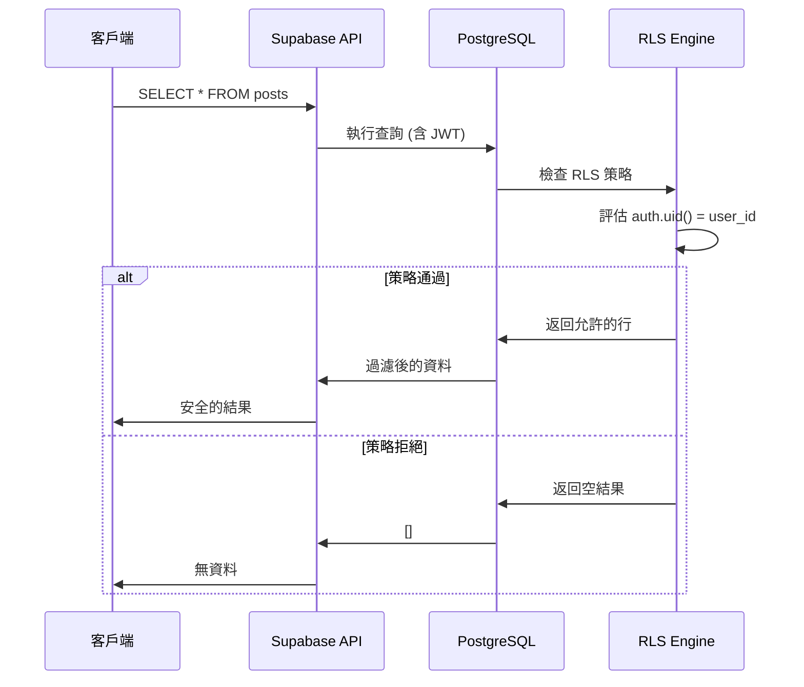

# Row Level Security (RLS) 策略 | RLS Strategy

> **文件版本 | Document Version**: 1.0.0  
> **最後更新 | Last Updated**: 2025-11-22  
> **安全等級 | Security Level**: 🔴 Critical

---

## 📋 目錄 | Table of Contents

- [1. RLS 概述](#1-rls-概述--rls-overview)
- [2. 策略設計原則](#2-策略設計原則--policy-design-principles)
- [3. 常見策略模式](#3-常見策略模式--common-policy-patterns)
- [4. 實作範例](#4-實作範例--implementation-examples)
- [5. 測試與驗證](#5-測試與驗證--testing-and-validation)
- [6. 效能考量](#6-效能考量--performance-considerations)

---

## 1. RLS 概述 | RLS Overview

### 1.1 什麼是 RLS？ | What is RLS?

**Row Level Security (RLS)** 是 PostgreSQL 的原生功能，允許在資料庫層級控制每一行資料的存取權限。

Row Level Security is a native PostgreSQL feature that controls access to individual rows of data at the database level.

### 1.2 為什麼使用 RLS？ | Why Use RLS?



### 1.3 RLS 工作原理 | How RLS Works



---

## 2. 策略設計原則 | Policy Design Principles

### 2.1 最小權限原則 | Principle of Least Privilege

**核心概念 | Core Concept**:
- 預設拒絕所有存取（Deny by Default）
- 僅授予完成任務所需的最小權限
- 明確定義每個角色的權限範圍

### 2.2 防禦性編程 | Defensive Programming

```sql
-- ❌ 錯誤：過於寬鬆的策略
CREATE POLICY "anyone_can_read" ON posts
  FOR SELECT
  USING (true);  -- 允許所有人讀取

-- ✅ 正確：明確的權限檢查
CREATE POLICY "authenticated_users_can_read" ON posts
  FOR SELECT
  USING (
    auth.role() = 'authenticated' AND
    (is_public = true OR user_id = auth.uid())
  );
```

### 2.3 策略命名規範 | Policy Naming Convention

**推薦格式 | Recommended Format**:
```
{role}_{action}_{table}_{condition}

範例 | Examples:
- authenticated_select_posts_own
- admin_insert_users_all
- public_select_products_published
```

---

## 3. 常見策略模式 | Common Policy Patterns

### 3.1 模式一：使用者擁有資料 | Pattern 1: User Owns Data

**使用場景 | Use Case**: 使用者只能存取自己建立的資料

**資料表結構 | Table Structure**:
```sql
CREATE TABLE posts (
  id UUID PRIMARY KEY DEFAULT gen_random_uuid(),
  user_id UUID REFERENCES auth.users(id) NOT NULL,
  title TEXT NOT NULL,
  content TEXT,
  created_at TIMESTAMPTZ DEFAULT now(),
  updated_at TIMESTAMPTZ DEFAULT now()
);
```

**RLS 策略 | RLS Policies**:
```sql
-- 啟用 RLS
ALTER TABLE posts ENABLE ROW LEVEL SECURITY;

-- 1. 使用者可以查看自己的文章
CREATE POLICY "users_select_own_posts" ON posts
  FOR SELECT
  USING (auth.uid() = user_id);

-- 2. 使用者可以新增文章（自動設定 user_id）
CREATE POLICY "users_insert_own_posts" ON posts
  FOR INSERT
  WITH CHECK (auth.uid() = user_id);

-- 3. 使用者可以更新自己的文章
CREATE POLICY "users_update_own_posts" ON posts
  FOR UPDATE
  USING (auth.uid() = user_id)
  WITH CHECK (auth.uid() = user_id);

-- 4. 使用者可以刪除自己的文章
CREATE POLICY "users_delete_own_posts" ON posts
  FOR DELETE
  USING (auth.uid() = user_id);
```

**TypeScript 使用範例 | TypeScript Usage**:
```typescript
// src/app/services/post.service.ts
import { Injectable } from '@angular/core';
import { SupabaseService } from './supabase.service';
import { Observable, from } from 'rxjs';
import { map } from 'rxjs/operators';

export interface Post {
  id: string;
  user_id: string;
  title: string;
  content: string;
  created_at: string;
  updated_at: string;
}

@Injectable({ providedIn: 'root' })
export class PostService {
  constructor(private supabase: SupabaseService) {}

  // 取得使用者自己的文章（RLS 自動過濾）
  getMyPosts(): Observable<Post[]> {
    return from(
      this.supabase.client
        .from('posts')
        .select('*')
        .order('created_at', { ascending: false })
    ).pipe(
      map(response => {
        if (response.error) throw response.error;
        return response.data as Post[];
      })
    );
  }

  // 新增文章（RLS 確保 user_id 正確）
  createPost(post: Partial<Post>): Observable<Post> {
    return from(
      this.supabase.client
        .from('posts')
        .insert(post)
        .select()
        .single()
    ).pipe(
      map(response => {
        if (response.error) throw response.error;
        return response.data as Post;
      })
    );
  }
}
```

### 3.2 模式二：公開與私有資料 | Pattern 2: Public and Private Data

**使用場景 | Use Case**: 資料可以是公開或私有的

**資料表結構 | Table Structure**:
```sql
CREATE TABLE posts (
  id UUID PRIMARY KEY DEFAULT gen_random_uuid(),
  user_id UUID REFERENCES auth.users(id) NOT NULL,
  title TEXT NOT NULL,
  content TEXT,
  is_public BOOLEAN DEFAULT false,  -- 公開標記
  created_at TIMESTAMPTZ DEFAULT now()
);
```

**RLS 策略 | RLS Policies**:
```sql
ALTER TABLE posts ENABLE ROW LEVEL SECURITY;

-- 1. 匿名使用者只能查看公開文章
CREATE POLICY "anon_select_public_posts" ON posts
  FOR SELECT
  USING (
    auth.role() = 'anon' AND is_public = true
  );

-- 2. 已登入使用者可以查看公開文章或自己的文章
CREATE POLICY "authenticated_select_posts" ON posts
  FOR SELECT
  USING (
    auth.role() = 'authenticated' AND
    (is_public = true OR user_id = auth.uid())
  );

-- 3. 使用者可以新增文章
CREATE POLICY "authenticated_insert_posts" ON posts
  FOR INSERT
  WITH CHECK (
    auth.role() = 'authenticated' AND
    auth.uid() = user_id
  );

-- 4. 使用者可以更新自己的文章
CREATE POLICY "users_update_own_posts" ON posts
  FOR UPDATE
  USING (auth.uid() = user_id)
  WITH CHECK (auth.uid() = user_id);
```

### 3.3 模式三：基於角色的存取控制 (RBAC) | Pattern 3: Role-Based Access Control

**使用場景 | Use Case**: 不同角色有不同權限（管理員、編輯、讀者）

**資料表結構 | Table Structure**:
```sql
-- 使用者角色表
CREATE TABLE user_roles (
  id UUID PRIMARY KEY DEFAULT gen_random_uuid(),
  user_id UUID REFERENCES auth.users(id) NOT NULL UNIQUE,
  role TEXT NOT NULL CHECK (role IN ('admin', 'editor', 'reader')),
  created_at TIMESTAMPTZ DEFAULT now()
);

-- 內容表
CREATE TABLE articles (
  id UUID PRIMARY KEY DEFAULT gen_random_uuid(),
  author_id UUID REFERENCES auth.users(id) NOT NULL,
  title TEXT NOT NULL,
  content TEXT,
  status TEXT DEFAULT 'draft' CHECK (status IN ('draft', 'published', 'archived')),
  created_at TIMESTAMPTZ DEFAULT now()
);
```

**輔助函數 | Helper Functions**:
```sql
-- 取得使用者角色的函數
CREATE OR REPLACE FUNCTION public.get_user_role()
RETURNS TEXT
LANGUAGE sql
SECURITY DEFINER
SET search_path = public
STABLE
AS $$
  SELECT role
  FROM user_roles
  WHERE user_id = auth.uid()
$$;
```

**RLS 策略 | RLS Policies**:
```sql
ALTER TABLE articles ENABLE ROW LEVEL SECURITY;

-- 1. 管理員可以查看所有文章
CREATE POLICY "admin_select_all_articles" ON articles
  FOR SELECT
  USING (get_user_role() = 'admin');

-- 2. 編輯可以查看已發布的文章和自己的草稿
CREATE POLICY "editor_select_articles" ON articles
  FOR SELECT
  USING (
    get_user_role() = 'editor' AND
    (status = 'published' OR author_id = auth.uid())
  );

-- 3. 讀者只能查看已發布的文章
CREATE POLICY "reader_select_published_articles" ON articles
  FOR SELECT
  USING (
    get_user_role() = 'reader' AND
    status = 'published'
  );

-- 4. 編輯和管理員可以新增文章
CREATE POLICY "editor_insert_articles" ON articles
  FOR INSERT
  WITH CHECK (
    get_user_role() IN ('editor', 'admin') AND
    author_id = auth.uid()
  );

-- 5. 管理員可以更新所有文章
CREATE POLICY "admin_update_all_articles" ON articles
  FOR UPDATE
  USING (get_user_role() = 'admin');

-- 6. 編輯可以更新自己的文章
CREATE POLICY "editor_update_own_articles" ON articles
  FOR UPDATE
  USING (
    get_user_role() = 'editor' AND
    author_id = auth.uid()
  );
```

### 3.4 模式四：多租戶架構 | Pattern 4: Multi-Tenancy

**使用場景 | Use Case**: 多個組織共用同一個資料庫，資料完全隔離

**資料表結構 | Table Structure**:
```sql
-- 組織表
CREATE TABLE organizations (
  id UUID PRIMARY KEY DEFAULT gen_random_uuid(),
  name TEXT NOT NULL,
  created_at TIMESTAMPTZ DEFAULT now()
);

-- 組織成員表
CREATE TABLE organization_members (
  id UUID PRIMARY KEY DEFAULT gen_random_uuid(),
  organization_id UUID REFERENCES organizations(id) NOT NULL,
  user_id UUID REFERENCES auth.users(id) NOT NULL,
  role TEXT NOT NULL CHECK (role IN ('owner', 'admin', 'member')),
  created_at TIMESTAMPTZ DEFAULT now(),
  UNIQUE(organization_id, user_id)
);

-- 專案表（屬於組織）
CREATE TABLE projects (
  id UUID PRIMARY KEY DEFAULT gen_random_uuid(),
  organization_id UUID REFERENCES organizations(id) NOT NULL,
  name TEXT NOT NULL,
  description TEXT,
  created_at TIMESTAMPTZ DEFAULT now()
);
```

**輔助函數 | Helper Functions**:
```sql
-- 檢查使用者是否為組織成員
CREATE OR REPLACE FUNCTION public.is_organization_member(org_id UUID)
RETURNS BOOLEAN
LANGUAGE sql
SECURITY DEFINER
SET search_path = public
STABLE
AS $$
  SELECT EXISTS (
    SELECT 1
    FROM organization_members
    WHERE organization_id = org_id
      AND user_id = auth.uid()
  );
$$;

-- 檢查使用者在組織中的角色
CREATE OR REPLACE FUNCTION public.get_organization_role(org_id UUID)
RETURNS TEXT
LANGUAGE sql
SECURITY DEFINER
SET search_path = public
STABLE
AS $$
  SELECT role
  FROM organization_members
  WHERE organization_id = org_id
    AND user_id = auth.uid()
$$;
```

**RLS 策略 | RLS Policies**:
```sql
ALTER TABLE projects ENABLE ROW LEVEL SECURITY;

-- 1. 組織成員可以查看組織的專案
CREATE POLICY "members_select_org_projects" ON projects
  FOR SELECT
  USING (is_organization_member(organization_id));

-- 2. 組織管理員可以新增專案
CREATE POLICY "admin_insert_org_projects" ON projects
  FOR INSERT
  WITH CHECK (
    get_organization_role(organization_id) IN ('owner', 'admin')
  );

-- 3. 組織管理員可以更新專案
CREATE POLICY "admin_update_org_projects" ON projects
  FOR UPDATE
  USING (
    get_organization_role(organization_id) IN ('owner', 'admin')
  );

-- 4. 組織擁有者可以刪除專案
CREATE POLICY "owner_delete_org_projects" ON projects
  FOR DELETE
  USING (
    get_organization_role(organization_id) = 'owner'
  );
```

---

## 4. 實作範例 | Implementation Examples

### 4.1 Angular Service 整合 RLS | Angular Service with RLS

```typescript
// src/app/services/organization.service.ts
import { Injectable } from '@angular/core';
import { SupabaseService } from './supabase.service';
import { Observable, from } from 'rxjs';
import { map } from 'rxjs/operators';

export interface Organization {
  id: string;
  name: string;
  created_at: string;
}

export interface Project {
  id: string;
  organization_id: string;
  name: string;
  description: string;
  created_at: string;
}

@Injectable({ providedIn: 'root' })
export class OrganizationService {
  constructor(private supabase: SupabaseService) {}

  // 取得使用者所屬組織的專案（RLS 自動過濾）
  getOrganizationProjects(orgId: string): Observable<Project[]> {
    return from(
      this.supabase.client
        .from('projects')
        .select('*')
        .eq('organization_id', orgId)
        .order('created_at', { ascending: false })
    ).pipe(
      map(response => {
        if (response.error) {
          // RLS 拒絕存取會返回空陣列，而非錯誤
          console.error('Access denied or error:', response.error);
          return [];
        }
        return response.data as Project[];
      })
    );
  }

  // 新增專案（RLS 檢查使用者權限）
  createProject(project: Partial<Project>): Observable<Project | null> {
    return from(
      this.supabase.client
        .from('projects')
        .insert(project)
        .select()
        .single()
    ).pipe(
      map(response => {
        if (response.error) {
          console.error('Create project failed:', response.error);
          return null;
        }
        return response.data as Project;
      })
    );
  }
}
```

---

## 5. 測試與驗證 | Testing and Validation

### 5.1 測試 RLS 策略 | Testing RLS Policies

#### 使用 SQL 測試

```sql
-- 測試 1: 切換到特定使用者身份
SET request.jwt.claim.sub = 'user-uuid-here';

-- 執行查詢，驗證結果
SELECT * FROM posts;  -- 應只返回該使用者的文章

-- 測試 2: 嘗試未授權操作
INSERT INTO posts (user_id, title, content)
VALUES ('other-user-uuid', 'Test', 'Should fail');
-- 預期結果: 違反 RLS 策略錯誤
```

#### 使用 Supabase Dashboard 測試

1. 進入 **Table Editor** → 選擇表格
2. 點擊 **RLS** 標籤
3. 使用 **Test policy** 功能模擬不同使用者

### 5.2 自動化測試 | Automated Testing

```typescript
// src/app/services/post.service.spec.ts
import { TestBed } from '@angular/core/testing';
import { PostService } from './post.service';
import { SupabaseService } from './supabase.service';

describe('PostService with RLS', () => {
  let service: PostService;
  let supabaseMock: jasmine.SpyObj<SupabaseService>;

  beforeEach(() => {
    const spy = jasmine.createSpyObj('SupabaseService', ['client']);
    
    TestBed.configureTestingModule({
      providers: [
        PostService,
        { provide: SupabaseService, useValue: spy }
      ]
    });
    
    service = TestBed.inject(PostService);
    supabaseMock = TestBed.inject(SupabaseService) as jasmine.SpyObj<SupabaseService>;
  });

  it('should only fetch user own posts', async () => {
    // Mock Supabase client response
    supabaseMock.client.from = jasmine.createSpy().and.returnValue({
      select: () => ({
        order: () => Promise.resolve({
          data: [
            { id: '1', user_id: 'current-user', title: 'My Post' }
          ],
          error: null
        })
      })
    });

    const posts = await service.getMyPosts().toPromise();
    
    expect(posts?.length).toBe(1);
    expect(posts?.[0].user_id).toBe('current-user');
  });
});
```

---

## 6. 效能考量 | Performance Considerations

### 6.1 索引優化 | Index Optimization

```sql
-- 為 RLS 常用欄位建立索引
CREATE INDEX idx_posts_user_id ON posts(user_id);
CREATE INDEX idx_posts_is_public ON posts(is_public);
CREATE INDEX idx_organization_members_user_org 
  ON organization_members(user_id, organization_id);
```

### 6.2 避免複雜查詢 | Avoid Complex Queries

```sql
-- ❌ 錯誤：RLS 策略中使用 JOIN
CREATE POLICY "complex_policy" ON posts
  FOR SELECT
  USING (
    EXISTS (
      SELECT 1 FROM users u
      JOIN permissions p ON u.id = p.user_id
      WHERE u.id = auth.uid() AND p.can_read = true
    )
  );

-- ✅ 正確：使用快取的函數
CREATE OR REPLACE FUNCTION has_read_permission()
RETURNS BOOLEAN
LANGUAGE sql
SECURITY DEFINER
STABLE  -- 重要：標記為 STABLE 以啟用快取
AS $$
  SELECT EXISTS (
    SELECT 1 FROM permissions
    WHERE user_id = auth.uid() AND can_read = true
  );
$$;

CREATE POLICY "optimized_policy" ON posts
  FOR SELECT
  USING (has_read_permission());
```

### 6.3 監控 RLS 效能 | Monitor RLS Performance

```sql
-- 查看慢查詢
SELECT
  query,
  calls,
  total_time,
  mean_time
FROM pg_stat_statements
WHERE query LIKE '%posts%'
ORDER BY mean_time DESC
LIMIT 10;
```

---

## 7. 安全檢查清單 | Security Checklist

- [ ] **啟用 RLS**: 所有包含敏感資料的表格都已啟用 RLS
- [ ] **最小權限**: 策略遵循最小權限原則
- [ ] **測試覆蓋**: 所有 RLS 策略都有測試案例
- [ ] **索引優化**: RLS 常用欄位已建立索引
- [ ] **審計日誌**: 關鍵操作有日誌記錄
- [ ] **定期檢查**: 每季度審查 RLS 策略

---

**文件維護者 | Maintained by**: 7Spade Security Team  
**最後審核 | Last Reviewed**: 2025-11-22  
**下次審核 | Next Review**: 2026-02-22
